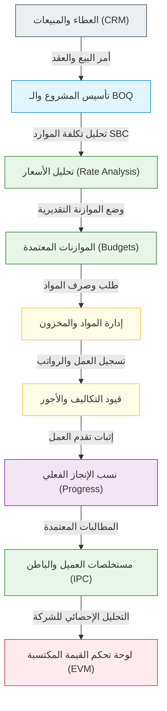

# دليل مديول المقاولات وتكامل البيانات السعودية (SBC Construction Suite)

مرحباً بك في دليل مديول **`construction_execution`** والمديول المساعد للبيانات السعودية **`saudi_construction_demo_data`**. يغطي هذا الدليل هيكلية النظام، دورة الحياة المشتركة، وقائمة الإصلاحات التقنية التي تم تطبيقها لضمان استقرار التشغيل.

---

## 🔄 1. دورة حياة المشاريع الإنشائية والتكامل المشترك

يعمل النظامان بتناغم كامل يربط الجانب المالي/التجاري بالجانب الهندسي والتشغيلي في الموقع، وذلك وفق تسلسل العمليات الإنشائية السعودية:

### تفاصيل دورة حياة التشغيل:
1. **التهيئة والتأسيس (SBC Setup):** يقوم مديول `saudi_construction_demo_data` بتهيئة قاعدة البيانات بالعملة المحلية (SAR)، الضرائب (15% VAT)، وتغذية المخازن بـ **135 مادة و39 خدمة** هندسية مصنفة بالكامل طبقاً لـ **كود البناء السعودي (SBC)**.
2. **جدول الكميات (BOQ):** يُنشأ مديول `construction_execution` بنود مقايسة المشروع (BOQ Items) وتنسيقها هرمياً.
3. **التخطيط المالي (Budget & Rate Analysis):** يتم تسعير بنود المقايسة وربطها بالمواد والعمالة المتاحة (Rate Analysis)، ومن ثم وضع ميزانية تقديرية للمشروع لتلافي الخسائر.
4. **التنفيذ والصرف (Material & Labor):** يتم صرف المواد الإنشائية للموقع عبر طلبات الصرف (`Material Issue`) مع تسجيل ساعات العمل والمشرفين وخصمها من المخازن وتحميل تكلفتها على الحساب التحليلي للمشروع.
5. **سجل الإنجاز والمطالبات (Progress & IPC):** يقوم المهندس بالموقع بتسجيل نسب الإنجاز الفعلي (`Progress`) والتي تتحول تلقائياً لمستخلصات مالية معتمدة (`IPC`) بخصم نسب الاحتجاز والضمانات (Retentions)، وتوليد فواتير مستخلصات العميل ومقاولي الباطن تلقائياً.
6. **التحليل والمراقبة (Dashboard - EVM):** تلتقط لوحة التحكم (`construction.dashboard`) الفروقات بين الميزانية التقديرية والتكاليف الفعلية ومبالغ الإنجاز المعتمدة لتقديم مؤشرات أداء المشروع المالية والزمنية (SPI / CPI / EAC / ETC) في الوقت الحقيقي.

---

## 🛠️ 2. سجل الإصلاحات التقنية والهيكلية (Technical Changelog)

لضمان عمل المديولات دون أخطاء أو تعارض مع مديولات Odoo القياسية، تم إجراء التعديلات التالية:

### أ. مديول التشغيل: `construction_execution`

#### 1. إصلاح حقل `progress_percent` في نموذج المشروع
* **المشكلة:** كان استعلام الـ SQL View الخاص بـ `construction_dashboard` يعتمد على قراءة الحقل المذكور من قاعدة البيانات مباشرة، إلا أنه كان حتمياً حدوث خطأ `UndefinedColumn` لكون الحقل مُعرّف كحقل محتسب (Computed) وغير مخزن بقاعدة البيانات.
* **الإصلاح:** تم تحويل حقل `progress_percent` ليكون مخزناً بقاعدة البيانات (`store=True`) في ملف `models/construction_project.py` مع تحديث محفزات الاحتساب لتعمل تلقائياً عند تغيير حالات المستخلصات.

#### 2. إصلاح جلب حقل العملة `currency_id` في الـ SQL View
* **المشكلة:** حدوث خطأ `UndefinedColumn` لعدم وجود حقل `currency_id` في جدول المشاريع بالـ DB لكونه حقل `related` غير مخزن.
* **الإصلاح:** تم تعديل الكود في `models/construction_dashboard.py` ليتم ربط جدول المشاريع بجدول الشركات `res_company` مباشرة عبر `LEFT JOIN` واستخراج حقل العملة `c.currency_id` بكفاءة.

#### 3. حل مشكلة تبعية مجموعات الصلاحيات وأمان الملفات
* **المشكلة:** خطأ `ParseError: External ID not found` أثناء تحميل ملف الأمان `security/construction_security.xml` لتعريف مجموعة Administrator التي تشير لمجموعة Director قبل تعريف مجموعة Director نفسها.
* **الإصلاح:** تم عكس الترتيب تصاعدياً من الأقل صلاحية (Auditor) وصولاً للأعلى صلاحية (Administrator) لضمان تسجيل كل تبعية مسبقاً.
* **إضافة صلاحيات المدير العام:** تم ربط مجموعة المقاولات الرئيسية `group_construction_admin` بمجموعة إدارة النظام الكلية لأودو `base.group_system` لتظهر القوائم والخيارات تلقائياً لمدير النظام فور التثبيت.

#### 4. إصلاح أخطاء النطاق (Domain) وحقول الـ UI
* **المشكلة 1:** خطأ `ValueError: Invalid field 'dayofmonth'` لعدم وجود هذا الحقل في موديل مهام نظام التشغيل المجدول `ir.cron` في Odoo 16. تم حذفه من ملف `data/construction_cron.xml`.
* **المشكلة 2:** خطأ `ParseError` لعدم تواجد حقل `company_id` في واجهة قيود التكاليف بالرغم من استخدامه في شروط تصفية الحساب. تم إضافته مخفياً (`invisible="1"`) في ملف `views/construction_cost_views.xml`.
* **المشكلة 3:** خطأ `Invalid composed field ipc_id.project_id` في شاشة الويزارد لأن محرك واجهة المستخدم لا يدعم تصفية الحقول عبر مسار متداخل (Dotted path). تم حل المشكلة بتعريف حقل متعلق `project_id` في كود الويزارد `wizard/construction_wizard.py` واستخدامه مباشرة في شاشة الـ XML.

#### 5. ترتيب تحميل الملفات في الـ Manifest
* **المشكلة:** خطأ عدم العثور على الإجراءات الخاصة بالتقارير لأن القوائم `views/construction_menu.xml` كانت تُحمّل قبل ملفات تعريف التقارير في الـ manifest.
* **الإصلاح:** تم تقديم تحميل مجلد `report/` ليكون قبل تحميل القوائم والويزارد في ملف `__manifest__.py`.

---

### ب. مديول التهيئة والبيانات: `saudi_construction_demo_data`

#### 1. استيراد الموديلات والـ Hooks الرئيسية
* **المشكلة:** عدم تفعيل ملف معالجة قيود ومبيعات ساعات العمل (`sale_timesheet_fixes.py`) لعدم استيراد مجلد الموديلات، بالإضافة لعدم استيراد الـ `post_init_hook` في ملف الاستيراد الرئيسي `__init__.py`.
* **الإصلاح:** تمت إضافة الاستيراد الصحيح لهما.

#### 2. حل تعارض تغيير أنواع المنتجات المستودعية
* **المشكلة:** حدوث أخطاء منع التحديث من Odoo `You can not change the type of a product that is currently reserved/used` بسبب محاولة خادم Odoo تعديل أنواع المنتجات من الاستهلاكية (Consumable) إلى مخزنية (Storable) أثناء تحديث ملفات XML بعد استخدامها في قيود سابقة.
* **الإصلاح:** تم تشغيل نص برمجى مباشر لتصحيح قيم الحقول بالـ DB عبر SQL، ثم إلغاء حجز الحركات الموقوفة مؤقتاً (`do_unreserve`) وإعادة حجزها تلقائياً بعد اكتمال الترقية لضمان سلامة العمليات وتلافي القيود البرمجية لأودو.
