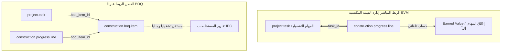

# خطة قياس التقدم وعلاقته بمهام المشروع (Construction Progress & Project Task Plan)

## 1. المقدمة والأهداف
تحدد هذه الوثيقة الاستراتيجية المعمارية والتشغيلية للعلاقة بين تقارير قياس التقدم الفعلي (`construction.progress`) ومهام إدارة المشاريع (`project.task`) داخل نظام Odoo للمقاولات (`ab_constraction`). تهدف الخطة إلى تقييم جدوى الربط المباشر بين الحصر الكمي والمالي (الذي يديره مهندسو حساب الكميات QS) والمهام التشغيلية اليومية (التي يديرها مديرو المشاريع ومشرفو المواقع).

---

## 2. المقارنة المعمارية: الربط المباشر مقابل الفصل (الربط غير المباشر عبر BOQ)



### أولاً: خيار الربط المباشر (Direct Linkage)
في هذا الخيار، يتم إضافة حقل `task_id` في سطور قياس التقدم `construction.progress.line` لربط كل حصر كمي بمهمة محددة في لوحة الـ Kanban.

#### ✅ فوائد الربط (Advantages):
1. **إدارة القيمة المكتسبة (Earned Value Management - EVM):**
   يتيح الربط المباشر للنظام دمج التكاليف الفعلية (ساعات العمل من التايم شيت في المهام) مع القيمة المكتسبة (الكميات المنفذة في تقرير التقدم)، مما يولد مؤشرات أداء دقيقة مثل CPI (مؤشر أداء التكلفة) و SPI (مؤشر أداء الجدول الزمني).
2. **أتمتة إغلاق المهام (Automated Task Completion):**
   عندما يصل السطر في تقرير التقدم إلى نسبة إنجاز 100%، يقوم النظام أوتوماتيكياً بنقل المهمة المرتبطة (`project.task`) إلى مرحلة "الانتهاء" (`Done`).
3. **تتبع دقيق لإنتاجية الموقع (Site Verification):**
   يمكن لمهندسي الموقع إدخال نسب إنجازهم اليومية داخل بطاقة المهمة نفسها، ليقوم النظام بتجميعها تلقائياً في تقرير الحصر الشهري.

#### ❌ عيوب الربط (Disadvantages):
1. **عدم تطابق مستوى التفاصيل (Granularity Mismatch):**
   في المشاريع الإنشائية، بند الـ BOQ الواحد (مثل: "أعمال خرسانة الأسقف") قد ينقسم في جدول المشروع إلى 15 مهمة تشغيلية منفصلة (نجارة، حدادة، تركيب شدات، صب، معالجة). فرض ربط مباشر قد يربك حاسب الكميات (QS) الذي يفضل جرد الكمية الإجمالية المصبوبة.
2. **القيود التشغيلية (Rigid Workflows):**
   تأخر إغلاق أو تحديث مهمة تشغيلية قد يتسبب في تأخر إصدار مستخلص العميل الشهري (IPC).

#### 💡 حلول مقترحة للتغلب على عيوب الربط (Proposed Solutions):
1. **حل مشكلة تفاوت التفاصيل (نظام الأوزان النسبية والمستويات الهرمية WBS):**
   - **الربط بالمهمة الرئيسية (Parent Task):** يتم حصر التقدم وربطه بالمهمة الأب فقط (مثل: أعمال الهيكل الخرساني) بدلاً من المهام الفرعية اليومية.
   - **أوزان الإنجاز النسبية (Weighted Milestones):** إعطاء وزن نسبي لكل مهمة فرعية (مثلاً: النجارة 20%، الحدادة 30%، الصب 50% من كمية البند). عند إغلاق المشرف لمهمة النجارة، يقوم النظام تلقائياً بحساب 20% من كمية الـ BOQ في تقرير التقدم دون أي عناء أو إرباك للـ QS.

2. **حل مشكلة القيود التشغيلية (صلاحية التجاوز التجاري - Commercial Override):**
   - إتاحة ميزة **الفصل التجاري المستقل (Asynchronous Billing)**، بحيث يمتلك مهندس الـ QS صلاحية كاملة لإدخال واعتماد الكميات الفعلية المنفذة في تقرير التقدم الشهري وتقديمه للعميل، حتى وإن نسي مهندس الموقع تحديث بطاقات المهام في لوحة الـ Kanban.
   - يقوم النظام حينها بتوليد إشعار فحص تلقائي (`Discrepancy Flag`) لمدير المشروع لمراجعة الفارق بين تقدم لوحة المهام والتقدم المالي المعتمد لاحقاً، مما يضمن عدم تعطل المستخلصات المالية للشركة تحت أي ظرف.

---

### ثانياً: خيار الفصل / الربط غير المباشر (Indirect Link via BOQ)
وهو الوضع القائم حالياً في الموديول، حيث ترتبط المهام (`project.task`) ببند جدول الكميات (`boq_item_id`)، وترتبط سطور التقدم (`construction.progress.line`) بنفس البند، دون اتصال مباشر بين المهمة وتقرير التقدم.

#### ✅ فوائد الفصل (Advantages):
1. **فصل الصلاحيات والمسؤوليات (Segregation of Duties):**
   يعمل مدير الموقع بحرية تامة في تحريك وتوزيع المهام العمالية في `project.task`، بينما يركز مهندس العقود والـ QS على الحصر المالي الرسمي في `construction.progress` دون تداخل.
2. **مرونة الحصر المالي (Flexible Aggregation):**
   يمكن لمهندس الـ QS حصر البنود المجمعة للمشروع وتقديمها للعميل بغض النظر عن تفاصيل بطاقات المهام المنفصلة.

#### ❌ عيوب الفصل (Disadvantages):
1. **تفاوت التقارير بين الموقع والإدارة (Synchronization Gap):**
   قد ينقل مشرف الموقع المهمة إلى "منتهي" في شاشة المهام، بينما يرفض الاستشاري استلام الكمية في تقرير التقدم، مما يخلق تضارباً بين نسبة الإنجاز في الجدول الزمني ونسبة الإنجاز المالية.

---

## 3. الخطة الاستراتيجية الموصى بها: (الربط الهرمي الذكي - Smart Hierarchical Linkage)

لتحقيق التكامل التام دون تقييد حركة العمل، نوصي بتطبيق نموذج **الربط الهرمي الذكي** عبر الخطوات التالية:

1. **إضافة حقل اختياري للمهمة (`task_id`):**
   إضافة الحقل `task_id` (Many2one) داخل `construction.progress.line`، مع جعله **اختيارياً** (Optional).
   - *إذا تم تحديده:* يسحب النظام بند الـ BOQ تلقائياً من المهمة.
   - *إذا تُرِك فارغاً:* يقوم الـ QS بالحصر المباشر على مستوى المشروع أو الـ BOQ.
2. **زر ذكي في بطاقة المهمة (Smart Button in Task):**
   إضافة زر "تقارير الإنجاز" (Progress Reports) داخل نموذج `project.task`، يعرض كافة الحصورة الكمية التي تمت على هذه المهمة.
3. **مؤشر الإنجاز الفعلي (Progress Bar):**
   عرض شريط إنجاز مالي وكمي (`executed_percent`) داخل بطاقة المهمة، ليعرف مدير المشروع نسبة الاعتماد المالي الفعلي لمهمته مقارنة بالجهد المبذول.

---

## 4. ملخص التحسينات البرمجية المقترحة (Code Enhancements)

```python
# في نموذج construction.progress.line
task_id = fields.Many2one('project.task', string='Task', domain="[('project_id', '=', project_id)]")

@api.onchange('task_id')
def _onchange_task_id(self):
    if self.task_id and self.task_id.boq_item_id:
        self.boq_item_id = self.task_id.boq_item_id
```

---
**تاريخ الإصدار:** 2026-06-29  
**النظام:** Odoo 16/17 — موديول إدارة المقاولات (`ab_constraction`)
