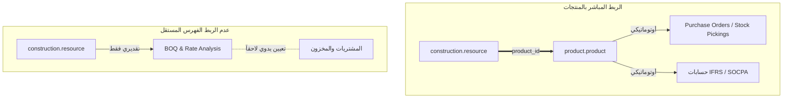

# خطة إدارة الموارد الإنشائية وارتباطها بالمنتجات (Resource & Product Linkage Plan)

## 1. المقدمة والأهداف
تم إعداد هذه الوثيقة لتحديد الاستراتيجية المثلى لإدارة الموارد الإنشائية (`construction.resource`) داخل نظام Odoo للمقاولات (`ab_constraction`). تهدف الخطة إلى حسم القرار المعماري والمحاسبي بشأن ربط الموارد الإنشائية ببطاقات المنتجات (`product.product`) من عدمه، مع توضيح الآثار المترتبة على كل خيار في مراحل العطاءات (Bidding)، التنفيذ (Execution)، والتوجيه المحاسبي وفق معايير **IFRS / SOCPA**.

---

## 2. المقارنة المعمارية: الربط مقابل عدم الربط



### أولاً: خيار الربط ببطاقة الصنف (Tightly Coupled Linkage)
في هذا الخيار، يتم ربط كل مورد إنشائي (مادة، معدة، عمالة) ببطاقة صنف مخصصة `product_id` في نظام Odoo.

#### ✅ فوائد الربط (Advantages):
1. **أتمتة المشتريات والمخزون (Automated Procurement & Picking):**
   عند طلب مواد للموقع (`construction.material.request`) أو صرفها (`construction.material.issue`)، يحتاج Odoo برمجياً إلى `product_id` لإنشاء أوامر الشراء وإيصالات الصرف (`stock.picking`). وجود الربط المسبق يمنع الحاجة لإدخال الأصناف يدوياً عند التنفيذ.
2. **التكامل المحاسبي التلقائي (IFRS / SOCPA Compliance):**
   بطاقات الأصناف تحتوي على الحسابات المحاسبية المخصصة (`property_account_expense_id`). عند ترحيل التكاليف (`construction.cost.entry`)، يسحب النظام الحساب الصحيح (مثل حسابات عكس التكلفة للعمالة والمعدات) بشكل فوري ودقيق.
3. **توحيد التسعير وتقييم المخزون:**
   استفادة الموارد من قواعد تسعير Odoo القياسية (FIFO، Average Cost) وتحديث التكاليف التقديرية بناءً على أسعار الشراء الفعلية.

#### ❌ عيوب الربط (Disadvantages):
1. **تضخم قاعدة بيانات المنتجات (Catalog Bloat):**
   في المشاريع الكبرى، قد يحتوي تحليل الأسعار على آلاف الموارد الدقيقة (مثل أنواع صغيرة من البراغي، مهام عمالة مؤقتة). إنشاء صنف لكل مورد يؤدي لزحام شديد في قاعدة بيانات المخزون.
2. **قيود الفلترة (Domain Restrictions):**
   حالياً، الحقل `product_id` في ملف `construction_resource.py` يحتوي على الشرط `domain=[('type', '!=', 'service')]`، مما يمنع ربط الموارد من نوع عمالة أو خدمات بالمنتجات ما لم يتم تعديل هذا الفلتر.

#### 💡 حلول مقترحة للتغلب على عيوب الربط (Proposed Solutions):
1. **حل مشكلة تضخم قاعدة البيانات (التجميع الفئوي للأصناف الخدمية والمعدات):**
   - **المنتجات التجميعية الموحدة (Master Products):** بدلاً من إنشاء 500 بطاقة صنف منفصلة لكل مسمى وظيفي للعمالة أو لكل معدة صغيرة، يتم إنشاء أصناف رئيسية مجمعة (مثل: صنف *"أجور وتكاليف العمال #1477"* وصنف *"استخدام وتأجير معدات #1476"*). يتم ربط كافة موارد العمالة والمعدات بهذه الأصناف المجمعة، مما يبقي قاعدة بيانات المخزون نظيفة للغاية مع ضمان التوجيه المحاسبي المثالي وفق معايير IFRS / SOCPA.
   - **التصنيف الهرمي للمواد النثرية:** تظل المواد النثرية التقديرية كموارد مستقلة (`construction.resource` فقط) أثناء مرحلة العطاءات، ولا يتم إنشاء أو ربط بطاقة صنف لها إلا عند الحاجة الفعلية لشرائها وتنفيذها في الموقع.

2. **حل مشكلة قيود الفلترة (الفلترة التكيفية الذكية - Dynamic Domain):**
   - تعديل الـ Domain الخاص بحقل `product_id` في ملف `construction_resource.py` ليصبح تكيفياً بناءً على نوع المورد (`resource_type`) كالتالي:
     ```python
     # إذا كان المورد مادة، اعرض المنتجات المخزنية فقط، وإذا كان عمالة أو معدة، اعرض المنتجات الخدمية
     domain="[('type', '=', 'service') if resource_type in ('labor', 'equipment', 'subcontract', 'service') else ('type', 'in', ('product', 'consu'))]"
     ```
   - هذا الحل يقضي تماماً على قيد الفلترة الحالي ويتيح ربط كافة الموارد بسلاسة تامة.

---

### ثانياً: خيار عدم الربط (Decoupled Master Data)
في هذا الخيار، يعمل موديول `construction.resource` ككتالوج تسعير مستقل تماماً، يُستخدم في إعداد جداول الكميات (BOQ) وتحليل الأسعار (`construction.rate.analysis`) دون إنشاء منتجات في المخزن.

#### ✅ فوائد عدم الربط (Advantages):
1. **مرونة وسرعة التسعير (Agile Bidding):**
   يمكن لمهندسي التسعير وحساب الكميات (QS) إنشاء آلاف الموارد الافتراضية أثناء المناقصات فوراً دون انتظار إدارة المخزون أو الحسابات لتعريف بطاقات الأصناف وتحديد التوجيه المحاسبي.
2. **نظافة قاعدة بيانات المنتجات:**
   يظل المخزون نظيفاً ومقتصراً فقط على المواد الفعلية التي يتم شراؤها وتخزينها وجردها.

#### ❌ عيوب عدم الربط (Disadvantages):
1. **عقبة التحول عند التنفيذ الفعلي:**
   بمجرد ترسية المشروع والبدء في التنفيذ، لا يمكن للنظام إصدار أوامر شراء أو إيصالات صرف مخزنية باستخدام مورد مستقل، بل سيضطر مهندس الموقع لربط واختيار بطاقة الصنف (`product_id`) يدوياً عند إنشاء طلبات الصرف.
2. **فصل التكاليف الفعلية عن التقديرية:**
   غياب الربط التلقائي يضعف قدرة النظام على مقارنة التكلفة الفعلية بالتكلفة المقدرة (Planned vs Actual Cost) بشكل لحظي.

#### 💡 حلول مقترحة للتغلب على عيوب عدم الربط (Proposed Solutions):
1. **حل عقبة التنفيذ الفعلي (الإنشاء الآلي عند التحول للتنفيذ - On-Demand Wizard):**
   - **معالج التوليد الذكي (Auto-Generation Wizard):** يتم إضافة زر/إجراء ذكي في طلبات المواد (`construction.material.request`) باسم *"توليد بطاقات المنتجات أوتوماتيكياً"*. عند تحول المشروع من مرحلة المناقصة إلى التنفيذ، يقوم النظام بفحص الموارد المستقلة غير المربوطة، وينشئ لها بطاقات صنف (`product.product`) في الخلفية تلقائياً مع ربطها بالحسابات المحاسبية الصحيحة (IFRS/SOCPA) وربطها بالمورد فوراً.
   - هذا الحل يحافظ على مرونة وسرعة التسعير أثناء المناقصات، ويزيل أي عقبة أو جهد يدوي عند بدء التنفيذ الفعلي.

2. **حل مشكلة مقارنة التكاليف (جسر أكواد التكلفة والتحليل المالي - Cost Codes & Analytics):**
   - **ربط التكاليف عبر (Cost Codes):** بدلاً من الاعتماد على بطاقة الصنف لمقارنة التكلفة التقديرية بالفعليه، يتم الاعتماد على كود التكلفة (`cost_code`) أو الحساب التحليلي (`Analytic Account / Tag`) المرتبط بالمورد المستقل.
   - عند تسجيل قيود الفواتير أو المصروفات الفعلية في الإدارة المالية، يتم توجيهها لكود التكلفة مباشرة، مما يتيح لتقارير مراقبة التكاليف (`construction.cost.control`) إجراء مقارنة فورية ودقيقة بين التكلفة المقدرة والفعلية (Planned vs Actual) دون الحاجة لوجود بطاقة صنف نهائياً.

---

## 3. الخطة الاستراتيجية الموصى بها: (النموذج الهجين الذكي)

لتحقيق أقصى استفادة من المزايا وتلافي العيوب، نوصي بتطبيق **استراتيجية الربط الهجين (Hybrid Strategy)**، حيث يتم تصنيف الموارد بناءً على نوعها (`resource_type`) كالتالي:

| نوع المورد (`resource_type`) | سياسة الربط بالمنتج (`product_id`) | التوجيه المحاسبي (IFRS / SOCPA) | الإجراء التشغيلي |
| :--- | :--- | :--- | :--- |
| **المواد الأساسية (Materials)**<br>*(أسمنت، حديد، خرسانة)* | 🔗 **ربط إلزامي** بمنتج مخزني (`product.product`). | حسابات مخزون المواد المباشرة / تكاليف الخامات. | الصرف المباشر عبر `stock.picking` وأتمتة المشتريات. |
| **المواد النثرية والاستهلاكية**<br>*(مسامير، أدوات حماية، نثريات)* | ⭕ **بدون ربط** (مورد مستقل). | يُدرج كبند مالي عام عند الشراء الفعلي. | مرونة تامة أثناء العطاءات والمناقصات. |
| **العمالة المباشرة (Labor)**<br>*(نجار، حداد، بناي)* | 🔗 **ربط بمنتج خدمي موحد**<br>*(مثل: صنف أجور وتكاليف العمال #1477)*. | حسابات عكس المصروف (`Contra-Expense`) لمنع إدراج إيرادات وهمية. | تقييد التكاليف الفعلية بناءً على الجداول الزمنية (`Timesheets`). |
| **المعدات (Equipment)**<br>*(حفار، رافعة، مضخة)* | 🔗 **ربط بمنتج خدمي/أصل موحد**<br>*(مثل: صنف تشغيل وتأجير معدات #1476)*. | حسابات استعاضة تكاليف تشغيل المعدات (`Equipment Cost Recovery`). | تحميل التكلفة التشغيلية بناءً على ساعات عمل المعدة. |

---

## 4. الخطوات التنفيذية الموصى بها في الكود (التحسينات المستقبلية)
لتفعيل هذه الخطة الهجينة بكفاءة تامة داخل موديول `ab_constraction`، يوصى بإجراء التعديل التالي على ملف `construction_resource.py`:
1. **تعديل شرط الفلترة (Domain) على حقل `product_id`:**
   إزالة الشرط `[('type', '!=', 'service')]` أو تخصيصه بناءً على نوع المورد، بحيث يُسمح بربط الموارد الإنشائية (العمالة والمعدات) بالمنتجات الخدمية المتوافقة مع معايير IFRS/SOCPA التي قمنا بإنشائها مسبقاً.
2. **أتمتة التوجيه في طلبات الصرف:**
   عند إنشاء طلب مواد `construction.material.request`، يقوم النظام تلقائياً بسحب `product_id` المرتبط بالمورد لتسريع دورة الشراء والصرف المخزني.

---
**تاريخ الإصدار:** 2026-06-29  
**النظام:** Odoo 16/17 — موديول إدارة المقاولات (`ab_constraction`)
