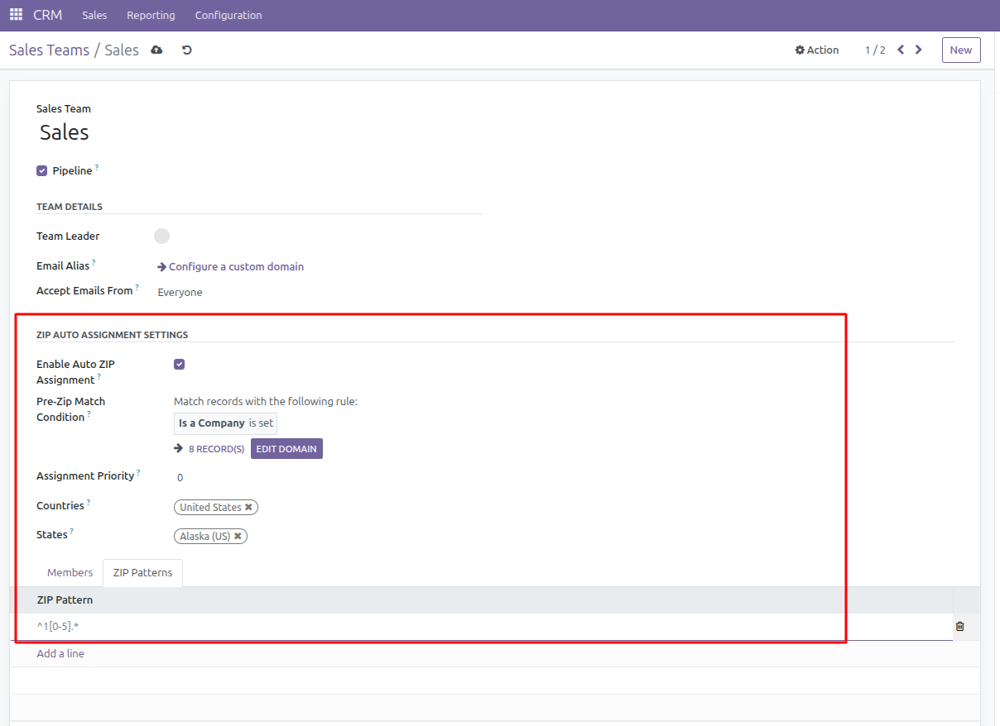

Auto-assign CRM teams to partners based on ZIP code patterns using regular expressions.

Features
--------

- Auto-assign CRM teams to partners based on ZIP code patterns
- Support for Python regular expressions with validation constraints
- Multi-company support
- Geographic filtering by countries and states
- Priority-based assignment when multiple teams match
- Exclusion flag for partners who should not be auto-assigned
- Real-time regex pattern validation prevents invalid patterns
- Contextual action for manual assignment from partner views
- Conditional assignment using pre-zip match conditions: teams can specify a domain expression (Odoo domain syntax) that must be satisfied by the partner before ZIP regex matching is performed. This allows for advanced filtering, e.g., only assign if the partner is a company or meets other criteria.

Assignment Logic
~~~~~~~~~~~~~~~~

The assignment is triggered on partner create/write when ZIP, company, country, state, or exclusion flag changes. A contextual action is also available from partner views for manual assignment. The system:

1. Finds all active teams with ZIP assignment enabled in the partner's company
2. Filters teams by matching countries and states (if specified)
3. For each eligible team, evaluates the optional pre-zip match condition (Odoo domain expression). If the partner does not satisfy the condition, the team is skipped.
4. Tests each remaining team's regex patterns against the partner's ZIP code
5. Selects the team with highest priority if multiple matches exist
6. Logs assignment activity for audit purposes

Assignment Rules
~~~~~~~~~~~~~~~~

1. Only active teams with "Active ZIP Assignment" enabled are considered
2. Only teams in the same company as the partner are considered
3. Teams must have matching countries (partner's country must be in team's countries)
4. Teams must have matching states (partner's state must be in team's states, if team has states defined)
5. If a team has a pre-zip match condition, the partner must satisfy the condition (Odoo domain) before ZIP regex matching is performed. If not set, all partners are considered.
6. Partners without a company, ZIP code, country, or state are not assigned
7. Partners with "Exclude from ZIP Assignment" checked are not assigned
8. When multiple teams match, the team with highest priority is selected
9. Invalid regex patterns are prevented by validation constraints at input time
