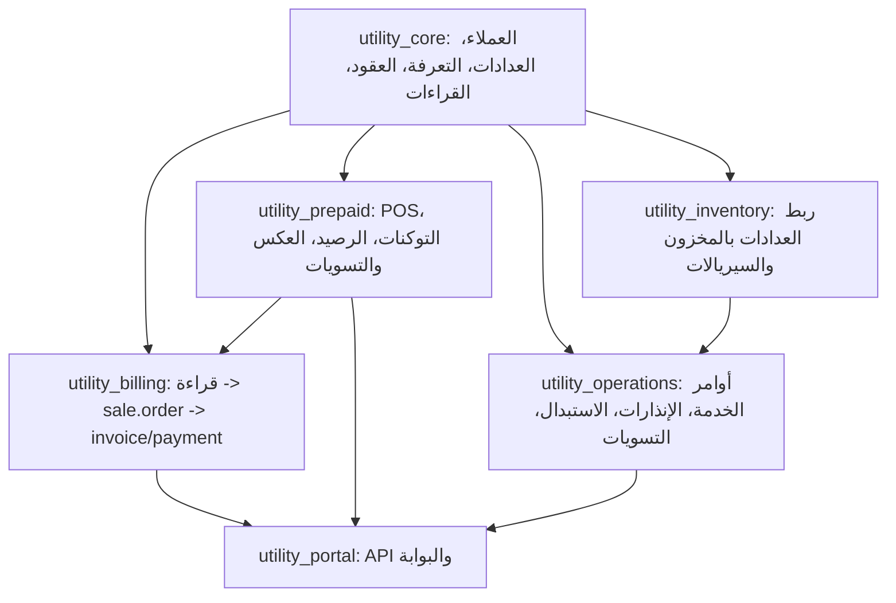

# مراجعة شاملة لمنطق الأعمال في Utility ERP

## 1. الهدف من المراجعة

هذه الوثيقة تراجع منطق الأعمال الحالي في موديولات Utility ERP على مستوى المسارات التشغيلية لا على مستوى تنسيق الكود فقط. الهدف هو تحديد:

1. هل مسارات العمل تعكس دورة شركة توزيع كهرباء بشكل صحيح؟
2. أين توجد مخاطر فواتير أو أرصدة أو مدفوعات غير صحيحة؟
3. أين توجد فجوات بين الموديولات أو اعتماد غير مكتمل؟
4. ما الأولويات العملية لتثبيت النظام قبل التوسع أو التشغيل الفعلي؟

الموديولات المشمولة:

- `utility_core`
- `utility_inventory`
- `utility_prepaid`
- `utility_operations`
- `utility_billing`
- `utility_portal`

## 2. الخلاصة التنفيذية

النظام يملك أساساً جيداً لفصل المجالات: بيانات أساسية، قراءات، فوترة، دفع مسبق، عمليات ميدانية، مخزون، وبوابة. أهم قرار معماري صحيح هو الاعتماد على نماذج Odoo القياسية في الماليات والمبيعات مثل `sale.order`, `account.payment`, `pos.order`, و`account.move` بدلاً من نماذج مالية مخصصة بالكامل.

لكن توجد فجوات منطق أعمال يجب علاجها قبل اعتبار النظام جاهزاً للتشغيل على بيانات حقيقية:

| المستوى | الملاحظة | الأثر |
|---|---|---|
| حرج | `bill_state` حقل محسوب، ومع ذلك توجد دوال تحاول الكتابة عليه مباشرة | حالات الفواتير قد لا تثبت أو يعاد حسابها بعكس المتوقع |
| حرج | الدفع المسبق يستدعي `utility.customer._update_balance()` والدالة غير موجودة حالياً | مسارات البيع، العكس، والتسويات في prepaid ستفشل وقت التنفيذ |
| حرج | معالجة دفعات القراءات تقرأ أول عناصر JSON كل مرة ولا تحفظ مؤشر تقدم داخل الملف | خطر تكرار معالجة نفس القراءات أو توقف الدفعة عند أول batch |
| حرج | إنشاء الدفع من API لا يقوم بترحيل `account.payment` ولا يقوم بعمل reconciliation مع الفاتورة | الدفع قد يظهر كسجل غير مرحل ولا يخفض الرصيد فعلياً |
| عالٍ | توجد نسختان متعارضتان لمفهوم استبدال العداد بين `utility_core` و`utility_operations` | تضارب في الحقول والأزرار ومسار الاستبدال |
| عالٍ | الفوترة من الفترة ومن القراءة يمكن أن تنشئ فواتير لنفس القراءة دون قيد فريد | احتمال تكرار الفاتورة لنفس القراءة |
| عالٍ | الغرامات تضيف `amount_penalty` على أمر البيع بدون إضافة بند أو إعادة حساب إجمالي الفاتورة | فرق بين مبلغ الغرامة والذمة المالية الفعلية |
| عالٍ | `safe_eval` يسمح بتمرير records للصيغة بدون طبقة عزل كافية | خطر منطقي وأمني إذا استخدمت الصيغ من مستخدمين غير موثوقين |
| متوسط | العمليات الميدانية تغير حالات وعدادات بدون تحقق صارم من الانتقال | يمكن إكمال أوامر ناقصة أو غير مجدولة |
| متوسط | الصلاحيات والـ API تعتمد على `auth='user'` فقط ولا تربط الطلب بحساب المستخدم | مستخدم داخلي قد يستعلم أو يدفع لحسابات لا تخصه |

## 3. خريطة منطق الأعمال الحالية



الاعتماد العام منطقي، لكن يجب الانتباه إلى أن `utility_inventory` يعتمد على `utility_core` فقط، بينما بعض منطق الاستبدال العملي موجود أيضاً في `utility_operations`. هذا يجعل مسار الاستبدال معرضاً للتضارب إذا تم تثبيت الموديولين معاً.

## 4. مراجعة `utility_core`

### 4.1 العملاء والحسابات `utility.customer`

المسار الحالي:

1. كل حساب كهرباء يمثله `utility.customer`.
2. الحساب مرتبط بـ `res.partner`.
3. يتم تعيين `customer_rank` و`is_subscriber` على الشريك تلقائياً.
4. يتم إنشاء حساب تحليلي تلقائياً عند إنشاء الحساب.
5. الحساب يحمل العداد، التعرفة/قالب العقد، الموقع، الرصيد، وآخر قراءة.

نقاط قوة:

- وجود رقم حساب فريد على مستوى الشركة.
- ربط مباشر بالعداد والمسار والمحول والفئة.
- إنشاء الحساب التحليلي تلقائياً خطوة مفيدة للتكامل المحاسبي.

ملاحظات ومخاطر:

1. `balance` يستخدم في الدفع المسبق والإنذارات، لكن لا توجد دالة مركزية موجودة لتحديثه رغم أن `utility_prepaid` يستدعي `_update_balance()`.
2. `last_reading_value`, `last_invoice_reading`, و`last_invoice_date` لا يتم تحديثها بشكل موحد عند اعتماد القراءة أو إصدار الفاتورة.
3. `payment_count` ثابت حالياً بقيمة صفر، لذلك الأزرار الذكية قد تعطي مؤشرات غير صحيحة.
4. إنشاء الحساب التحليلي يتم داخل `create` لكل حساب، وقد ينشئ خطة تحليلية افتراضية إذا لم توجد. هذا سلوك قوي لكنه قد يكون غير مرغوب في قواعد بيانات محاسبية مضبوطة.
5. التحقق من توافق `cell_id` و`meter_id` يعتمد على `cell.meter_ids | cell.coupling_meter_ids`، ويجب التأكد أن `coupling_meter_ids` موجود فعلاً في نموذج الفيدر/الخلية في كل حالة تثبيت.

التوصيات:

1. إضافة دالة مركزية على `utility.customer`:
   - `action_update_balance(amount, source_model=False, source_id=False)`
   - أو `_update_balance(delta)` مع قيود واضحة.
2. تحديث آخر قراءة وآخر قراءة مفوترة من مكان واحد عند:
   - اعتماد قراءة.
   - إصدار فاتورة.
   - استبدال عداد.
3. جعل إنشاء الحساب التحليلي قابلاً للتفعيل من الإعدادات، أو على الأقل عدم إنشاء خطة جديدة تلقائياً إلا بإذن واضح.
4. إصلاح `payment_count` ليحسب مدفوعات `account.payment` المرتبطة بفواتير الحساب.

### 4.2 العدادات `utility.meter`

المسار الحالي:

- العداد يرتبط بعميل، فيدر، محول، محطة، ومنطقة.
- يدعم أنظمة الدفع: آجل، مسبق، يدوي.
- يوجد قيد فريد على رقم العداد داخل الشركة وقيد فريد على الرقم التسلسلي.

نقاط قوة:

- فصل `meter_number` عن `serial_number`.
- دعم عدادات الربط `is_coupling_meter`.
- وجود ربط فني بالشبكة.

ملاحظات ومخاطر:

1. لا توجد قيود تمنع ربط نفس العداد بأكثر من حساب من جهة العميل إذا تغيرت العلاقات بطريقة غير مباشرة.
2. `account_id` حقل related إلى `customer_id`، بينما بعض الكود يكتب `account_id` مباشرة على العداد في عمليات ميدانية، وهذا لن يكون مصدراً مستقلاً.
3. عند استبدال العداد يتم تعطيل العداد القديم في مسار، وفي مسار المخزون يعاد تفعيله كعداد معطل. هذا تضارب في تعريف دورة حياة العداد.

التوصيات:

1. اعتماد `customer_id` كمصدر وحيد لملكية العداد.
2. توثيق حالات العداد الفنية والمخزنية:
   - مركب.
   - في المخزون.
   - معطل.
   - مستبدل.
   - تالف.
3. عدم استخدام `active=False` كبديل وحيد للحالة الفنية، لأنه يخفي السجل من التشغيل والمراجعة.

### 4.3 القراءات `utility.reading`

المسار الحالي:

`draft -> under_review -> approved -> queued -> billed`

مع وجود حالة `error` للفوترة الدُفعية.

نقاط قوة:

- دورة مراجعة واضحة.
- حفظ صورة العداد للقراءات القابلة للفوترة.
- احتساب القراءة السابقة والاستهلاك آلياً.
- دعم قراءات المشترك والمحول والفيدر.

ملاحظات ومخاطر:

1. قيد التكرار الحالي `unique(meter_id, reading_date)` لا يمنع قراءتين لنفس العداد في نفس فترة الفوترة إذا اختلف الوقت.
2. الاستهلاك يمكن أن يصبح سالباً، ويتم تصنيفه كتنبيه، لكنه لا يمنع الفوترة لاحقاً.
3. اعتماد القراءة لا يحدث آخر قراءة على الحساب أو العداد.
4. `_compute_consumption_analysis` يبحث داخل compute لكل قراءة، وهذا قد يصبح مكلفاً عند البيانات الكبيرة.
5. عند رفض قراءة معتمدة تعود إلى `draft`، لكن لا يوجد تحقق إن كانت مفوترة أو مرتبطة بفواتير.

التوصيات:

1. إضافة قيد منطقي يمنع أكثر من قراءة قابلة للفوترة لنفس `meter_id` و`date_range_id` إلا إذا كانت قراءة تسوية واضحة.
2. منع فوترة الاستهلاك السالب أو وضعه في مسار تسوية مستقل.
3. تحديث `last_reading_value` و`last_reading_date` عند الاعتماد.
4. منع رفض القراءة إذا كانت `billed` إلا عبر إلغاء فاتورة أو تسوية معتمدة.

### 4.4 قوالب العقود والصيغ `utility.contract.template` و`utility.formula`

المسار الحالي:

- قالب العقد هو مصدر التسعير.
- البنود تولد من أسعار القالب أو من صيغ كمية ديناميكية.
- `safe_eval` ينفذ كود Python لحساب الكمية والاسم.

نقاط قوة:

- مرونة عالية في الفوترة.
- دعم الرسوم الثابتة والمحلية والخصومات والدعم.
- إمكانية مزامنة البنود من القالب.

ملاحظات ومخاطر:

1. `safe_eval` يعطى records مثل `account`, `category`, `line`, و`template`. هذا يسمح للصيغة بقراءة/استدعاء خصائص أكثر من المطلوب.
2. عند فشل الصيغة يتم إرجاع `0.0` بصمت نسبي، وهذا قد ينتج فاتورة ناقصة بدون إيقاف واضح.
3. لا توجد قيود على القيم السالبة أو غير المنطقية في أسعار القالب.
4. مزامنة البنود تحدث بإضافة بنود ناقصة وتحديث أسعار، لكنها لا تتعامل مع حذف أو تعطيل بند لم يعد مطلوباً.

التوصيات:

1. جعل فشل الصيغة يوقف الفاتورة أو يسجل خطأ فوترة واضحاً بدلاً من احتساب صفر في المسارات المالية.
2. تمرير بيانات قراءة فقط للصيغة بدلاً من records كاملة قدر الإمكان.
3. إضافة قيود على الأسعار والفترات:
   - `effective_date <= end_date`
   - الأسعار الأساسية لا تكون سالبة إلا في بنود الخصم.
4. توثيق قواعد الخصم والدعم محاسبياً قبل استخدام `sponsor_id` في invoice lines.

### 4.5 الفترات `date.range`

المسار الحالي:

- توسيع `date.range` لإدارة فترات قراءة ودفع.
- فترة واحدة نشطة لكل نوع عمل/دورة/منطقة.

نقاط قوة:

- استخدام موديول Odoo موجود بدلاً من نموذج مخصص.
- دعم الفترات حسب المنطقة ونوع العمل.

ملاحظات ومخاطر:

1. القيد يسمح بفترة نشطة عامة وفترات نشطة لمنطقة إذا لم تضبط المنطقة بدقة.
2. `region_ids` موجود لكنه لا يدخل في قيد الفترة النشطة.
3. الفوترة من الفترة تستخدم `region_id` فقط، لا `region_ids`.

التوصيات:

1. تحديد هل الفترة تدعم منطقة واحدة أو عدة مناطق. الخلط الحالي يحتاج قرار.
2. توحيد الفوترة والتقارير على `region_id` أو `region_ids`.
3. إضافة تحقق من عدم تداخل تاريخي بين فترات نفس المنطقة ونوع العمل.

## 5. مراجعة `utility_billing`

### 5.1 الفاتورة عبر `sale.order`

المسار الحالي:

1. القراءة المعتمدة تنشئ `sale.order`.
2. `_calculate_amounts()` ينشئ `sale.order.line` من قالب العقد.
3. يتم ربط القراءة والفترة والعداد والحساب.
4. حالة الفاتورة `bill_state` محسوبة من حالة أمر البيع والفواتير المحاسبية والدفع.

نقاط قوة:

- استخدام `sale.order` كحامل لفاتورة الكهرباء قرار جيد.
- `_calculate_amounts()` يمسح البنود ثم يعيد إنشاءها، وهذا يقلل التكرار عند إعادة الحساب اليدوي.
- وجود تقسيم مبالغ: طاقة، ثابت، خدمة، رسوم محلية، خصومات، غرامات.

ملاحظات حرجة:

1. `bill_state` معرف كـ `compute='_compute_bill_state', store=True`، ومع ذلك:
   - يتم تمريره عند إنشاء `sale.order`.
   - `cron_update_overdue_orders` يحاول `orders.write({'bill_state': 'overdue'})`.
   هذا غير متسق لأن الحقل المحسوب يعاد حسابه من الاعتمادات.
2. `date_range_id` مطلوب في `sale.order`، لكن `action_generate_bill()` من القراءة لا يمرر `date_range_id`. هذا قد يفشل أو يعتمد على default غير موجود.
3. لا يوجد قيد فريد يمنع أكثر من `sale.order` لنفس `reading_id`.
4. `_compute_previous_balance` يترك القيمة القديمة إذا لم يكن الأمر draft وكان لديه partner، لأنه لا يعين قيمة في كل فروع compute.
5. `balance_due = amount_total - paid` يعتمد على فواتير Odoo المنشورة فقط، بينما `account.payment.utility_sale_order_id` وحده لا يكفي لتخفيض الرصيد.
6. الخصم والحد الأقصى يضافان كبند سالب، لكن `amount_discount` يتراكم كموجب في حالة max charge، بينما البند نفسه سالب. يجب توحيد دلالة الحقل.

التوصيات:

1. جعل `bill_state` إما:
   - محسوباً فقط ولا يكتب عليه مباشرة.
   - أو حقلاً عادياً تديره أفعال واضحة.
   الخيار الأفضل حالياً: إبقاؤه محسوباً وإزالة كل writes المباشرة.
2. إضافة `date_range_id` عند الفوترة من القراءة:
   - من `reading.date_range_id`.
   - أو الفترة الحالية `work_type='readings'`.
   - مع منع الإنشاء إذا لا توجد فترة.
3. إضافة قيد SQL أو Python:
   - قراءة واحدة لا تنتج أكثر من فاتورة غير ملغاة.
4. إصلاح `_compute_previous_balance` ليعين قيمة دائماً.
5. توحيد معنى `amount_discount`: هل يخزن قيمة سالبة أم مقدار الخصم الموجب.

### 5.2 الفوترة من القراءة

المسار الحالي:

- `action_generate_bill()` ينشئ فاتورة قراءة واحدة.
- `action_generate_bills_batch()` يرسل القراءات إلى `queued`.
- `_cron_generate_bills()` يعالج القراءات واحدة واحدة مع commit/rollback.

نقاط قوة:

- وجود طابور فوترة وحالة `error`.
- فشل قراءة لا يوقف الدفعة كاملة.

ملاحظات ومخاطر:

1. شرط `if self.state == 'billed'` داخل `action_generate_bill()` غير قابل للوصول فعلياً لأنه يأتي بعد شرط `self.state != 'approved'`.
2. لا يوجد تحقق من وجود فاتورة سابقة لنفس القراءة قبل إنشاء `sale.order`.
3. `self.env.cr.commit()` داخل loop مفيد للدُفعات لكنه يجب أن يستخدم بحذر ويوثق لأن Odoo عادة يدير transaction تلقائياً.
4. الخطأ يخزن `str(e)` فقط، وقد يكشف تفاصيل تقنية للمستخدمين.

التوصيات:

1. البحث عن فاتورة موجودة لنفس `reading_id` قبل الإنشاء.
2. نقل منطق إنشاء الفاتورة إلى دالة service واضحة يمكن استدعاؤها من الفترة والقراءة بدون تكرار.
3. حفظ خطأ تقني في اللوج ورسالة أعمال مختصرة في `billing_error`.

### 5.3 دفعات رفع القراءات `utility.reading.batch`

المسار الحالي:

- المستخدم يرفع JSON وصور.
- يتم حساب `total_readings`.
- Cron يعالج أول `batch_size` من JSON.

ملاحظة حرجة:

الدالة `_cron_process_readings()` تقرأ `readings_data[:batch_size]` في كل تشغيل، ولا تحفظ offset أو تزيل العناصر التي تمت معالجتها. معنى ذلك أن التشغيل التالي سيعيد محاولة نفس أول عناصر الملف، وقد ينتج:

- أخطاء تكرار بسبب `unique(meter_id, reading_date)`.
- توقف الدفعة عند partial.
- تضخم `processed_count` و`error_count` بدون عكس حقيقي للتقدم.

ملاحظات إضافية:

1. لا يوجد قيد idempotency على `reading_source` أو `batch_id + seq`.
2. الصور تطابق بالاسم فقط.
3. لا يوجد تحقق كافٍ من المنطقة أو الفترة أو أن العداد تابع للقارئ/المنطقة.

التوصيات:

1. إضافة `processed_offset` أو إنشاء نموذج child line لكل قراءة في الدفعة.
2. تخزين `seq` على `utility.reading` أو جدول وسيط لمنع إعادة المعالجة.
3. التحقق من أن `meter_number` داخل منطقة الدفعة إذا حددت `region_id`.
4. عدم استخدام `processed_count + error_count` كمؤشر وحيد إذا لا يوجد تتبع للعناصر التي عولجت.

### 5.4 المدفوعات `account.payment`

المسار الحالي:

- إضافة رابط `utility_sale_order_id`.
- إضافة وسيلة دفع ووردية وفترة.
- اختيار وردية الكاشير أو المحصل المفتوحة تلقائياً.

نقاط قوة:

- الاعتماد على `account.payment` صحيح.
- ربط المدفوعات بالورديات والفترة مفيد للتقارير.

ملاحظات ومخاطر:

1. لا يوجد override أو action يضمن أن الدفع المرتبط بالفاتورة يتم ترحيله ومطابقته مع invoice.
2. لا يوجد تحقق أن مبلغ الدفع لا يتجاوز الرصيد المستحق إلا إذا كان ذلك مسموحاً كدفعة مقدمة.
3. لا يوجد تحقق أن الوردية مفتوحة عند إنشاء الدفع بعد default.
4. لا يوجد منع للدفع على فاتورة ملغاة أو مدفوعة.

التوصيات:

1. إنشاء دالة `action_register_utility_payment()` على `sale.order` أو wizard.
2. الدفع يجب أن:
   - ينشئ `account.payment`.
   - يرحله.
   - يعمل reconciliation مع invoice المفتوحة.
   - يحدث التقارير عبر حقول Odoo القياسية.
3. إضافة قيود على دفع فواتير `cancelled` أو `paid`.

### 5.5 الغرامات `utility.penalty`

المسار الحالي:

- Cron ينشئ غرامة تأخير على الفواتير المتأخرة.
- `action_apply_penalty()` ينشئ `account.move` منفصل للغرامة.
- Cron يزيد `order.amount_penalty`.

ملاحظات ومخاطر:

1. زيادة `order.amount_penalty` لا تزيد `amount_total` ولا تنشئ بنداً في أمر البيع.
2. الغرامة قد تطبق كفاتورة محاسبية منفصلة، لكنها غير مربوطة reconciliation مع فاتورة الكهرباء الأصلية.
3. منع التكرار يومي فقط، أي أن نفس الفاتورة يمكن أن تحصل على غرامة يومية إذا الـ cron يومي. قد يكون مقصوداً أو خطأ حسب السياسة.
4. لا توجد سياسة واضحة: غرامة مرة واحدة، يومية، شهرية، أو مركبة.

التوصيات:

1. تحديد سياسة الغرامة.
2. ربط الغرامة إما:
   - كبند على فاتورة الكهرباء قبل ترحيلها.
   - أو كـ invoice منفصلة مرتبطة بـ `sale_order_id`.
3. عدم تعديل `amount_penalty` يدوياً دون أثر محاسبي مقابل.

### 5.6 التأمينات `utility.deposit`

المسار الحالي:

- قبض وديعة عبر `account.payment`.
- استرداد وديعة عبر `account.payment`.
- مصادرة وديعة عبر `account.move`.

نقاط قوة:

- استخدام القيود المحاسبية القياسية.
- وجود حالات: draft, held, released, forfeited.

ملاحظات ومخاطر:

1. `action_release_deposit()` لا يتحقق من إعداد `deposit_journal_id` قبل إنشاء الدفع.
2. لا يتم حفظ `payment_id` عند الاسترداد، فقط عند القبض.
3. لا يوجد قيد يمنع مبلغ وديعة صفر أو سالب.
4. لا يوجد فصل واضح بين سند قبض الوديعة وسند صرف الاسترداد.

التوصيات:

1. إضافة `release_payment_id`.
2. إضافة قيود مبلغ موجب.
3. التحقق من الإعدادات في كل action.
4. تحديد الحساب الدائن/المدين في payments إذا احتاجت المحاسبة ذلك.

### 5.7 التسويات المالية والإعفاءات

المراجعة العامة:

- النماذج موجودة وتنفذ قيوداً محاسبية أو تعدل فواتير.
- يجب التأكد أن كل تسوية مالية لها أثر محاسبي واضح وليست مجرد حقل على سجل تشغيلي.

التوصيات:

1. كل writeoff أو settlement يجب أن ينتج move أو credit note أو بند واضح.
2. منع تطبيق التسوية أكثر من مرة.
3. ربط التسوية بالمستخدم، التاريخ، السبب، والموافقة.

## 6. مراجعة `utility_prepaid`

### 6.1 البيع عبر POS والتوكنات

المسار الحالي:

- `pos.order` يحمل حساب الكهرباء والعداد والقالب.
- `_generate_token()` ينشئ `utility.token` ويستدعي مزود STS محاكى.
- `_apply_balance()` يزيد رصيد الحساب وينشئ `utility.transaction`.

نقاط قوة:

- ربط POS بالعداد والحساب.
- فصل سجل التوكن عن الطلب.
- وجود status للتوكن.

ملاحظات حرجة:

1. `_apply_balance()` يستدعي `self.account_id._update_balance()` والدالة غير موجودة في `utility.customer`.
2. لا يوجد hook واضح يضمن استدعاء `_generate_token()` عند دفع أو إكمال `pos.order`.
3. `_generate_token()` لا يمنع توليد توكن جديد إذا كان `token_id` موجوداً مسبقاً.
4. التوكن المحاكى ثابت النمط وقد لا يكون فريداً بما يكفي.
5. لا يوجد ربط قوي بين مبلغ POS الفعلي و`amount_paid` المضاف هنا، وقد يتعارض مع حقل Odoo القياسي أو يحجبه.

التوصيات:

1. إضافة دالة balance مركزية في `utility.customer`.
2. ربط توليد التوكن بحدث POS الصحيح، مع idempotency:
   - إذا يوجد `token_id` ناجح لا يتم إنشاء آخر.
3. إضافة قيد يمنع أكثر من توكن ناجح لنفس `pos_order_id`.
4. عند الانتقال من المحاكاة إلى STS فعلي، يجب حفظ request/response بدون كشف أسرار.

### 6.2 الحركات `utility.transaction`

المسار الحالي:

- يسجل نوع الحركة، المبلغ، الرصيد قبل وبعد، الحساب، العداد، POS، العكس أو التسوية.

ملاحظة حرجة:

في `create_transaction()` يتم تعيين:

```python
'customer_id': account.customer_id.id
```

لكن في `utility.customer` الحقل `customer_id` هو self Many2one إلى نفس النموذج، بينما `utility.transaction.customer_id` يتوقع `res.partner`. هذا قد يسجل قيمة ID من نموذج خاطئ أو يفشل منطقياً.

التوصيات:

1. استخدام `account.partner_id.id` في `customer_id`.
2. إضافة `utility_customer_id` إذا كان مطلوباً فصل الشريك عن حساب الكهرباء.
3. جعل transaction ledger هو المصدر المرجعي لحركات الرصيد، والرصيد الحالي نتيجة قابلة للتدقيق.

### 6.3 العكس والتسويات

المسار الحالي:

- `utility.reversal` يعتمد approve ثم complete.
- `utility.adjustment` يعتمد approve ثم apply.

ملاحظات ومخاطر:

1. كلاهما يعتمد على `_update_balance()` غير الموجودة.
2. لا يوجد منع لتطبيق نفس العكس مرتين إذا حصل race condition.
3. العكس لا يتحقق أن المبلغ لا يتجاوز البيع الأصلي في حالة partial.
4. التسوية debit/credit لا تملك أثر محاسبي واضح إذا كان الرصيد المالي مرتبطاً بالمحاسبة.

التوصيات:

1. إضافة قيود state قوية داخل transaction.
2. ربط العكس بالـ POS order والتحقق من إجمالي المبالغ المعكوسة سابقاً.
3. تحديد هل prepaid balance محاسبي أم تشغيلي فقط، وبناء القيود على هذا القرار.

### 6.4 ورديات الكاشير

المسار الحالي:

- الوردية تحسب مبيعات POS للمستخدم بين وقت البداية والنهاية.

ملاحظات ومخاطر:

1. البحث في كل `pos.order` للمستخدم ثم `filtered` في Python قد يكون مكلفاً.
2. لا يوجد تحقق أن المستخدم لا يملك ورديتين مفتوحتين.
3. لا يتم ربط POS orders بالوردية مباشرة، لذلك تقارير الوردية تعتمد على الزمن فقط.

التوصيات:

1. إضافة قيد: وردية مفتوحة واحدة لكل كاشير.
2. إضافة `cashier_shift_id` على `pos.order` أو ضبطه وقت البيع.
3. استخدام domain كامل في search بدلاً من filtered بعد البحث.

## 7. مراجعة `utility_operations`

### 7.1 أوامر الخدمة

المسار الحالي:

`draft -> approved -> scheduled -> in_progress -> completed/cancelled`

نقاط قوة:

- حالات بسيطة ومفهومة.
- يدعم أنواع خدمة متعددة.
- عند إكمال استبدال العداد، يتم نقل الربط من القديم إلى الجديد.

ملاحظات ومخاطر:

1. الأفعال لا تتحقق من الانتقال السابق. يمكن تشغيل `action_complete()` مباشرة من draft.
2. `action_complete()` لا يتأكد من وجود الفني أو تاريخ الجدولة أو القراءات المطلوبة.
3. في استبدال العداد يتم الكتابة على `new_meter_id.account_id` رغم أن `account_id` related في نموذج العداد.
4. لا يتم إنشاء سجل `utility.meter.replacement` عند إكمال أمر خدمة استبدال.

التوصيات:

1. فرض انتقالات الحالة:
   - draft فقط إلى approved.
   - approved إلى scheduled.
   - scheduled إلى in_progress.
   - in_progress إلى completed.
2. ربط أمر خدمة استبدال العداد بسجل استبدال رسمي.
3. جعل إكمال الخدمة لا يغير ملكية العداد إلا عبر خدمة موحدة.

### 7.2 استبدال العداد

يوجد حالياً أكثر من مسار:

1. `utility_core.models.utility_meter_replacement` يعرف النموذج `_name = utility.meter.replacement` بحقول `utility_account_id`, `old_closing_reading`, `new_opening_reading`, ودالة `action_confirm_replacement`.
2. `utility_operations.models.utility_meter_replacement` يعرف نفس `_name = utility.meter.replacement` مرة أخرى بحقول مختلفة مثل `account_id`, `replacement_date`, ودالة `action_complete_replacement`.
3. `utility_inventory.models.utility_meter_replacement` يرث `utility.meter.replacement` ويفترض وجود `action_confirm_replacement` و`utility_account_id`.

ملاحظة حرجة:

تعريف نفس `_name` في موديولين مختلفين ليس امتداداً آمناً، بل قد يعيد تعريف النموذج حسب ترتيب التحميل. هذا يهدد مسار الاستبدال والمخزون معاً.

التوصيات:

1. اعتماد نموذج واحد فقط لاستبدال العداد في `utility_core` أو `utility_operations`.
2. إذا كان `utility_operations` يريد التوسعة، يجب استخدام:

```python
_inherit = 'utility.meter.replacement'
```

بدلاً من إعادة تعريف `_name`.
3. نقل منطق المخزون إلى inherit واضح يعتمد على نفس الحقول.
4. اعتماد action واحد لإكمال الاستبدال، ثم يستدعي hooks اختيارية للمخزون.

### 7.3 تسوية القراءات

المسار الحالي:

- التسوية تغير قيمة قراءة موجودة.
- لا تعيد حساب الفواتير المرتبطة أو القراءات اللاحقة.

ملاحظات ومخاطر:

1. إذا كانت القراءة مفوترة، تغيير `reading_value` لا يعدل `sale.order` الناتج.
2. لا يوجد منع من تسوية قراءة `billed`.
3. التعليق يقول إعادة حساب اللاحق، لكن التنفيذ لا يفعل ذلك.

التوصيات:

1. منع تعديل قراءة مفوترة مباشرة.
2. إذا كانت مفوترة، إنشاء تسوية مالية أو فاتورة فرق.
3. إعادة حساب القراءات اللاحقة أو تعليمها كـ `under_review`.

### 7.4 الإنذارات

المسار الحالي:

- إنذار انخفاض الرصيد ينشأ إذا الرصيد أقل من 50.
- يمكن إنشاء أمر خدمة من الإنذار.

ملاحظات ومخاطر:

1. الحد 50 ثابت وغير مأخوذ من إعدادات أو حد ائتمان الحساب.
2. الإنذار يمرر `region_id` رغم أنه related إلى `area_id.parent_id`، وقد لا يقبل الكتابة في بعض الحالات.
3. لا يوجد batch limit في cron.

التوصيات:

1. استخدام `credit_limit` من الحساب أو إعداد عام.
2. إضافة batch limit.
3. جعل إنشاء أمر الخدمة يمنع التكرار إذا يوجد أمر مفتوح لنفس الإنذار.

## 8. مراجعة `utility_inventory`

المسار الحالي:

- يضيف `product_id`, `lot_id`, و`condition` للعداد.
- يربط السيريال المخزني برقم العداد.
- يضيف حركة مخزنية عند استبدال العداد.

نقاط قوة:

- الاتجاه صحيح: العداد أصل مخزني Serialized.
- استخدام `stock.lot` مناسب للعدادات.

ملاحظات ومخاطر:

1. دالة الاستبدال المخزني تعتمد على حقول ومسار `utility_core`، بينما `utility_operations` يعيد تعريف نفس النموذج. هذا يجعل التكامل هشاً.
2. `_create_transfer()` لا يتحقق من وجود `product_id`, `uom_id`, أو `picking_type` قبل إنشاء الحركة.
3. `picking.button_validate()` قد يحتاج wizard في حالات Odoo معينة، مثل backorder أو immediate transfer.
4. لا يوجد تحقق أن `lot_id` متاح فعلاً في الموقع المصدر قبل صرف العداد الجديد.

التوصيات:

1. توحيد نموذج استبدال العداد أولاً.
2. قبل إنشاء transfer:
   - تحقق من المنتج.
   - تحقق من lot.
   - تحقق من الرصيد في الموقع.
   - تحقق من picking type.
3. تسجيل روابط `stock.picking` على سجل الاستبدال للمراجعة.
4. عدم الاعتماد على `active=False` للعداد القديم إذا كان سيعود للمخزون أو الإصلاح.

## 9. مراجعة `utility_portal`

المسار الحالي:

- API JSON للاستعلام عن الرصيد والفواتير.
- API لدفع فاتورة.
- API لإنشاء طلب خدمة.
- API لتقرير يومي.

نقاط قوة:

- يغطي احتياجات البوابة الأساسية.
- يستخدم نماذج Odoo القياسية.

ملاحظات حرجة:

1. `auth='user'` يعني أن أي مستخدم مسجل يملك صلاحية النموذج قد يستعلم عن أي `account_number` إذا لم تمنعه record rules.
2. API الدفع ينشئ `account.payment` لكنه لا يستدعي `action_post()` ولا يطابق الدفع مع الفاتورة.
3. لا يوجد تحقق أن المبلغ موجب.
4. لا يوجد تحقق أن الفاتورة تخص الحساب أو المستخدم الحالي.
5. `browse(int(order_id))` يقبل أي ID ولا يتحقق من حالة الفاتورة.
6. `reports_daily` يبدو أقرب لتقرير داخلي، ولا يجب أن يكون متاحاً لأي مستخدم بوابة.

التوصيات:

1. فصل API العملاء عن API الإدارة.
2. ربط المستخدم الحالي بحساباته المصرح بها.
3. دفع الفاتورة يجب أن يمر عبر service محمية تنفذ:
   - التحقق.
   - إنشاء الدفع.
   - الترحيل.
   - reconciliation.
   - الرد بحالة واضحة.
4. إضافة rate limiting أو مفاتيح API إذا ستستخدم خارج الواجهة الداخلية.

## 10. مشاكل عابرة للموديولات

### 10.1 تعريف مصادر الحقيقة

يجب تحديد مصدر الحقيقة لكل مفهوم:

| المفهوم | المصدر المقترح |
|---|---|
| ملكية العداد | `utility.meter.customer_id` مع انعكاس واضح على `utility.customer.meter_id` |
| الرصيد prepaid | ledger في `utility.transaction` + حقل مخزن على `utility.customer` |
| ذمة postpaid | `account.move` و`account.payment` بعد reconciliation |
| حالة فاتورة الكهرباء | compute من `sale.order` والفواتير المحاسبية |
| آخر قراءة | آخر `utility.reading` معتمدة/مفوترة، مع حقول cached على الحساب |
| فترة الفوترة | `date.range` محددة على القراءة والفاتورة |

### 10.2 Idempotency

المسارات التالية تحتاج ضمان عدم التكرار:

1. قراءة واحدة لا تنتج فاتورتين.
2. POS order واحد لا ينتج توكنين ناجحين.
3. Reversal واحد لا يطبق مرتين.
4. Adjustment واحد لا يطبق مرتين.
5. Batch upload لا يعالج نفس entry مرتين.
6. Penalty cron لا يكرر غرامة غير مقصودة لنفس السياسة.

### 10.3 المحاسبة مقابل الحقول التشغيلية

أي مبلغ مالي يجب أن يكون له أثر محاسبي واضح أو تعريف بأنه تشغيلي فقط:

- `balance` في `utility.customer`
- `amount_penalty`
- `amount_discount`
- `deposit.amount`
- `adjustment.amount`
- `reversal.amount`
- `balance_due`

بدون هذا الفصل، ستظهر فروقات بين شاشات النظام ودفاتر Odoo.

### 10.4 الصلاحيات

المسارات عالية الحساسية:

1. اعتماد القراءة.
2. توليد الفاتورة.
3. إعادة حساب الفاتورة.
4. تسجيل الدفع.
5. تطبيق الغرامة أو الإعفاء.
6. عكس عملية prepaid.
7. تسوية قراءة مفوترة.
8. استبدال عداد.

كل مسار يجب أن يملك:

- صلاحية group واضحة.
- تحقق server-side داخل الدالة، وليس فقط إخفاء زر في XML.
- سجل تتبع للمستخدم والوقت والسبب.

## 11. الأولويات المقترحة للإصلاح

### أولوية 1: إصلاحات تمنع فشل التنفيذ أو فساد مالي

1. إضافة `_update_balance()` أو إعادة تصميم تحديث الرصيد في `utility.customer`.
2. توحيد نموذج استبدال العداد وإزالة إعادة تعريف `_name` المتضاربة.
3. إصلاح `date_range_id` عند إنشاء فاتورة من قراءة.
4. منع تكرار فاتورة لنفس القراءة.
5. إصلاح API الدفع ليقوم بالترحيل والمطابقة أو منعه حتى يكتمل.
6. إصلاح معالجة `utility.reading.batch` بإضافة offset أو line model.

### أولوية 2: تثبيت الحالات ومسارات الاعتماد

1. إزالة writes المباشرة على `bill_state` أو تحويله لحقل غير محسوب.
2. فرض انتقالات الحالة في أوامر الخدمة، الاستبدال، العكس، والتسويات.
3. منع تعديل قراءة مفوترة إلا بتسوية رسمية.
4. جعل فشل الصيغة الديناميكية خطأ فوترة واضح.

### أولوية 3: جودة محاسبية وتشغيلية

1. ربط الغرامات محاسبياً بوضوح.
2. ضبط التأمينات وإضافة سند استرداد مستقل.
3. توحيد `amount_discount` و`amount_penalty` مع بنود الفواتير.
4. ضبط ورديات الكاشير والمحصّل بقيود تمنع التداخل.

### أولوية 4: الأداء والتوسع

1. تحسين compute التي تبحث داخل loops.
2. إضافة batch limits لكل cron.
3. إضافة فهارس أو قيود على الحقول المستخدمة في البحث:
   - `reading_id`
   - `date_range_id`
   - `meter_id`
   - `customer_id`
   - `bill_state`
4. استخدام `read_group` في الإحصائيات الثقيلة.

## 12. سيناريوهات اختبار أعمال مطلوبة

لا توجد بنية اختبارات حالياً، لكن هذه هي السيناريوهات التي يجب بناؤها أولاً:

1. إنشاء مشترك مع عداد وقالب عقد.
2. إنشاء قراءة، إرسالها للمراجعة، اعتمادها.
3. توليد فاتورة من القراءة، والتأكد من:
   - وجود `date_range_id`.
   - وجود بنود صحيحة.
   - تحول القراءة إلى `billed`.
   - منع توليد فاتورة ثانية لنفس القراءة.
4. إنشاء invoice من `sale.order` وترحيلها.
5. تسجيل دفع وربطه ومطابقته، ثم تحول `bill_state` إلى `paid`.
6. رفع batch قراءات من JSON على دفعتين والتأكد من عدم تكرار أول عناصر الملف.
7. بيع prepaid عبر POS وتوليد توكن مرة واحدة.
8. عكس عملية prepaid جزئياً وكلياً مع تحقق الرصيد.
9. استبدال عداد مع مخزون:
   - خروج العداد الجديد.
   - رجوع القديم.
   - تحديث الحساب.
   - إنشاء قراءات الإغلاق والافتتاح.
10. تسوية قراءة مفوترة والتأكد من إنشاء أثر مالي لا تعديل صامت.

## 13. تعريف الجاهزية التشغيلية

يمكن اعتبار منطق الأعمال جاهزاً مبدئياً عند تحقق التالي:

1. لا توجد دوال تستدعي methods غير موجودة في المسارات الأساسية.
2. لا يوجد نموذج معرف بنفس `_name` في أكثر من موديول بدون قصد واضح.
3. كل عملية مالية تملك أثراً محاسبياً أو تعريفاً تشغيلياً موثقاً.
4. كل مسار دُفعي قابل للإعادة بدون تكرار نتائج.
5. كل قراءة وفاتورة ودفع وتوكن واستبدال عداد يملك idempotency واضح.
6. API البوابة لا يسمح بالوصول إلى حسابات غير مصرح بها.
7. توجد اختبارات أو سيناريوهات تحقق يدوية موثقة للمسارات العشرة الأساسية.

