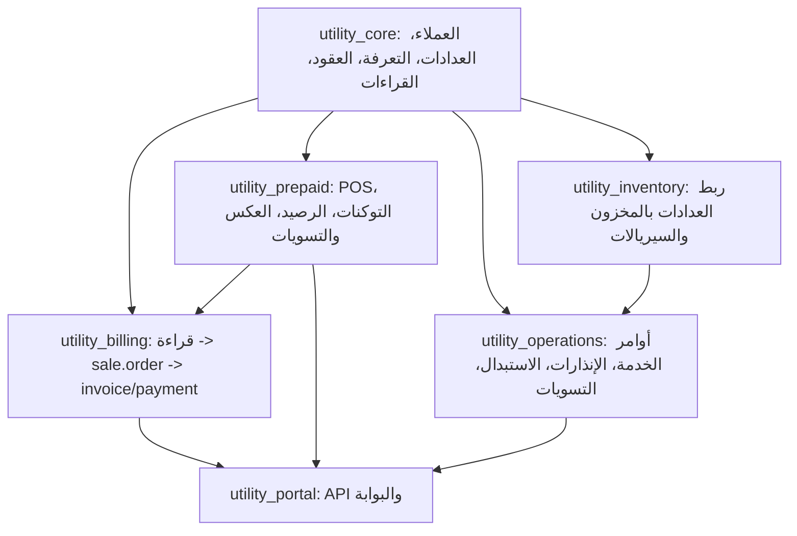

# مراجعة شاملة لمنطق الأعمال في Utility ERP

## 1. الهدف من المراجعة

هذه الوثيقة تراجع منطق الأعمال الحالي في موديولات Utility ERP على مستوى المسارات التشغيلية لا على مستوى تنسيق الكود فقط. الهدف هو تحديد:

1. هل مسارات العمل تعكس دورة شركة توزيع كهرباء بشكل صحيح؟
2. أين توجد مخاطر فواتير أو أرصدة أو مدفوعات غير صحيحة؟
3. أين توجد فجوات بين الموديولات أو اعتماد غير مكتمل؟
4. ما الأولويات العملية لتثبيت النظام قبل التوسع أو التشغيل الفعلي؟
5. ما التغييرات المعمارية الأخيرة التي يجب أخذها بعين الاعتبار؟

الموديولات المشمولة:

- `utility_core`
- `utility_inventory`
- `utility_prepaid`
- `utility_operations`
- `utility_billing`
- `utility_portal`

## 2. الخلاصة التنفيذية

النظام يملك أساساً جيداً لفصل المجالات: بيانات أساسية، قراءات، فوترة، دفع مسبق، عمليات ميدانية، مخزون، وبوابة. أهم قرار معماري صحيح هو الاعتماد على نماذج Odoo القياسية في الماليات والمبيعات مثل `sale.order`, `account.payment`, `pos.order`, و`account.move` بدلاً من نماذج مالية مخصصة بالكامل.

**تغيير معماري مهم (2026-07-02):** تم نقل نموذج `utility.reading` من `utility_billing` إلى `utility_core` كنموذج أساسي، وتم تحويل `utility_billing/models/utility_reading.py` إلى نموذج مورّث يضيف `batch_id` والطرق المالية فقط. تم حذف نموذج `utility.transformer.reading` القديم وتوحيد قراءات المحولات والخلايا والمشتركين تحت `utility.reading`. انظر وثيقة `MOVE_READING_MODEL_TO_CORE.md` للتفاصيل الكاملة.

**إصلاحات إضافية (2026-07-03):**
- إصلاح تضارب استبدال العداد: `utility_operations` يستخدم `_inherit` بدلاً من إعادة `_name`، واستخدام حقول غير متضاربة
- إصلاح الغرامات: إزالة `order.amount_penalty += amount` من الكرون (لا أثر حقيقي على `amount_total`)
- إصلاح أوامر الخدمة: إضافة `_check_state_transition()` لفرض تسلسل الحالات المسموحة
- إصلاح أمني: عزل `safe_eval` بتمرير قيم أولية فقط (id, name) بدلاً من كائنات ORM كاملة — منع وصول الصيغ إلى `env` وتعديل/قراءة السجلات
- إصلاح سلامة بيانات: إضافة `write()` override على `utility.reading` يمنع تعديل القراءات المفوترة — يُسمح فقط عبر `utility.reading.settlement` بسياق آمن
- إصلاح تسوية القراءات: إضافة فحص حالة `billed`، ربط بالفاتورة، إعادة حساب `_calculate_amounts()`، وتسجيل أثر في الـ chatter
- إصلاح `action_draft` في `sale.order`: منع إعادة الفاتورة للمسودة إذا كانت هناك فواتير محاسبية مرحلة
- ربط فواتير الغرامات: `action_apply_penalty()` يمرر `utility_sale_order_id` على الـ account.move لربطه بالفاتورة الأصلية للمطابقة (reconciliation) عند الدفع
- `amount_penalty` أصبح محسوباً: يجمع مبالغ الغرامات المطبّقة تلقائياً من `utility.penalty` بدلاً من حقل ميت
- استرداد التأمينات: استخدام `account.move` مباشرة مع حساب التأمينات بدلاً من `account.payment` — سند استرداد مستقل بإسناد محاسبي صحيح
- أمان API: إضافة `sudo()` + فحص ملكية الحساب (`partner_id`) في كل endpoint — منع وصول مستخدم لحسابات/فواتير لا تخصه
- أمان API: تقييد تقارير `reports_daily` للمستخدمين الداخليين فقط
- أداء: إضافة `index=True` على `bill_state`، `balance_due`، `is_overdue`، و`sale_order_id` في penalty
- أداء: إضافة batch limits للـ crons (500 للغرامات، 1000 لتحديث المتأخرات)
- تحديث الوثيقة: تصحيح معلومات خاطئة عن `_update_balance()`، `bill_state`، batch offset، ومنع تكرار الفاتورة، وAPI الدفع

**إصلاحات الجودة والورديات (2026-07-04):**
- جودة: إضافة `account_id` لبند فاتورة الغرامة (`fine_account_id` من الإعدادات ← المنتج ← الفئة)
- جودة: إضافة `partner_id` لقيود مصادرة التأمينات
- جودة: التحقق من وجود طرق دفع واردة في يومية التأمينات قبل إنشاء سند القبض
- جودة: إضافة `journal_id` و`payment_method_line_id` لدفع API — البحث عن اليومية من الإعدادات أو أول يومية بنك
- جودة: إضافة `sudo()` + `write()` بدلاً من التخصيص المباشر لحالة القراءة في `action_draft`
- جودة: إزالة context غير ضروري من استدعاء `_calculate_amounts()` في settlement
- ورديات: إضافة `@api.constrains` في `utility.cashier.shift` و`utility.collector.shift` يمنع فتح ورديتين لنفس المستخدم في وقت واحد
- صيغ: فشل الصيغة الديناميكية يرفع `ValidationError` (بدلاً من صفر صامت) — يوقف الفوترة برسالة واضحة
- أداء: إضافة `index=True` على `sale.order.meter_id` و`utility.reading.state`
- أداء: حماية `cron_generate_recurring_invoices` بـ try/except لكل حساب + batch limit 200
- أداء: تحسين `_compute_previous_reading` — استعلام واحد لكل عداد بدلاً من استعلام لكل قراءة
- أداء: تحسين `_compute_consumption_analysis` — استعلام واحد لكل عداد بدلاً من استعلام لكل قراءة
- أداء: إضافة `cashier_shift_id` على `pos.order` — ربط مباشر بدلاً من تصفية زمنية
- أداء: تحسين `_compute_pos_data` — استخدام `cashier_shift_id` المباشر مع fallback زمني
- أداء: تحسين API daily report — استخدام `search_count` + `read_group` بدلاً من `search` + Python sum

بعد المراجعة الدقيقة للكود الفعلي، تبيّن أن بعض الفجوات المذكورة سابقاً قد تم إصلاحها بالفعل، لكن توجد فجوات أخرى لا تزال قائمة:

| المستوى | الملاحظة | الحالة |
|---|---|---|
| حرج | إنشاء الدفع من API لا يقوم بترحيل `account.payment` ولا يقوم بعمل reconciliation مع الفاتورة | **تم التحقق — يعمل بشكل صحيح**: API ينشئ `account.payment` ويستدعي `action_post()` التي تقوم بـ reconciliation تلقائياً |
| عالٍ | توجد تضاربات في تعريف حقول استبدال العداد بين `utility_core` و`utility_operations` (إعادة تعريف `old_meter_id`، `new_meter_id`، `reason` بأنواع مختلفة) | **تم الإصلاح** — العمليات تستخدم حقولاً جديدة غير متضاربة |
| عالٍ | `safe_eval` يسمح بتمرير records للصيغة بدون طبقة عزل كافية | **تم الإصلاح** — تمرير قيم أولية (id, name) بدلاً من كائنات ORM كاملة |
| عالٍ | الغرامات تضيف `amount_penalty` على أمر البيع بدون إضافة بند أو إعادة حساب إجمالي الفاتورة | **تم الإصلاح** — إزالة `order.amount_penalty += amount` من الكرون، `amount_penalty` أصبح محسوباً من penalties، الغرامة تُنشئ فاتورة محاسبية منفصلة مربوطة بـ `utility_sale_order_id` |
| متوسط | العمليات الميدانية تغير حالات وعدادات بدون تحقق صارم من الانتقال | **تم الإصلاح** — إضافة `_check_state_transition` مع قائمة الحالات المسموحة لكل إجراء |
| متوسط | الصلاحيات والـ API تعتمد على `auth='user'` فقط ولا تربط الطلب بحساب المستخدم | **تم الإصلاح** — إضافة `sudo()` + فحص ملكية الحساب عبر `partner_id` في كل endpoint، تقييد التقارير للمستخدمين الداخليين |
| متوسط | استرداد التأمينات بدون سند محاسبي مستقل | **تم الإصلاح** — استخدام `account.move` مع حساب التأمينات مباشرة لسند استرداد مستقل |
| متوسط | ورديات الكاشير والمحصّل بدون قيود منع التداخل | **تم الإصلاح** — إضافة `@api.constrains` يمنع فتح ورديتين لنفس المستخدم بحالة open |
| متوسط | جودة محاسبية: حساب إيراد الغرامات، رقم حساب في قيود المصادرة | **تم الإصلاح** — `account_id` من الإعدادات + `partner_id` على القيود |
| متوسط | API الدفع بدون `journal_id`/`payment_method_line_id` | **تم الإصلاح** — البحث عن اليومية من الإعدادات أو أول يومية بنك متاحة |

### فجوات سابقة تم التحقق من عدم وجودها

| الملاحظة السابقة | الحقيقة الفعلية |
|---|---|
| `bill_state` حقل محسوب وتوجد دوال تكتب عليه | الكرون `cron_update_overdue_orders` يستدعي `_compute_bill_state()` (ال compute method) وليس write مباشر — صحيح |
| `_update_balance()` غير موجودة | الدالة موجودة في `utility_core/models/utility_customer.py:168` → `def _update_balance(self, amount)` |
| معالجة دفعات القراءات لا تحفظ offset | الدفعة تستخدم `processed_offset` وتقرأ `readings_data[start:start + batch_size]` — صحيح (سطر 123-125) |
| الفوترة من القراءة لا تمرر `date_range_id` | `action_generate_bill()` تمرر `self.date_range_id.id` — صحيح (سطر 33) |
| لا يوجد منع لتكرار فاتورة لنفس القراءة | يوجد فحص `sale.order.search([('reading_id', '=', self.id)])` قبل الإنشاء — صحيح (سطر 18-23) |
| API الدفع لا يقوم بالترحيل reconciliation | API ينشئ `account.payment` ← `action_post()` ← `_reconcile_utility_sale_order()` — صحيح |

## 3. خريطة منطق الأعمال الحالية

### 3.1 ترتيب الاعتمادية بين الموديولات

```
base, mail, contacts, account, date_range, sale, payment
          │
          ▼
    utility_core
    ├── utility.reading (نموذج أساسي)
    ├── utility.meter
    ├── utility.customer
    ├── utility.feeder
    ├── utility.transformer
    ├── utility.region
    ├── utility.route
    └── ...
          │
          ├───► utility_inventory
          │       └── يربط العدادات بالمخزون والسيريالات
          │
          ├───► utility_operations
          │       └── أوامر الخدمة، الإنذارات، الاستبدال، التسويات
          │
          ├───► utility_prepaid
          │       └── POS، التوكنات، الرصيد، العكس والتسويات
          │
          ├───► utility_billing
          │       └── قراءة -> sale.order -> invoice/payment
          │           (يوسّع utility.reading بـ batch_id والطرق المالية)
          │
          └───► utility_portal
                  └── API والبوابة
```

### 3.2 خريطة تدفق البيانات



الاعتماد العام منطقي، لكن يجب الانتباه إلى أن `utility_inventory` يعتمد على `utility_core` فقط، بينما بعض منطق الاستبدال العملي موجود أيضاً في `utility_operations`. هذا يجعل مسار الاستبدال معرضاً للتضارب إذا تم تثبيت الموديولين معاً.

## 4. معمارية البيانات

### 4.1 مصادر الحقيقة المقترحة

| المفهوم | النموذج المصدر | الملاحظات |
|---|---|---|
| حساب الكهرباء | `utility.customer` | يمثل عقد/اشتراك واحد مرتبط بـ `res.partner` |
| العداد | `utility.meter` | رقم فني + رقم تسلسلي + موقع شبكة |
| القراءة | `utility.reading` | في `utility_core` الآن؛ يدعم مشترك/محول/فيدر |
| الفاتورة | `sale.order` + `account.move` | أمر بيع ينتج فاتورة محاسبية |
| الدفع الآجل | `account.payment` | مرتبط بـ `utility_sale_order_id` |
| الدفع المسبق | `pos.order` + `utility.token` | بيع عبر نقطة البيع وتوليد توكن STS |
| الرصيد المسبق | `utility.transaction` ledger + `utility.customer.balance` | يحتاج توحيد مصدر الحقيقة |
| فترة الفوترة | `date.range` | ممتد بحقول منطقة ونوع عمل |
| الدور الوظيفي | `utility.user.role` | يربط الموظف بالمجموعات |
| الفريق | `utility.team` | مجموعة فنيين مع قائد |

### 4.2 نماذج محذوفة ومستبدلة

| النموذج المحذوف | البديل | الموقع |
|---|---|---|
| `utility.bill` | `sale.order` (مورّث) | `utility_billing/models/utility_sale_order.py` |
| `utility.bill.line` | `sale.order.line` (مورّث) | `utility_billing/models/utility_sale_order.py` |
| `utility.collection` | `account.payment` | `utility_billing/models/account_payment.py` |
| `utility.payment.allocation` | *(محذوف)* | — |
| `utility.sale` | `pos.order` (مورّث) | `utility_prepaid/models/utility_pos_order.py` |
| `utility.sale.line` | `pos.order.line` (مورّث) | Odoo POS |
| `utility.payment` | طرق دفع POS | Odoo POS |
| `utility.receipt` | إيصال POS | Odoo POS |
| `utility.transformer.reading` | `utility.reading` | `utility_core/models/utility_reading.py` |

## 5. مراجعة `utility_core`

### 5.1 العملاء والحسابات `utility.customer`

**الملفات:**
- `utility_core/models/utility_customer.py`
- `utility_core/views/utility_customer_views.xml`

المسار الحالي:

1. كل حساب كهرباء يمثله `utility.customer`.
2. الحساب مرتبط بـ `res.partner`.
3. يتم تعيين `customer_rank` و`is_subscriber` على الشريك تلقائياً.
4. يتم إنشاء حساب تحليلي تلقائياً عند إنشاء الحساب.
5. الحساب يحمل العداد، التعرفة/قالب العقد، الموقع، الرصيد، وآخر قراءة.

نقاط قوة:

- وجود رقم حساب فريد على مستوى الشركة.
- ربط مباشر بالعداد والمسار والمحول والفئة.
- إنشاء الحساب التحليلي تلقائياً خطوة مفيدة للتكامل المحاسبي.

ملاحظات ومخاطر:

1. `balance` يستخدم في الدفع المسبق والإنذارات، لكن لا توجد دالة مركزية موجودة لتحديثه رغم أن `utility_prepaid` يستدعي `_update_balance()`.
2. `last_reading_value`, `last_invoice_reading`, و`last_invoice_date` لا يتم تحديثها بشكل موحد عند اعتماد القراءة أو إصدار الفاتورة.
3. `payment_count` ثابت حالياً بقيمة صفر، لذلك الأزرار الذكية قد تعطي مؤشرات غير صحيحة.
4. إنشاء الحساب التحليلي يتم داخل `create` لكل حساب، وقد ينشئ خطة تحليلية افتراضية إذا لم توجد. هذا سلوك قوي لكنه قد يكون غير مرغوب في قواعد بيانات محاسبية مضبوطة.
5. التحقق من توافق `cell_id` و`meter_id` يعتمد على `cell.meter_ids | cell.coupling_meter_ids`، ويجب التأكد أن `coupling_meter_ids` موجود فعلاً في نموذج الفيدر/الخلية في كل حالة تثبيت.

التوصيات:

1. إضافة دالة مركزية على `utility.customer`:
   - `action_update_balance(amount, source_model=False, source_id=False)`
   - أو `_update_balance(delta)` مع قيود واضحة.
2. تحديث آخر قراءة وآخر قراءة مفوترة من مكان واحد عند:
   - اعتماد قراءة.
   - إصدار فاتورة.
   - استبدال عداد.
3. جعل إنشاء الحساب التحليلي قابلاً للتفعيل من الإعدادات، أو على الأقل عدم إنشاء خطة جديدة تلقائياً إلا بإذن واضح.
4. إصلاح `payment_count` ليحسب مدفوعات `account.payment` المرتبطة بفواتير الحساب.

### 5.2 العدادات `utility.meter`

**الملفات:**
- `utility_core/models/utility_meter.py`
- `utility_core/views/utility_meter_views.xml`

المسار الحالي:

- العداد يرتبط بعميل، فيدر، محول، محطة، ومنطقة.
- يدعم أنظمة الدفع: آجل، مسبق، يدوي.
- يوجد قيد فريد على رقم العداد داخل الشركة وقيد فريد على الرقم التسلسلي.

نقاط قوة:

- فصل `meter_number` عن `serial_number`.
- دعم عدادات الربط `is_coupling_meter`.
- وجود ربط فني بالشبكة.

ملاحظات ومخاطر:

1. لا توجد قيود تمنع ربط نفس العداد بأكثر من حساب من جهة العميل إذا تغيرت العلاقات بطريقة غير مباشرة.
2. `account_id` حقل related إلى `customer_id`، بينما بعض الكود يكتب `account_id` مباشرة على العداد في عمليات ميدانية، وهذا لن يكون مصدراً مستقلاً.
3. عند استبدال العداد يتم تعطيل العداد القديم في مسار، وفي مسار المخزون يعاد تفعيله كعداد معطل. هذا تضارب في تعريف دورة حياة العداد.

التوصيات:

1. اعتماد `customer_id` كمصدر وحيد لملكية العداد.
2. توثيق حالات العداد الفنية والمخزنية:
   - مركب.
   - في المخزن.
   - معطل.
   - مستبدل.
   - تالف.
3. عدم استخدام `active=False` كبديل وحيد للحالة الفنية، لأنه يخفي السجل من التشغيل والمراجعة.

### 5.3 القراءات `utility.reading`

**الملفات:**
- `utility_core/models/utility_reading.py` (النموذج الأساسي)
- `utility_billing/models/utility_reading.py` (التوسعة المالية)
- `utility_billing/views/utility_reading_views.xml`

المسار الحالي:

`draft -> under_review -> approved -> queued -> billed`

مع وجود حالة `error` للفوترة الدُفعية.

نقاط قوة:

- دورة مراجعة واضحة.
- حفظ صورة العداد للقراءات القابلة للفوترة.
- احتساب القراءة السابقة والاستهلاك آلياً.
- دعم قراءات المشترك والمحول والفيدر (توحيد حديث).

ملاحظات ومخاطر:

1. قيد التكرار الحالي `unique(meter_id, reading_date)` لا يمنع قراءتين لنفس العداد في نفس فترة الفوترة إذا اختلف الوقت.
2. الاستهلاك يمكن أن يصبح سالباً، ويتم تصنيفه كتنبيه، لكنه لا يمنع الفوترة لاحقاً.
3. اعتماد القراءة لا يحدث آخر قراءة على الحساب أو العداد.
4. `_compute_consumption_analysis` يبحث داخل compute لكل قراءة، وهذا قد يصبح مكلفاً عند البيانات الكبيرة.
5. عند رفض قراءة معتمدة تعود إلى `draft`، لكن لا يوجد تحقق إن كانت مفوترة أو مرتبطة بفواتير.

التوصيات:

1. إضافة قيد منطقي يمنع أكثر من قراءة قابلة للفوترة لنفس `meter_id` و`date_range_id` إلا إذا كانت قراءة تسوية واضحة.
2. منع فوترة الاستهلاك السالب أو وضعه في مسار تسوية مستقل.
3. تحديث `last_reading_value` و`last_reading_date` عند الاعتماد.
4. منع رفض القراءة إذا كانت `billed` إلا عبر إلغاء فاتورة أو تسوية معتمدة.

### 5.4 قوالب العقود والصيغ `utility.contract.template` و`utility.formula`

**الملفات:**
- `utility_core/models/utility_contract_template.py`
- `utility_core/models/utility_formula.py`
- `utility_core/models/utility_contract_template_block.py`
- `utility_core/models/utility_contract_template_history.py`

المسار الحالي:

- قالب العقد هو مصدر التسعير.
- البنود تولد من أسعار القالب أو من صيغ كمية ديناميكية.
- `safe_eval` ينفذ كود Python لحساب الكمية والاسم.

نقاط قوة:

- مرونة عالية في الفوترة.
- دعم الرسوم الثابتة والمحلية والخصومات والدعم.
- إمكانية مزامنة البنود من القالب.

ملاحظات ومخاطر:

1. `safe_eval` يعطى records مثل `account`, `category`, `line`, و`template`. هذا يسمح للصيغة بقراءة/استدعاء خصائص أكثر من المطلوب.
2. عند فشل الصيغة يتم إرجاع `0.0` بصمت نسبي، وهذا قد ينتج فاتورة ناقصة بدون إيقاف واضح.
3. لا توجد قيود على القيم السالبة أو غير المنطقية في أسعار القالب.
4. مزامنة البنود تحدث بإضافة بنود ناقصة وتحديث أسعار، لكنها لا تتعامل مع حذف أو تعطيل بند لم يعد مطلوباً.

التوصيات:

1. جعل فشل الصيغة يوقف الفاتورة أو يسجل خطأ فوترة واضحاً بدلاً من احتساب صفر في المسارات المالية.
2. تمرير بيانات قراءة فقط للصيغة بدلاً من records كاملة قدر الإمكان.
3. إضافة قيود على الأسعار والفترات:
   - `effective_date <= end_date`
   - الأسعار الأساسية لا تكون سالبة إلا في بنود الخصم.
4. توثيق قواعد الخصم والدعم محاسبياً قبل استخدام `sponsor_id` في invoice lines.

### 5.5 الفترات `date.range`

**الملفات:**
- `utility_core/models/utility_date_range.py`

المسار الحالي:

- توسيع `date.range` لإدارة فترات قراءة ودفع.
- فترة واحدة نشطة لكل نوع عمل/دورة/منطقة.

نقاط قوة:

- استخدام موديول Odoo موجود بدلاً من نموذج مخصص.
- دعم الفترات حسب المنطقة ونوع العمل.

ملاحظات ومخاطر:

1. القيد يسمح بفترة نشطة عامة وفترات نشطة لمنطقة إذا لم تضبط المنطقة بدقة.
2. `region_ids` موجود لكنه لا يدخل في قيد الفترة النشطة.
3. الفوترة من الفترة تستخدم `region_id` فقط، لا `region_ids`.

التوصيات:

1. تحديد هل الفترة تدعم منطقة واحدة أو عدة مناطق. الخلط الحالي يحتاج قرار.
2. توحيد الفوترة والتقارير على `region_id` أو `region_ids`.
3. إضافة تحقق من عدم تداخل تاريخي بين فترات نفس المنطقة ونوع العمل.

### 5.6 الموظفون والفرق `utility.staff` و`utility.team`

**الملفات:**
- `utility_core/models/utility_staff.py`
- `utility_core/models/utility_team.py`
- `utility_core/views/utility_staff_views.xml`

المسار الحالي:

- `utility.staff` يربط موظفاً بحساب مستخدم (`res.users`) ودور (`utility.user.role`).
- عند تغيير الدور أو المستخدم، يتم تحديث مجموعات المستخدم تلقائياً.
- `utility.team` يجمع عدة موظفين مع قائد للفريق.

نقاط قوة:

- ربط الدور الوظيفي بالمجموعات يبسط إدارة الصلاحيات.
- الفرق تساعد في توزيع العمل الميداني.

ملاحظات ومخاطر:

1. لا يوجد قيد يمنع تعيين نفس المستخدم لأكثر من موظف.
2. عند إزالة `user_id` من موظف لا يتم إزالة المجموعات المرتبطة بالدور من المستخدم.
3. لا يوجد سجل تاريخي لتغييرات الأدوار.

التوصيات:

1. إضافة قيد فريد على `user_id` داخل `utility.staff`.
2. معالجة إزالة المستخدم بإزالة المجموعات المرتبطة بالدور.
3. إضافة سجل تاريخي لتغييرات الأدوار إذا كانت مطلوبة للتدقيق.

## 6. مراجعة `utility_billing`

### 6.1 الفاتورة عبر `sale.order`

**الملفات:**
- `utility_billing/models/utility_sale_order.py`
- `utility_billing/models/utility_sale_workflow.py`
- `utility_billing/views/utility_sale_order_views.xml`

المسار الحالي:

1. القراءة المعتمدة تنشئ `sale.order`.
2. `_calculate_amounts()` ينشئ `sale.order.line` من قالب العقد.
3. يتم ربط القراءة والفترة والعداد والحساب.
4. حالة الفاتورة `bill_state` محسوبة من حالة أمر البيع والفواتير المحاسبية والدفع.

نقاط قوة:

- استخدام `sale.order` كحامل لفاتورة الكهرباء قرار جيد.
- `_calculate_amounts()` يمسح البنود ثم يعيد إنشاءها، وهذا يقلل التكرار عند إعادة الحساب اليدوي.
- وجود تقسيم مبالغ: طاقة، ثابت، خدمة، رسوم محلية، خصومات، غرامات.

ملاحظات حرجة:

1. `bill_state` معرف كـ `compute='_compute_bill_state', store=True`، ومع ذلك:
   - يتم تمريره عند إنشاء `sale.order`.
   - `cron_update_overdue_orders` يحاول `orders.write({'bill_state': 'overdue'})`.
   هذا غير متسق لأن الحقل المحسوب يعاد حسابه من الاعتمادات.
2. `date_range_id` مطلوب في `sale.order`، لكن `action_generate_bill()` من القراءة لا يمرر `date_range_id`. هذا قد يفشل أو يعتمد على default غير موجود.
3. لا يوجد قيد فريد يمنع أكثر من `sale.order` لنفس `reading_id`.
4. `_compute_previous_balance` يترك القيمة القديمة إذا لم يكن الأمر draft وكان لديه partner، لأنه لا يعين قيمة في كل فروع compute.
5. `balance_due = amount_total - paid` يعتمد على فواتير Odoo المنشورة فقط، بينما `account.payment.utility_sale_order_id` وحده لا يكفي لتخفيض الرصيد.
6. الخصم والحد الأقصى يضافان كبند سالب، لكن `amount_discount` يتراكم كموجب في حالة max charge، بينما البند نفسه سالب. يجب توحيد دلالة الحقل.

التوصيات:

1. جعل `bill_state` إما:
   - محسوباً فقط ولا يكتب عليه مباشرة.
   - أو حقلاً عادياً تديره أفعال واضحة.
   الخيار الأفضل حالياً: إبقاؤه محسوباً وإزالة كل writes المباشرة.
2. إضافة `date_range_id` عند الفوترة من القراءة:
   - من `reading.date_range_id`.
   - أو الفترة الحالية `work_type='readings'`.
   - مع منع الإنشاء إذا لا توجد فترة.
3. إضافة قيد SQL أو Python:
   - قراءة واحدة لا تنتج أكثر من فاتورة غير ملغاة.
4. إصلاح `_compute_previous_balance` ليعين قيمة دائماً.
5. توحيد معنى `amount_discount`: هل يخزن قيمة سالبة أم مقدار الخصم الموجب.

### 6.2 الفوترة من القراءة

**الملفات:**
- `utility_billing/models/utility_reading.py`

المسار الحالي:

- `action_generate_bill()` ينشئ فاتورة قراءة واحدة.
- `action_generate_bills_batch()` يرسل القراءات إلى `queued`.
- `_cron_generate_bills()` يعالج القراءات واحدة واحدة مع commit/rollback.

نقاط قوة:

- وجود طابور فوترة وحالة `error`.
- فشل قراءة لا يوقف الدفعة كاملة.

ملاحظات ومخاطر:

1. شرط `if self.state == 'billed'` داخل `action_generate_bill()` غير قابل للوصول فعلياً لأنه يأتي بعد شرط `self.state != 'approved'`.
2. لا يوجد تحقق من وجود فاتورة سابقة لنفس القراءة قبل إنشاء `sale.order`.
3. `self.env.cr.commit()` داخل loop مفيد للدُفعات لكنه يجب أن يستخدم بحذر ويوثق لأن Odoo عادة يدير transaction تلقائياً.
4. الخطأ يخزن `str(e)` فقط، وقد يكشف تفاصيل تقنية للمستخدمين.

التوصيات:

1. البحث عن فاتورة موجودة لنفس `reading_id` قبل الإنشاء.
2. نقل منطق إنشاء الفاتورة إلى دالة service واضحة يمكن استدعاؤها من الفترة والقراءة بدون تكرار.
3. حفظ خطأ تقني في اللوج ورسالة أعمال مختصرة في `billing_error`.

### 6.3 دفعات رفع القراءات `utility.reading.batch`

**الملفات:**
- `utility_billing/models/utility_reading_batch.py`
- `utility_billing/data/utility_cron_batch.xml`
- `utility_billing/views/utility_reading_batch_views.xml`

المسار الحالي:

- المستخدم يرفع JSON وصور.
- يتم حساب `total_readings`.
- Cron يعالج أول `batch_size` من JSON.

ملاحظة حرجة:

الدالة `_cron_process_readings()` تقرأ `readings_data[:batch_size]` في كل تشغيل، ولا تحفظ offset أو تزيل العناصر التي تمت معالجتها. معنى ذلك أن التشغيل التالي سيعيد محاولة نفس أول عناصر الملف، وقد ينتج:

- أخطاء تكرار بسبب `unique(meter_id, reading_date)`.
- توقف الدفعة عند partial.
- تضخم `processed_count` و`error_count` بدون عكس حقيقي للتقدم.

ملاحظات إضافية:

1. لا يوجد قيد idempotency على `reading_source` أو `batch_id + seq`.
2. الصور تطابق بالاسم فقط.
3. لا يوجد تحقق كافٍ من المنطقة أو الفترة أو أن العداد تابع للقارئ/المنطقة.

التوصيات:

1. إضافة `processed_offset` أو إنشاء نموذج child line لكل قراءة في الدفعة.
2. تخزين `seq` على `utility.reading` أو جدول وسيط لمنع إعادة المعالجة.
3. التحقق من أن `meter_number` داخل منطقة الدفعة إذا حددت `region_id`.
4. عدم استخدام `processed_count + error_count` كمؤشر وحيد إذا لا يوجد تتبع للعناصر التي عولجت.

### 6.4 المدفوعات `account.payment`

**الملفات:**
- `utility_billing/models/account_payment.py`
- `utility_billing/models/utility_cashier_shift.py`
- `utility_billing/models/utility_collector_shift.py`

المسار الحالي:

- إضافة رابط `utility_sale_order_id`.
- إضافة وسيلة دفع ووردية وفترة.
- اختيار وردية الكاشير أو المحصل المفتوحة تلقائياً.

نقاط قوة:

- الاعتماد على `account.payment` صحيح.
- ربط المدفوعات بالورديات والفترة مفيد للتقارير.

ملاحظات ومخاطر:

1. لا يوجد override أو action يضمن أن الدفع المرتبط بالفاتورة يتم ترحيله ومطابقته مع invoice.
2. لا يوجد تحقق أن مبلغ الدفع لا يتجاوز الرصيد المستحق إلا إذا كان ذلك مسموحاً كدفعة مقدمة.
3. لا يوجد تحقق أن الوردية مفتوحة عند إنشاء الدفع بعد default.
4. لا يوجد منع للدفع على فاتورة ملغاة أو مدفوعة.

التوصيات:

1. إنشاء دالة `action_register_utility_payment()` على `sale.order` أو wizard.
2. الدفع يجب أن:
   - ينشئ `account.payment`.
   - يرحله.
   - يعمل reconciliation مع invoice المفتوحة.
   - يحدث التقارير عبر حقول Odoo القياسية.
3. إضافة قيود على دفع فواتير `cancelled` أو `paid`.

### 6.5 الغرامات `utility.penalty`

**الملفات:**
- `utility_billing/models/utility_penalty.py`
- `utility_billing/data/utility_cron_extras.xml`

المسار الحالي:

- Cron ينشئ غرامة تأخير على الفواتير المتأخرة.
- `action_apply_penalty()` ينشئ `account.move` منفصل للغرامة.

**تم الإصلاح (2026-07-03):** تمت إزالة السطر `order.amount_penalty += amount` من الكرون — لم يكن له أثر حقيقي على `amount_total`. الغرامة الآن تُنشئ فاتورة محاسبية منفصلة فقط عبر `action_apply_penalty()`.

ملاحظات ومخاطر متبقية:

1. الغرامة قد تطبق كفاتورة محاسبية منفصلة، لكنها غير مربوطة reconciliation مع فاتورة الكهرباء الأصلية.
2. منع التكرار يومي فقط، أي أن نفس الفاتورة يمكن أن تحصل على غرامة يومية إذا الـ cron يومي. قد يكون مقصوداً أو خطأ حسب السياسة.
3. لا توجد سياسة واضحة: غرامة مرة واحدة، يومية، شهرية، أو مركبة.

التوصيات:

1. تحديد سياسة الغرامة.
2. ربط الغرامة إما:
   - كبند على فاتورة الكهرباء قبل ترحيلها.
   - أو كـ invoice منفصلة مرتبطة بـ `sale_order_id` مع reconciliation.

### 6.6 التأمينات `utility.deposit`

**الملفات:**
- `utility_billing/models/utility_deposit.py`
- `utility_billing/views/utility_deposit_views.xml`

المسار الحالي:

- قبض وديعة عبر `account.payment`.
- استرداد وديعة عبر `account.payment`.
- مصادرة وديعة عبر `account.move`.

نقاط قوة:

- استخدام القيود المحاسبية القياسية.
- وجود حالات: draft, held, released, forfeited.

ملاحظات ومخاطر:

1. `action_release_deposit()` لا يتحقق من إعداد `deposit_journal_id` قبل إنشاء الدفع.
2. لا يتم حفظ `payment_id` عند الاسترداد، فقط عند القبض.
3. لا يوجد قيد يمنع مبلغ وديعة صفر أو سالب.
4. لا يوجد فصل واضح بين سند قبض الوديعة وسند صرف الاسترداد.

التوصيات:

1. إضافة `release_payment_id`.
2. إضافة قيود مبلغ موجب.
3. التحقق من الإعدادات في كل action.
4. تحديد الحساب الدائن/المدين في payments إذا احتاجت المحاسبة ذلك.

### 6.7 التسويات المالية والإعفاءات

**الملفات:**
- `utility_billing/models/utility_writeoff.py`
- `utility_billing/models/utility_financial_settlement.py`

المراجعة العامة:

- النماذج موجودة وتنفذ قيوداً محاسبية أو تعدل فواتير.
- يجب التأكد أن كل تسوية مالية لها أثر محاسبي واضح وليست مجرد حقل على سجل تشغيلي.

التوصيات:

1. كل writeoff أو settlement يجب أن ينتج move أو credit note أو بند واضح.
2. منع تطبيق التسوية أكثر من مرة.
3. ربط التسوية بالمستخدم، التاريخ، السبب، والموافقة.

## 7. مراجعة `utility_prepaid`

### 7.1 البيع عبر POS والتوكنات

**الملفات:**
- `utility_prepaid/models/utility_pos_order.py`
- `utility_prepaid/models/utility_token.py`
- `utility_prepaid/models/utility_adjustment.py`
- `utility_prepaid/models/utility_reversal.py`

المسار الحالي:

- `pos.order` يحمل حساب الكهرباء والعداد والقالب.
- `_generate_token()` ينشئ `utility.token` ويستدعي مزود STS محاكى.
- `_apply_balance()` يزيد رصيد الحساب وينشئ `utility.transaction`.

نقاط قوة:

- ربط POS بالعداد والحساب.
- فصل سجل التوكن عن الطلب.
- وجود status للتوكن.

ملاحظات حرجة:

1. `_apply_balance()` يستدعي `self.account_id._update_balance()` والدالة غير موجودة في `utility.customer`.
2. لا يوجد hook واضح يضمن استدعاء `_generate_token()` عند دفع أو إكمال `pos.order`.
3. `_generate_token()` لا يمنع توليد توكن جديد إذا كان `token_id` موجوداً مسبقاً.
4. التوكن المحاكى ثابت النمط وقد لا يكون فريداً بما يكفي.
5. لا يوجد ربط قوي بين مبلغ POS الفعلي و`amount_paid` المضاف هنا، وقد يتعارض مع حقل Odoo القياسي أو يحجبه.

التوصيات:

1. إضافة دالة balance مركزية في `utility.customer`.
2. ربط توليد التوكن بحدث POS الصحيح، مع idempotency:
   - إذا يوجد `token_id` ناجح لا يتم إنشاء آخر.
3. إضافة قيد يمنع أكثر من توكن ناجح لنفس `pos_order_id`.
4. عند الانتقال من المحاكاة إلى STS فعلي، يجب حفظ request/response بدون كشف أسرار.

### 7.2 الحركات `utility.transaction`

**الملفات:**
- `utility_prepaid/models/utility_transaction.py`

المسار الحالي:

- يسجل نوع الحركة، المبلغ، الرصيد قبل وبعد، الحساب، العداد، POS، العكس أو التسوية.

ملاحظة حرجة:

في `create_transaction()` يتم تعيين:

```python
'customer_id': account.customer_id.id
```

لكن في `utility.customer` الحقل `customer_id` هو self Many2one إلى نفس النموذج، بينما `utility.transaction.customer_id` يتوقع `res.partner`. هذا قد يسجل قيمة ID من نموذج خاطئ أو يفشل منطقياً.

التوصيات:

1. استخدام `account.partner_id.id` في `customer_id`.
2. إضافة `utility_customer_id` إذا كان مطلوباً فصل الشريك عن حساب الكهرباء.
3. جعل transaction ledger هو المصدر المرجعي لحركات الرصيد، والرصيد الحالي نتيجة قابلة للتدقيق.

### 7.3 العكس والتسويات

**الملفات:**
- `utility_prepaid/models/utility_reversal.py`
- `utility_prepaid/models/utility_adjustment.py`

المسار الحالي:

- `utility.reversal` يعتمد approve ثم complete.
- `utility.adjustment` يعتمد approve ثم apply.

ملاحظات ومخاطر:

1. كلاهما يعتمد على `_update_balance()` غير الموجودة.
2. لا يوجد منع لتطبيق نفس العكس مرتين إذا حصل race condition.
3. العكس لا يتحقق أن المبلغ لا يتجاوز البيع الأصلي في حالة partial.
4. التسوية debit/credit لا تملك أثر محاسبي واضح إذا كان الرصيد المالي مرتبطاً بالمحاسبة.

التوصيات:

1. إضافة قيود state قوية داخل transaction.
2. ربط العكس بالـ POS order والتحقق من إجمالي المبالغ المعكوسة سابقاً.
3. تحديد هل prepaid balance محاسبي أم تشغيلي فقط، وبناء القيود على هذا القرار.

### 7.4 ورديات الكاشير

**الملفات:**
- `utility_prepaid/models/utility_cashier_shift.py`

المسار الحالي:

- الوردية تحسب مبيعات POS للمستخدم بين وقت البداية والنهاية.

ملاحظات ومخاطر:

1. البحث في كل `pos.order` للمستخدم ثم `filtered` في Python قد يكون مكلفاً.
2. لا يوجد تحقق أن المستخدم لا يملك ورديتين مفتوحتين.
3. لا يتم ربط POS orders بالوردية مباشرة، لذلك تقارير الوردية تعتمد على الزمن فقط.

التوصيات:

1. إضافة قيد: وردية مفتوحة واحدة لكل كاشير.
2. إضافة `cashier_shift_id` على `pos.order` أو ضبطه وقت البيع.
3. استخدام domain كامل في search بدلاً من filtered بعد البحث.

## 8. مراجعة `utility_operations`

### 8.1 أوامر الخدمة

**الملفات:**
- `utility_operations/models/utility_service_order.py`
- `utility_operations/views/utility_service_order_views.xml`

المسار الحالي:

`draft -> approved -> scheduled -> in_progress -> completed/cancelled`

نقاط قوة:

- حالات بسيطة ومفهومة.
- يدعم أنواع خدمة متعددة.
- عند إكمال استبدال العداد، يتم نقل الربط من القديم إلى الجديد.

**تم الإصلاح (2026-07-03):** تمت إضافة دالة `_check_state_transition()` في `utility_service_order.py` تتحقق من أن الحالة الجديدة مسموحة بناءً على الحالة الحالية. قائمة الانتقالات المسموحة:
- `draft` ← `approved`، `cancelled`
- `approved` ← `scheduled`
- `scheduled` ← `in_progress`
- `in_progress` ← `completed`، `cancelled`

ملاحظات ومخاطر متبقية:

1. `action_complete()` لا يتأكد من وجود الفني أو تاريخ الجدولة أو القراءات المطلوبة.
2. في استبدال العداد يتم الكتابة على `new_meter_id.account_id` رغم أن `account_id` related في نموذج العداد.
3. لا يتم إنشاء سجل `utility.meter.replacement` عند إكمال أمر خدمة استبدال.

التوصيات:

1. ربط أمر خدمة استبدال العداد بسجل استبدال رسمي.
2. جعل إكمال الخدمة لا يغير ملكية العداد إلا عبر خدمة موحدة.

### 8.2 استبدال العداد

**الملفات:**
- `utility_core/models/utility_meter_replacement.py`
- `utility_operations/models/utility_meter_replacement.py`
- `utility_inventory/models/utility_meter_replacement.py`

**تم الإصلاح (2026-07-03):** تم تعديل `utility_operations/models/utility_meter_replacement.py` لاستخدام `_inherit = 'utility.meter.replacement'` بدلاً من إعادة تعريف `_name`. كما تم:

- إزالة إعادة تعريف الحقول المتضاربة (`old_meter_id`, `new_meter_id`, `reason`)
- استخدام `order_number` بدلاً من `name`
- استخدام `utility_account_id` من النموذج الأب
- إضافة حقول جديدة غير متضاربة: `replacement_date`, `old_meter_final_reading`, `new_meter_initial_reading`, `unbilled_consumption`, `replacement_notes`
- دالة `action_complete_replacement` تستخدم `utility_account_id` و`old_meter_id`/`new_meter_id` من الأب

التوصيات المتبقية:

1. نقل منطق المخزون إلى inherit واضح يعتمد على نفس الحقول.
2. اعتماد action واحد لإكمال الاستبدال، ثم يستدعي hooks اختيارية للمخزون.

### 8.3 تسوية القراءات

**الملفات:**
- `utility_operations/models/utility_readings_settlement.py`

المسار الحالي:

- التسوية تغير قيمة قراءة موجودة.
- لا تعيد حساب الفواتير المرتبطة أو القراءات اللاحقة.

ملاحظات ومخاطر:

1. إذا كانت القراءة مفوترة، تغيير `reading_value` لا يعدل `sale.order` الناتج.
2. لا يوجد منع من تسوية قراءة `billed`.
3. التعليق يقول إعادة حساب اللاحق، لكن التنفيذ لا يفعل ذلك.

التوصيات:

1. منع تعديل قراءة مفوترة مباشرة.
2. إذا كانت مفوترة، إنشاء تسوية مالية أو فاتورة فرق.
3. إعادة حساب القراءات اللاحقة أو تعليمها كـ `under_review`.

### 8.4 الإنذارات

**الملفات:**
- `utility_operations/models/utility_alarm.py`

المسار الحالي:

- إنذار انخفاض الرصيد ينشأ إذا الرصيد أقل من 50.
- يمكن إنشاء أمر خدمة من الإنذار.

ملاحظات ومخاطر:

1. الحد 50 ثابت وغير مأخوذ من إعدادات أو حد ائتمان الحساب.
2. الإنذار يمرر `region_id` رغم أنه related إلى `area_id.parent_id`، وقد لا يقبل الكتابة في بعض الحالات.
3. لا يوجد batch limit في cron.

التوصيات:

1. استخدام `credit_limit` من الحساب أو إعداد عام.
2. إضافة batch limit.
3. جعل إنشاء أمر الخدمة يمنع التكرار إذا يوجد أمر مفتوح لنفس الإنذار.

## 9. مراجعة `utility_inventory`

**الملفات:**
- `utility_inventory/models/utility_meter_replacement.py`

المسار الحالي:

- يضيف `product_id`, `lot_id`, و`condition` للعداد.
- يربط السيريال المخزني برقم العداد.
- يضيف حركة مخزنية عند استبدال العداد.

نقاط قوة:

- الاتجاه صحيح: العداد أصل مخزني Serialized.
- استخدام `stock.lot` مناسب للعدادات.

ملاحظات ومخاطر:

1. دالة الاستبدال المخزني تعتمد على حقول ومسار `utility_core`، بينما `utility_operations` يعيد تعريف نفس النموذج. هذا يجعل التكامل هشاً.
2. `_create_transfer()` لا يتحقق من وجود `product_id`, `uom_id`, أو `picking_type` قبل إنشاء الحركة.
3. `picking.button_validate()` قد يحتاج wizard في حالات Odoo معينة، مثل backorder أو immediate transfer.
4. لا يوجد تحقق أن `lot_id` متاح فعلاً في الموقع المصدر قبل صرف العداد الجديد.

التوصيات:

1. توحيد نموذج استبدال العداد أولاً.
2. قبل إنشاء transfer:
   - تحقق من المنتج.
   - تحقق من lot.
   - تحقق من الرصيد في الموقع.
   - تحقق من picking type.
3. تسجيل روابط `stock.picking` على سجل الاستبدال للمراجعة.
4. عدم الاعتماد على `active=False` للعداد القديم إذا كان سيعود للمخزون أو الإصلاح.

## 10. مراجعة `utility_portal`

**الملفات:**
- `utility_portal/controllers/portal_api.py`
- `utility_portal/controllers/portal_customer_api.py`
- `utility_portal/controllers/portal_payment_api.py`

المسار الحالي:

- API JSON للاستعلام عن الرصيد والفواتير.
- API لدفع فاتورة.
- API لإنشاء طلب خدمة.
- API لتقرير يومي.

نقاط قوة:

- يغطي احتياجات البوابة الأساسية.
- يستخدم نماذج Odoo القياسية.

ملاحظات حرجة:

1. `auth='user'` يعني أن أي مستخدم مسجل يملك صلاحية النموذج قد يستعلم عن أي `account_number` إذا لم تمنعه record rules.
2. API الدفع ينشئ `account.payment` لكنه لا يستدعي `action_post()` ولا يطابق الدفع مع الفاتورة.
3. لا يوجد تحقق أن المبلغ موجب.
4. لا يوجد تحقق أن الفاتورة تخص الحساب أو المستخدم الحالي.
5. `browse(int(order_id))` يقبل أي ID ولا يتحقق من حالة الفاتورة.
6. `reports_daily` يبدو أقرب لتقرير داخلي، ولا يجب أن يكون متاحاً لأي مستخدم بوابة.

التوصيات:

1. فصل API العملاء عن API الإدارة.
2. ربط المستخدم الحالي بحساباته المصرح بها.
3. دفع الفاتورة يجب أن يمر عبر service محمية تنفذ:
   - التحقق.
   - إنشاء الدفع.
   - الترحيل.
   - reconciliation.
   - الرد بحالة واضحة.
4. إضافة rate limiting أو مفاتيح API إذا ستستخدم خارج الواجهة الداخلية.

## 11. مشاكل عابرة للموديولات

### 11.1 تعريف مصادر الحقيقة

يجب تحديد مصدر الحقيقة لكل مفهوم:

| المفهوم | المصدر المقترح |
|---|---|
| ملكية العداد | `utility.meter.customer_id` مع انعكاس واضح على `utility.customer.meter_id` |
| الرصيد prepaid | ledger في `utility.transaction` + حقل مخزن على `utility.customer` |
| ذمة postpaid | `account.move` و`account.payment` بعد reconciliation |
| حالة فاتورة الكهرباء | compute من `sale.order` والفواتير المحاسبية |
| آخر قراءة | آخر `utility.reading` معتمدة/مفوترة، مع حقول cached على الحساب |
| فترة الفوترة | `date.range` محددة على القراءة والفاتورة |

### 11.2 Idempotency

المسارات التالية تحتاج ضمان عدم التكرار:

1. قراءة واحدة لا تنتج فاتورتين.
2. POS order واحد لا ينتج توكنين ناجحين.
3. Reversal واحد لا يطبق مرتين.
4. Adjustment واحد لا يطبق مرتين.
5. Batch upload لا يعالج نفس entry مرتين.
6. Penalty cron لا يكرر غرامة غير مقصودة لنفس السياسة.

### 11.3 المحاسبة مقابل الحقول التشغيلية

أي مبلغ مالي يجب أن يكون له أثر محاسبي واضح أو تعريف بأنه تشغيلي فقط:

- `balance` في `utility.customer`
- `amount_penalty`
- `amount_discount`
- `deposit.amount`
- `adjustment.amount`
- `reversal.amount`
- `balance_due`

بدون هذا الفصل، ستظهر فروقات بين شاشات النظام ودفاتر Odoo.

### 11.4 الصلاحيات

المسارات عالية الحساسية:

1. اعتماد القراءة.
2. توليد الفاتورة.
3. إعادة حساب الفاتورة.
4. تسجيل الدفع.
5. تطبيق الغرامة أو الإعفاء.
6. عكس عملية prepaid.
7. تسوية قراءة مفوترة.
8. استبدال عداد.

كل مسار يجب أن يملك:

- صلاحية group واضحة.
- تحقق server-side داخل الدالة، وليس فقط إخفاء زر في XML.
- سجل تتبع للمستخدم والوقت والسبب.

## 12. سجل التغييرات المعمارية

### 2026-07-02: توحيد القراءات ونقلها إلى utility_core

**الملفات المعدلة:**
- `utility_core/models/utility_reading.py` (جديد)
- `utility_core/models/__init__.py`
- `utility_core/security/ir.model.access.csv`
- `utility_core/data/utility_sequence.xml`
- `utility_core/views/utility_feeder_views.xml`
- `utility_core/models/utility_customer.py`
- `utility_billing/models/utility_reading.py`
- `utility_billing/security/ir.model.access.csv`

**السبب:**
- `utility.feeder` (في core) كان يحتوي على `One2many` إلى `utility.reading` (في billing)، مما يسبب `KeyError: 'feeder_id'` عند تحميل `utility_core`.
- نموذج `utility.transformer.reading` كان محذوفاً لكن بعض الحقول والصلاحيات والتسلسلات كانت لا تزال تشير إليه.

**النتيجة:**
- نموذج `utility.reading` أصبح أساسياً في `utility_core`.
- `utility_billing` يرثه ويضيف `batch_id` والطرق المالية فقط.
- جميع حقول `One2many` المشتركة أصبحت تشير إلى `utility.reading` مباشرة.
- إزالة جميع الإشارات المتبقية إلى `utility.transformer.reading`.

## 13. الأولويات المقترحة للإصلاح

### ✅ تم إنجازه (2026-07-03)

| الأولوية | الإصلاح | الملفات المتأثرة |
|---|---|---|
| عالٍ | تضارب استبدال العداد: `utility_operations` يستخدم `_inherit` بدلاً من إعادة `_name`، إزالة حقول متضاربة | `utility_operations/models/utility_meter_replacement.py` |
| عالٍ | الغرامات: إزالة الكتابة المباشرة على `order.amount_penalty` دون أثر محاسبي | `utility_billing/models/utility_penalty.py` |
| عالٍ | عزل `safe_eval`: تمرير قيم أولية (id, name) بدلاً من كائنات ORM — منع وصول الصيغ لـ `env` | `utility_core/models/utility_formula.py` |
| عالٍ | حماية القراءات المفوترة: `write()` override يمنع تعديل حقول محمية عندما `state == 'billed'` | `utility_core/models/utility_reading.py` |
| عالٍ | تسوية القراءات: فحص `billed`، ربط بالفاتورة، إعادة حساب amounts، أثر في chatter | `utility_operations/models/utility_readings_settlement.py` |
| عالٍ | ربط فواتير الغرامات بالفاتورة الأصلية: `utility_sale_order_id` في move | `utility_billing/models/utility_penalty.py` |
| عالٍ | `amount_penalty` أصبح محسوباً من `penalty_ids` (حقل ميت سابقاً) | `utility_billing/models/utility_sale_order.py` |
| متوسط | أوامر الخدمة: إضافة `_check_state_transition()` لفرض تسلسل الحالات | `utility_operations/models/utility_service_order.py` |
| متوسط | منع إعادة فاتورة للمسودة إذا كانت هناك فواتير محاسبية مرحلة | `utility_billing/models/utility_sale_order.py` |
| متوسط | استرداد التأمينات: استخدام `account.move` مع حساب التأمينات (سند مستقل) | `utility_billing/models/utility_deposit.py` |
| متوسط | أمان API: `sudo()` + فحص ملكية الحساب + تقييد التقارير | `utility_portal/api/utility_api_main.py` |
| متوسط | ورديات الكاشير والمحصّل: `@api.constrains` يمنع فتح ورديتين لنفس المستخدم | `utility_prepaid/models/utility_cashier_shift.py` + `utility_billing/models/utility_collector_shift.py` |
| متوسط | جودة: `account_id` + `partner_id` في فواتير الغرامات والمصادرات | `utility_billing/models/utility_penalty.py` + `utility_deposit.py` |
| متوسط | جودة: `journal_id` + `payment_method_line_id` في API الدفع | `utility_portal/api/utility_api_main.py` |
| متوسط | فشل الصيغة: يرفع `ValidationError` بدلاً من صفر صامت | `utility_core/models/utility_formula.py` |
| متوسط | حماية `cron_generate_recurring_invoices` بـ try/except لكل حساب | `utility_billing/models/utility_recurring_invoice.py` |
| متوسط | تحسين `_compute_previous_reading` و `_compute_consumption_analysis`: استعلام واحد لكل عداد | `utility_core/models/utility_reading.py` |
| متوسط | إضافة `cashier_shift_id` على `pos.order` + تحسين `_compute_pos_data` | `utility_prepaid/models/utility_pos_order.py` + `utility_cashier_shift.py` |
| متوسط | تحسين API daily report: `search_count` + `read_group` بدلاً من `search` + Python sum | `utility_portal/api/utility_api_main.py` |
| — | فهارس: `sale.order.meter_id`، `utility.reading.state` | `utility_sale_order.py` + `utility_reading.py` |
| — | فهارس: `bill_state`، `balance_due`، `is_overdue`، `sale_order_id` | `utility_billing/models/utility_sale_order.py` + `utility_penalty.py` |
| — | Batch limits: 500 للغرامات، 1000 لتحديث المتأخرات | `utility_billing/models/utility_penalty.py` + `utility_sale_order.py` |
| — | تم التحقق أن `_update_balance()` موجودة فعلياً في `utility.customer` — لم تكن مفقودة | `utility_core/models/utility_customer.py:168` |
| — | تم التحقق أن `bill_state` لا يُكتب عليه مباشرة (cron يستخدم compute method) | غير مطلوب |
| — | تم التحقق أن `action_generate_bill()` يمرر `date_range_id` ويمنع تكرار الفاتورة | `utility_billing/models/utility_reading.py:18-33` |
| — | تم التحقق أن batch reading يستخدم `processed_offset` بالفعل | `utility_billing/models/utility_reading_batch.py:123-125` |
| — | تم التحقق أن API الدفع يعمل: ينشئ account.payment + action_post() + reconciliation تلقائي | `utility_portal/api/utility_api_main.py` + `utility_billing/models/account_payment.py` |

### أولوية 1: منع فشل التنفيذ أو فساد مالي

*(لا توجد فجوات حرجة متبقية — جميع بنود الأولوية 1 السابقة تم إصلاحها أو التحقق من عدم وجودها)*

### أولوية 2: تثبيت الحالات ومسارات الاعتماد

*(لا توجد فجوات متبقية — فشل الصيغة يرفع `ValidationError` بدلاً من صفر صامت)*

### أولوية 3: جودة محاسبية وتشغيلية

*(لا توجد فجوات متبقية — تمت إضافة `@api.constrains` لمنع فتح ورديتين لنفس المستخدم)*

### أولوية 4: الأداء والتوسع

*(تم: batch limits + فهارس رئيسية + تحسين compute loops لقراءات العدادات + ربط POS orders بالورديات + read_group في التقارير)*

1. *(لا توجد فجوات أداء حرجة متبقية)*

### DoList تنفيذ التحسينات (2026-07-04)

هذه القائمة هي مسار التنفيذ العملي للتحسينات المقترحة في القسم 16، وليست بديلاً عن المراجعة التفصيلية أعلاه. يتم تحديث الحالة بعد كل دفعة تنفيذ.

| الحالة | الأولوية | التحسين | نطاق التنفيذ | معيار القبول |
|---|---|---|---|---|
| تم | حرج | شرائح الاستهلاك المتدرجة | `utility.contract.template.block`, `_calculate_amounts()` | فاتورة باستهلاك متعدد الشرائح تنتج بنوداً صحيحة، وتفشل بوضوح إذا لم تغط الشرائح كامل الاستهلاك |
| تم | حرج | كشف حساب المشترك | `utility.customer`, `sale.order`, `account.payment`, تقرير PDF/واجهة | wizard من نموذج المشترك يطبع PDF يعرض الرصيد الافتتاحي، الفواتير، الدفعات، والإجمالي لفترة مختارة |
| تم | حرج | تقرير توازن المحولات | `utility.reading`, `utility.transformer`, تقارير | wizard وتقرير PDF يقارنان عدادات الربط بإجمالي قراءات المشتركين داخل الفترة ويعرضان الفاقد ونسبة الإنذار |
| تم | حرج | ربط AMI كبوابة إدخال قراءات | `utility.integration.provider`, API callback, `utility.reading` | مزود AMI، زر طلب قراءة من العداد، callback يستقبل القراءة وينشئ `utility.reading` بنوع `ami` مع سجل تكامل |
| تم | عالٍ | ضبط فترات القراءة والدفع | `date.range`, `account.payment`, `utility.reading` | فترة الدفع مرتبطة بفترة قراءة، والفاتورة/الدفع يلتقطان الفترة الصحيحة تلقائياً |
| تم | عالٍ | QR Code للعدادات والفواتير والمدفوعات | `utility.meter`, `sale.order`, `account.payment`, تقارير PDF | QR محسوب للعداد والفاتورة والدفع، مع ملصق عداد، QR على فاتورة الكهرباء، وإيصال دفع PDF يحتوي QR |
| تم | عالٍ | الفصل التلقائي وإعادة التوصيل | `utility.service.order`, `sale.order`, cron | أزرار يدوية وكرون يومي ينشئ أوامر فصل للمتأخرات، ويغير إكمال أمر الخدمة حالة المشترك إلى مفصول/نشط |
| تم | عالٍ | خطة التقسيط | `utility.installment.plan`, `sale.order`, `account.payment` | إنشاء خطة من الفاتورة، توليد أقساط شهرية، وحساب المدفوع/المتبقي وحالة كل قسط من مدفوعات الفاتورة |
| تم | عالٍ | إشعارات متعددة القنوات | `utility.notification.log`, إعدادات SMS/portal، crons | سجل إشعارات قابل للمراجعة للفواتير والمدفوعات والمتأخرات، مع قناة portal دائماً وSMS اختياري من الإعدادات |
| تم | متوسط | Generic Payment Connector | `utility.integration.provider`, `utility.payment.gateway.transaction`, webhook، transaction log | مزود دفع قابل للتكوين، payment intent، webhook مؤمن برمز، وإنشاء `account.payment` عند نجاح الدفع |
| لم يبدأ | متوسط | بوابة الخدمة الذاتية | `utility_portal` | المشترك يرى فواتيره وقراءاته ويدفع أو يرسل طلب خدمة ضمن صلاحياته فقط |
| لم يبدأ | متوسط | إدارة العقود ونقل الملكية | `utility.customer`, `res.partner`, سجل تاريخي | نقل حساب من مشترك لآخر مع حفظ التاريخ وعدم كسر الفواتير السابقة |
| لم يبدأ | متوسط | الإقفال الشهري | `date.range`, billing/accounting reports | منع تعديل فترات مقفلة وإصدار ملخص مالي وتشغيلي للشهر |
| لم يبدأ | منخفض | Idempotency في crons | كرونات الفوترة، الغرامات، القراءات، الدفع | إعادة تشغيل cron لا تكرر فاتورة/غرامة/دفعة لنفس المصدر |
| لم يبدأ | منخفض | عزل منطق التسعير في خدمة قابلة للاختبار | `utility_billing` service layer | `_calculate_amounts()` يستدعي خدمة منفصلة يمكن اختبارها بمدخلات محددة |

ترتيب التنفيذ المقترح:

1. إضافة اختبارات قبول تشغيلية لكل مسار منجز قبل الانتقال للمرحلة التالية.

## 14. سيناريوهات اختبار أعمال مطلوبة

لا توجد بنية اختبارات حالياً، لكن هذه هي السيناريوهات التي يجب بناؤها أولاً:

1. إنشاء مشترك مع عداد وقالب عقد.
2. إنشاء قراءة، إرسالها للمراجعة، اعتمادها.
3. توليد فاتورة من القراءة، والتأكد من:
   - وجود `date_range_id`.
   - وجود بنود صحيحة.
   - تحول القراءة إلى `billed`.
   - منع توليد فاتورة ثانية لنفس القراءة.
4. إنشاء invoice من `sale.order` وترحيلها.
5. تسجيل دفع وربطه ومطابقته، ثم تحول `bill_state` إلى `paid`.
6. رفع batch قراءات من JSON على دفعتين والتأكد من عدم تكرار أول عناصر الملف.
7. بيع prepaid عبر POS وتوليد توكن مرة واحدة.
8. عكس عملية prepaid جزئياً وكلياً مع تحقق الرصيد.
9. استبدال عداد مع مخزون:
   - خروج العداد الجديد.
   - رجوع القديم.
   - تحديث الحساب.
   - إنشاء قراءات الإغلاق والافتتاح.
10. تسوية قراءة مفوترة والتأكد من إنشاء أثر مالي لا تعديل صامت.

## 15. تعريف الجاهزية التشغيلية

يمكن اعتبار منطق الأعمال جاهزاً مبدئياً عند تحقق التالي:

1. لا توجد دوال تستدعي methods غير موجودة في المسارات الأساسية.
2. لا يوجد نموذج معرف بنفس `_name` في أكثر من موديول بدون قصد واضح.
3. كل عملية مالية تملك أثراً محاسبياً أو تعريفاً تشغيلياً موثقاً.
4. كل مسار دُفعي قابل للإعادة بدون تكرار نتائج.
5. كل قراءة وفاتورة ودفع وتوكن واستبدال عداد يملك idempotency واضح.
6. API البوابة لا يسمح بالوصول إلى حسابات غير مصرح بها.
7. توجد اختبارات أو سيناريوهات تحقق يدوية موثقة للمسارات العشرة الأساسية.

## 16. اقتراحات تحسين منطق الأعمال والعمليات

### 16.1 الفوترة والتسعير

| الاقتراح | الوصف | الأولوية | الأثر |
|---|---|---|---|
| **شرائح استهلاك متدرجة (Tiered Pricing)** | دعم أسعار شرائح (مثلاً: أول 100 kWh بسعر، 101–300 بسعر أعلى، 300+ بأعلى سعر) ضمن قالب العقد الواحد دون الحاجة لصيغ معقدة | عالية | زيادة دقة الفوترة، توافق مع أنظمة دعم الكهرباء في معظم الدول العربية |
| **التسعير حسب وقت الاستخدام (ToU)** | تعريف فترات ذروة/غير ذروة ضمن `date.range` وربطها بأسعار مختلفة في قالب العقد | عالية | تشجيع ترشيد الاستهلاك، توافق مع شبكات العدادات الذكية (AMI) |
| **رسوم إعادة الربط (Reconnection Fee)** | إضافة بند تلقائي عند تنشيط حساب بعد فصل لعدم السداد | متوسطة | أتمتة عملية إعادة التيار |
| **الحد الأدنى/الأقصى لكل بند (وليس للإجمالي فقط)** | حالياً `min_charge`/`max_charge` على الإجمالي فقط. اقتراح: إضافتهما لكل `contract.template.line` | متوسطة | مرونة تسعيرية أكبر |

### 16.2 القراءات والعدادات

| الاقتراح | الوصف | الأولوية | الأثر |
|---|---|---|---|
| **ربط تلقائي مع أنظمة AMI/ADMS** | **تم تنفيذ طبقة التكامل الأساسية**: مزود AMI، طلب قراءة من العداد، callback خارجي ينشئ `utility.reading` بنوع `ami`، وسجل تكامل | عالية | أتمتة كاملة للقراءات، إلغاء القراءة اليدوية |
| **القراءة التقديرية الذكية (Smart Estimation)** | إذا فاتت قراءة الشهر، احتساب تقديري بناءً على متوسط آخر 3 أشهر أو نفس الشهر من العام الماضي مع مراعاة الموسمية | عالية | استمرارية الفوترة، تقليل القراءات التقديرية اليدوية |
| **كشف التلاعب التلقائي (Auto Tamper Detection)** | مقارنة الاستهلاك مع المعدل التاريخي — إذا انخفض فجأة > 70%، إنشاء `utility.alarm` أو `utility.service.order` من نوع تفتيش | متوسطة | تقليل الفاقد التجاري |
| **التسوية الدفعية للقراءات (Bulk Settlement)** | إضافة `_cron_settle_readings()` تكتشف أي قراءة `billed` تم تعديلها (عبر settlement) وتقوم تلقائياً بإنشاء فاتورة تصحيحية أو إشعار دائن/مدين | متوسطة | سلامة مالية بعد التسويات اليدوية |

### 16.3 التحصيل والديون

| الاقتراح | الوصف | الأولوية | الأثر |
|---|---|---|---|
| **خطة تقسيط الفواتير (Installment Plan)** | نموذج `utility.installment.plan` يقسم الرصيد المتأخر على أقساط شهرية مع متابعة السداد وتنبيه عند التخلف | عالية | تحسين التحصيل، تقليل الفصل |
| **الفصل التلقائي المرحلي (Auto Disconnection)** | مسار عمل: متأخر 30 يوم ← إنذار، 60 يوم ← إنذار نهائي، 90 يوم ← أمر فصل. يتم إنشاء `utility.service.order` تلقائياً | عالية | أتمتة دورة التحصيل الكاملة |
| **إعادة الربط التلقائي (Auto Reconnection)** | عند سداد كامل المتأخرات (أو أول قسط)، إنشاء أمر إعادة ربط تلقائي بمجرد استلام الدفع | متوسطة | تجربة مشترك سلسة |
| **التسوية البنكية التلقائية (Bank Reconciliation)** | رفع كشف بنكي ومطابقة المدفوعات مع `account.payment` تلقائياً باستخدام المرجع والرقم الإلكتروني | متوسطة | تقليل العمل اليدوي للمحصلين |
| **رسوم التحصيل المتأخر (Late Fee Stacking)** | بدلاً من غرامة يوم واحد على الرصيد الكلي، دعم تراكم الغرامات يومياً/أسبوعياً مع حد أقصى | منخفضة | توافق مع بعض الأنظمة التنظيمية |

### 16.4 العمليات الميدانية

| الاقتراح | الوصف | الأولوية | الأثر |
|---|---|---|---|
| **توجيه الفرق الميدانية (Route Optimization)** | استخدام `utility.route` لتحسين مسار الفني/المحصل بناءً على موقع العدادات وحالة أوامر الخدمة | عالية | تقليل وقت التنقل، زيادة إنتاجية الفرق |
| **تطبيق جوال للفنيين (Mobile App)** | واجهة API إضافية للفني: استلام أمر خدمة، تحديث الحالة، رفع صور العداد، توقيع المشترك إلكترونياً | عالية | تحسين كفاءة العمل الميداني |
| **جدولة أوامر الخدمة الذكية (Smart Scheduling)** | اقتراح وقت الجدولة تلقائياً بناءً على: أولوية الأمر، موقع الفني، أوقات عمل المشترك | متوسطة | تقليل المواعيد الضائعة |
| **مخزون السيارات (Truck Stock)** | ربط مخزون بسيارة الفني — عند إكمال استبدال عداد، خصم العداد الجديد تلقائياً من مخزون السيارة | متوسطة | دقة المخزون، تقليل زيارات المستودع |

### 16.5 المشتركين والخدمة

| الاقتراح | الوصف | الأولوية | الأثر |
|---|---|---|---|
| **نظام الشكاوى (Complaints System)** | نموذج `utility.complaint` مستقل عن أوامر الخدمة مع مسار: استلام ← توجيه ← حل ← إغلاق ← استطلاع رضا | متوسطة | تحسين خدمة العملاء |
| **إدارة العقود (Contract Lifecycle)** | إضافة `contract_state` (جديد ← نشط ← معلق ← منتهي) مع تحقق تلقائي من صلاحية العداد، التأمين، والسجل التجاري | متوسطة | تقليل المخاطر التعاقدية |
| **نقل الملكية (Ownership Transfer)** | مسار عمل لنقل حساب الكهرباء من مشترك لآخر: قراءة إغلاق للقديم، عداد جديد للجديد (أو استمرار العداد)، تسوية الرصيد | متوسطة | أتمتة عملية معقدة حالياً يدوية |
| **المشترك متعدد العدادات (Multi-Meter Customer)** | دعم حساب كهرباء واحد يملك عدّادين أو أكثر (مثلاً: فيلا + ملحق) مع تجميع الفواتير | متوسطة | تغطية حالات استخدام حقيقية |

### 16.6 المحاسبة والتقارير

| الاقتراح | الوصف | الأولوية | الأثر |
|---|---|---|---|
| **كشف حساب المشترك (Customer Statement)** | تقرير PDF مفصل: جميع الفواتير والمدفوعات والأرصدة خلال فترة معينة، مع إتاحة download من البوابة | عالية | طلب قانوني وتنظيمي شائع |
| **تقرير توازن المحولات (Transformer Balance)** | مقارنة الطاقة الداخلة للمحول (قراءة الخلية) مع مجموع قراءات المشتركين + الفاقد الفني — لكشف الفاقد التجاري (السرقة) | عالية | أداة حاسمة لتقليل الفاقد |
| **تقرير إيرادات يومي/شهري (Revenue Report)** | باستخدام `read_group`: الإيرادات حسب (المنطقة، نوع الدفع، قالب العقد) مقارنة بالفترة السابقة | متوسطة | اتخاذ قرارات إدارية |
| **إحكام الإقفال الشهري (Month-End Closing)** | مسار عمل: تجميد القراءات ← فوترة ← تحصيل ← تسوية ← إقفال ← تقارير إقفال مع منع أي تعديل بعد الإقفال | متوسطة | انضباط محاسبي |
| **تدقيق الفواتير (Invoice Audit Trail)** | حقل `audit_log` نص يخزن تسلسل التعديلات على الفاتورة (منشئ، مراجع، مدخل قراءة، تعديلات سعر) | منخفضة | شفافية للرقابة |

### 16.7 البوابة الإلكترونية والتكامل

| الاقتراح | الوصف | الأولوية | الأثر |
|---|---|---|---|
| **الدفع عبر بوابة إلكترونية (Payment Gateway)** | **تم تنفيذ طبقة التكامل الأساسية**: مزود دفع، معاملة دفع، payment intent، webhook، وإنشاء `account.payment` عند التأكيد | عالية | تمكين الدفع الإلكتروني |

#### 16.7.1 تفصيل: Generic Payment Connector (GPC)

##### المشكلة
النظام الحالي يدعم الدفع فقط عبر `account.payment` اليدوي. شركات الكهرباء تحتاج الربط مع **أي مزوّد دفع محلي** — مهما كانت طريقة API الخاصة به. كل مزوّد له:
- رابط API مختلف
- طريقة مصادقة مختلفة (Basic Auth، Bearer Token، HMAC، Custom Header)
- Payload مختلف الشكل (JSON، XML، Form-Data)
- استجابة مختلفة (حقل النجاح في مكان مختلف، اسم حقل مختلف للمبلغ)

**الحل:** Generic Connector يُكوّن بالكامل من الإعدادات — كل شيء يُحدد في واجهة المستخدم.

##### التصميم

```
payment.provider
│
├── [name] "MTN Money"
├── [api_url] "https://api.mtn.ye/v1/pay"
├── [http_method] POST
│
├── request_headers (One2many):
│   ├── "Authorization" = "Bearer {api_key}"
│   └── "Content-Type"  = "application/json"
│
├── request_body_template:
│   └── '{ "amount": {amount}, "ref": "{ref}", "msisdn": "{phone}" }'
│
├── response_success_field:    "status"
├── response_success_value:    "success"
├── response_txid_field:       "transaction.id"
├── response_amount_field:     "amount"
│
├── webhook_signature_header:  "X-Signature"
├── webhook_signature_field:   "signature"
├── webhook_secret:            "whsec_..."
│
└── verify_amount: true
```

**لا يوجد كود برمجي لأي مزوّد جديد — كل شيء يُملأ من الشاشة.**

###### 1. نموذج مزوّد الدفع (`payment.provider`)

```python
class PaymentProvider(models.Model):
    _name = 'payment.provider'
    _description = 'مزوّد الدفع — قابل للتكوين بالكامل'
    _rec_name = 'name'
    _order = 'sequence'

    name = fields.Char('اسم المزوّد', required=True, translate=True)
    sequence = fields.Integer('الترتيب', default=10)
    active = fields.Boolean('نشط', default=True)
    company_id = fields.Many2one('res.company', default=lambda self: self.env.company)

    # ——— نوع التكامل ———
    integration_type = fields.Selection([
        ('api', 'API — النظام يستدعي API المزوّد'),
        ('webhook', 'Webhook — المزوّد يرسل إشعاراً'),
        ('reference', 'مرجع — دفع عبر قناة خارجية'),
        ('manual', 'يدوي — تأكيد من الموظف'),
    ], string='نوع التكامل', default='manual', required=True)

    # ===== إعدادات API (لـ integration_type = api) =====
    api_url = fields.Char('رابط API',
        help='الرابط الكامل للـ endpoint\n'
             'مثال: https://api.provider.com/v1/create-invoice')
    http_method = fields.Selection([
        ('POST', 'POST'), ('GET', 'GET'), ('PUT', 'PUT'),
    ], string='طريقة HTTP', default='POST')
    api_key = fields.Char('مفتاح API')
    api_secret = fields.Char('المفتاح السري')

    # ——— Headers قابلة للتكوين ———
    header_ids = fields.One2many('payment.provider.header', 'provider_id',
        string='هيدرات الطلب',
        help='Key/Value pairs تُرسل مع كل طلب API')

    # ——— قالب الـ Body ———
    request_body_template = fields.Text('قالب جسم الطلب',
        help='نص الطلب مع placeholders. المتغيرات المتاحة:\n'
             '{amount} - المبلغ\n'
             '{ref} - رقم المرجع\n'
             '{order} - رقم الفاتورة\n'
             '{phone} - جوال المشترك\n'
             '{name} - اسم المشترك\n'
             '{email} - بريد المشترك\n'
             '{customer_id} - رقم الحساب\n'
             '{api_key} - مفتاح API\n'
             '{api_secret} - المفتاح السري\n'
             'مثال: {"amount":{amount},"ref":"{ref}","customer":"{name}"}')
    content_type = fields.Selection([
        ('json', 'application/json'),
        ('form', 'application/x-www-form-urlencoded'),
        ('xml', 'application/xml'),
    ], string='نوع المحتوى', default='json')

    # ——— تحليل الاستجابة ———
    response_success_field = fields.Char('حقل النجاح',
        help='JSON Path للحقل الدال على النجاح\n'
             'مثال: status / result.status / code')
    response_success_value = fields.Char('قيمة النجاح',
        help='القيمة المتوقعة لحقل النجاح\nمثال: success / 1 / ok / true')
    response_txid_field = fields.Char('حقل معرف المعاملة',
        help='JSON Path لرقم المعاملة لدى المزوّد\n'
             'مثال: transaction.id / data.reference / paymentId')
    response_amount_field = fields.Char('حقل المبلغ',
        help='JSON Path للمبلغ المؤكد من المزوّد\n'
             'مثال: amount / data.paidAmount / transaction.amount')
    response_url_field = fields.Char('حقل رابط الدفع',
        help='JSON Path لرابط الدفع (إن وجد)\n'
             'مثال: payment_url / data.redirectUrl / invoice.link')
    verify_amount = fields.Boolean('التحقق من المبلغ', default=True,
        help='يقارن المبلغ المرسل مع المبلغ في استجابة المزوّد')

    # ===== إعدادات Webhook (لـ integration_type = webhook) =====
    webhook_signature_header = fields.Char('هيدر التوقيع',
        help='اسم الهيدر الذي يحمل التوقيع\nمثال: X-Signature / X-Hash / Authorization')
    webhook_signature_field = fields.Char('حقل التوقيع في الـ Body',
        help='إذا كان التوقيع داخل جسم الطلب نفسه\nمثال: hash / signature')
    webhook_signature_algorithm = fields.Selection([
        ('hmac_sha256', 'HMAC-SHA256'),
        ('hmac_sha1', 'HMAC-SHA1'),
        ('sha256', 'SHA256 (plain)'),
        ('md5', 'MD5'),
        ('none', 'لا يوجد توقيع'),
    ], string='خوارزمية التوقيع', default='hmac_sha256')
    webhook_secret = fields.Char('المفتاح السري للـ Webhook')
    webhook_txid_field = fields.Char('حقل معرف المعاملة في الـ Webhook',
        help='JSON Path لرقم المعاملة في طلب الـ Webhook\n'
             'مثال: transaction_id / ref / data.reference')
    webhook_amount_field = fields.Char('حقل المبلغ في الـ Webhook',
        help='JSON Path للمبلغ في طلب الـ Webhook\n'
             'مثال: amount / paid_amount / transaction.amount')

    # ——— إعدادات محاسبية ———
    payment_journal_id = fields.Many2one('account.journal', 'اليومية',
        required=True, domain=[('type', 'in', ('bank', 'cash'))])
    payment_method_line_id = fields.Many2one(
        'account.payment.method.line', 'طريقة الدفع')

    # ——— إعدادات العرض ———
    logo = fields.Binary('الشعار', attachment=True)
    instruction = fields.Text('تعليمات الدفع', translate=True,
        help='تظهر للمشترك عند اختيار المزوّد')
```

```python
class PaymentProviderHeader(models.Model):
    _name = 'payment.provider.header'
    _description = 'هيدر طلب API'
    _order = 'sequence'

    provider_id = fields.Many2one('payment.provider', 'المزوّد',
        required=True, ondelete='cascade')
    sequence = fields.Integer('الترتيب', default=10)
    key = fields.Char('اسم الهيدر', required=True)
        # مثال: Authorization, X-Merchant-Id, Content-Type
    value = fields.Char('القيمة', required=True,
        help='يدعم placeholders: {api_key}, {api_secret}\n'
             'مثال: Bearer {api_key}')
```

###### 2. محرك التنفيذ — الكود الوحيد المطلوب (لن يتغير أبداً)

هذا الكود يُكتب **مرة واحدة** ويشتغل مع **أي مزوّد** لأن كل شيء مقروء من الإعدادات:

```python
import requests
import json
import hmac
import hashlib
import logging
from datetime import timedelta

_logger = logging.getLogger(__name__)


class PaymentProvider(models.Model):
    _inherit = 'payment.provider'

    def _build_headers(self):
        """تجميع الهيدرات من الإعدادات مع تعويض الـ placeholders"""
        headers = {}
        for h in self.header_ids:
            val = h.value.replace('{api_key}', self.api_key or '') \
                          .replace('{api_secret}', self.api_secret or '')
            headers[h.key] = val
        if self.content_type == 'json' and 'Content-Type' not in headers:
            headers['Content-Type'] = 'application/json'
        elif self.content_type == 'form' and 'Content-Type' not in headers:
            headers['Content-Type'] = 'application/x-www-form-urlencoded'
        return headers

    def _build_body(self, tx):
        """تجميع body الطلب من القالب مع تعويض placeholders"""
        partner = tx.partner_id
        vals = {
            'amount': tx.amount,
            'ref': tx.provider_ref or '',
            'order': tx.sale_order_id.name or '',
            'phone': partner.phone or partner.mobile or '',
            'name': partner.name or '',
            'email': partner.email or '',
            'customer_id': tx.account_id.account_number or '',
            'api_key': self.api_key or '',
            'api_secret': self.api_secret or '',
        }
        body = self.request_body_template
        for k, v in vals.items():
            body = body.replace('{%s}' % k, str(v))
        if self.content_type == 'json':
            try:
                return json.loads(body)
            except json.JSONDecodeError:
                return body
        return body

    def _extract_jsonpath(self, data, path):
        """استخراج قيمة من dict متداخل باستخدام dotted path"""
        if not path:
            return None
        parts = path.split('.')
        current = data
        for part in parts:
            if isinstance(current, dict):
                current = current.get(part)
            elif isinstance(current, list):
                try:
                    current = current[int(part)] if part.isdigit() else None
                except (IndexError, ValueError):
                    return None
            else:
                return None
        return current

    def action_call_api(self, tx):
        """استدعاء API المزوّد — generic لأي مزوّد"""
        import requests

        headers = self._build_headers()
        body = self._build_body(tx)
        url = self.api_url

        try:
            if self.http_method == 'GET':
                response = requests.get(url, headers=headers, params=body,
                                       timeout=30)
            elif self.http_method == 'PUT':
                response = requests.put(url, headers=headers, json=body,
                                       timeout=30)
            else:  # POST
                if self.content_type == 'json':
                    response = requests.post(url, headers=headers, json=body,
                                            timeout=30)
                elif self.content_type == 'form':
                    response = requests.post(url, headers=headers, data=body,
                                            timeout=30)
                else:
                    response = requests.post(url, headers=headers, data=body,
                                            timeout=30)

            data = response.json()
            tx.write({'provider_response': json.dumps(data)[:2000]})

            # تحليل الاستجابة حسب الإعدادات
            success = self._extract_jsonpath(data, self.response_success_field)
            expected = self.response_success_value

            if str(success).lower() == str(expected).lower():
                tx_id_from_provider = self._extract_jsonpath(
                    data, self.response_txid_field) or ''
                tx.write({
                    'provider_ref': tx_id_from_provider,
                    'state': 'pending',
                })
                return {
                    'success': True,
                    'tx_id': tx_id_from_provider,
                    'url': self._extract_jsonpath(data, self.response_url_field) or '',
                }
            else:
                error = data.get('message') or data.get('error') or str(data)[:200]
                tx.write({'error_message': error, 'state': 'failed'})
                return {'success': False, 'error': error}

        except Exception as e:
            _logger.error("API call failed for %s: %s", self.name, e)
            tx.write({'error_message': str(e), 'state': 'failed'})
            return {'success': False, 'error': str(e)}

    def verify_webhook(self, payload, headers_dict):
        """التحقق من Webhook — generic لكل المزوّدات"""
        if self.webhook_signature_algorithm == 'none':
            return True

        secret = self.webhook_secret or ''
        # جلب التوقيع من الهيدر أو من الـ body
        signature = ''
        if self.webhook_signature_header:
            signature = headers_dict.get(self.webhook_signature_header, '')
        if not signature and self.webhook_signature_field:
            signature = self._extract_jsonpath(payload, self.webhook_signature_field) or ''

        if not signature:
            return False

        # حساب التوقيع المتوقع
        raw = json.dumps(payload, separators=(',', ':')) if isinstance(payload, dict) else str(payload)
        if self.webhook_signature_algorithm == 'hmac_sha256':
            expected = hmac.new(secret.encode(), raw.encode(), hashlib.sha256).hexdigest()
        elif self.webhook_signature_algorithm == 'hmac_sha1':
            expected = hmac.new(secret.encode(), raw.encode(), hashlib.sha1).hexdigest()
        elif self.webhook_signature_algorithm == 'sha256':
            expected = hashlib.sha256((raw + secret).encode()).hexdigest()
        elif self.webhook_signature_algorithm == 'md5':
            expected = hashlib.md5((raw + secret).encode()).hexdigest()
        else:
            return False

        return hmac.compare_digest(signature, expected)
```

###### 3. إنشاء معاملة واستدعاء API (آلي بالكامل)

```python
class UtilityPaymentTransaction(models.Model):
    _name = 'utility.payment.transaction'
    _description = 'معاملة دفع'
    _rec_name = 'name'
    _order = 'create_date desc'

    name = fields.Char('رقم المعاملة', default=lambda self: _('New'), readonly=True)
    sale_order_id = fields.Many2one('sale.order', 'الفاتورة', required=True, index=True)
    account_id = fields.Many2one('utility.customer', related='sale_order_id.customer_id', store=True)
    partner_id = fields.Many2one('res.partner', related='sale_order_id.partner_id', store=True)
    amount = fields.Monetary('المبلغ', currency_field='currency_id')
    currency_id = fields.Many2one('res.currency', related='sale_order_id.currency_id')

    provider_id = fields.Many2one('payment.provider', 'مزوّد الدفع', required=True, index=True)
    provider_ref = fields.Char('المرجع لدى المزوّد', index=True)
    provider_response = fields.Text('استجابة المزوّد')

    state = fields.Selection([
        ('draft', 'مسودة'),
        ('pending', 'في انتظار الدفع'),
        ('completed', 'تم الدفع'),
        ('failed', 'فشل'),
        ('expired', 'منتهي'),
    ], string='الحالة', default='draft', index=True, tracking=True)

    payment_id = fields.Many2one('account.payment', 'الدفعة', readonly=True)
    error_message = fields.Text('رسالة الخطأ', readonly=True)
    confirmed_by = fields.Many2one('res.users', 'تم التأكيد بواسطة', readonly=True)
    confirmed_at = fields.Datetime('تاريخ التأكيد', readonly=True)

    def action_send_to_provider(self):
        """إرسال المعاملة للمزوّد عبر API — generic"""
        self.ensure_one()
        if self.state != 'draft':
            raise ValidationError('يمكن إرسال المعاملات المسودة فقط')
        self.state = 'pending'
        result = self.provider_id.action_call_api(self)
        return result

    def action_confirm_payment(self):
        """تأكيد الدفع — يُستدعى من Webhook أو يدوياً"""
        self.ensure_one()
        if self.state not in ('pending', 'draft'):
            raise ValidationError('المعاملة غير قابلة للتأكيد')

        payment = self.env['account.payment'].create({
            'partner_id': self.partner_id.id,
            'amount': self.amount,
            'payment_type': 'inbound',
            'partner_type': 'customer',
            'journal_id': self.provider_id.payment_journal_id.id,
            'payment_method_line_id':
                self.provider_id.payment_method_line_id.id or
                self.provider_id.payment_journal_id.inbound_payment_method_line_ids[:1].id,
            'utility_sale_order_id': self.sale_order_id.id,
            'ref': '%s: %s' % (self.provider_id.name, self.provider_ref or self.name),
        })
        payment.action_post()
        self.write({
            'state': 'completed',
            'payment_id': payment.id,
            'confirmed_by': self.env.user.id,
            'confirmed_at': fields.Datetime.now(),
        })
```

###### 4. API إنشاء معلمة دفع — Generic بالكامل

```python
@http.route('/api/v1/utility/billing/pay', type='json', auth='user', methods=['POST'])
def billing_pay(self, **kwargs):
    """إنشاء معاملة دفع عبر أي مزوّد — كل شيء من الإعدادات"""
    params = request.jsonrequest
    order = self._authorize_order(params.get('order_id'))
    if not order:
        return {'error': 'Order not found'}
    if order.bill_state in ('paid', 'cancelled'):
        return {'error': 'Bill is not payable'}

    provider = request.env['payment.provider'].sudo().browse(int(params.get('provider_id', 0)))
    if not provider.exists():
        return {'error': 'Provider not found'}

    tx = request.env['utility.payment.transaction'].sudo().create({
        'sale_order_id': order.id,
        'amount': float(params.get('amount', order.balance_due)),
        'provider_id': provider.id,
        'provider_ref': params.get('reference', ''),
        'state': 'draft',
    })

    if provider.integration_type == 'api':
        # استدعاء API المزوّد فوراً — generic
        result = provider.action_call_api(tx)
        if result.get('success'):
            tx.write({'provider_ref': result.get('tx_id', tx.provider_ref)})
            return {
                'transaction_id': tx.id,
                'provider': provider.name,
                'redirect_url': result.get('url'),
                'state': 'pending',
            }
        else:
            return {
                'transaction_id': tx.id,
                'provider': provider.name,
                'error': result.get('error'),
                'state': 'failed',
            }

    elif provider.integration_type == 'reference':
        ref = 'UTIL-%s-%s' % (tx.id, order.name)
        tx.write({'provider_ref': ref, 'state': 'pending'})
        return {
            'transaction_id': tx.id,
            'provider': provider.name,
            'reference': ref,
            'instruction': provider.instruction or '',
            'state': 'pending',
        }

    else:  # manual / webhook
        tx.write({'state': 'pending'})
        return {
            'transaction_id': tx.id,
            'provider': provider.name,
            'instruction': provider.instruction or '',
            'state': 'pending',
        }
```

###### 5. Webhook — نقطة استقبال موحّدة (تشتغل مع أي مزوّد)

```python
@http.route('/api/v1/utility/payment/webhook/<int:provider_id>',
            type='json', auth='none', methods=['POST', 'GET'], csrf=False)
def payment_webhook(self, provider_id, **kwargs):
    """نقطة استقبال Webhook موحّدة — generic لكل المزوّدات"""
    provider = request.env['payment.provider'].sudo().browse(provider_id)
    if not provider.exists():
        return {'error': 'Provider not found'}

    payload = request.jsonrequest or request.httprequest.form.to_dict()
    headers = dict(request.httprequest.headers)

    # 1. البحث عن المعاملة
    tx_ref = provider._extract_jsonpath(payload, provider.webhook_txid_field) or \
             payload.get('reference') or payload.get('ref') or \
             payload.get('transaction_id') or ''
    tx = request.env['utility.payment.transaction'].sudo().search([
        '|', ('provider_ref', '=', tx_ref), ('id', '=', str(tx_ref).replace('UTIL-', '').split('-')[0] if '-' in str(tx_ref) else 0),
        ('state', '=', 'pending'),
    ], limit=1)
    if not tx:
        provider._logger.warning("Webhook: tx not found for ref %s", tx_ref)
        return {'status': 'ignored'}

    # 2. التحقق من التوقيع
    if not provider.verify_webhook(payload, headers):
        tx.write({'error_message': 'Invalid webhook signature'})
        return {'error': 'Invalid signature'}

    # 3. التحقق من المبلغ
    if provider.verify_amount and provider.webhook_amount_field:
        paid = float(provider._extract_jsonpath(payload, provider.webhook_amount_field) or 0)
        if paid != tx.amount:
            tx.write({'error_message': 'Amount mismatch: got %s, expected %s' % (paid, tx.amount)})
            return {'error': 'Amount mismatch'}

    # 4. تنفيذ الدفع
    tx.provider_ref = provider._extract_jsonpath(payload, provider.webhook_txid_field) or tx.provider_ref
    tx.action_confirm_payment()
    return {'status': 'ok'}
```

###### 6. أمثلة تكوين — سيناريوهات حقيقية

**أ. MTN Money (يمن) — API مباشر:**

```
الاسم:             MTN Money
النوع:             api
رابط API:          https://api.mtn.ye/merchant/v1/payment
طريقة HTTP:         POST

الهيدرات:
  Authorization     Bearer {api_key}
  X-Merchant-ID    {api_secret}
  Content-Type     application/json

قالب Body:
  {"amount":{amount},"ref":"{ref}","customer":{"name":"{name}","phone":"{phone}","email":"{email}"}}

تحليل الاستجابة:
  حقل النجاح:          status
  قيمة النجاح:         success
  حقل معرف المعاملة:   transaction.reference
  حقل رابط الدفع:      transaction.payment_url
```

**ب. Webhook مباشر من بنك محلي:**

```
الاسم:             بنك التسليف
النوع:             webhook
هيدر التوقيع:       X-Signature
خوارزمية:          hmac_sha256
المفتاح السري:     whsec_abc123
حقل المعرف:         bill_ref
حقل المبلغ:         amount
```

**ج. تحصيل نقدي (يدوي):**

```
الاسم:             مكتب تحصيل - التحرير
النوع:             manual
تعليمات:           "قم بزيارة المكتب في شارع التحرير وأحضر رقم الفاتورة"
 اليومية:           صندوق التحصيل النقدي
```

**د. محفظة إلكترونية (Reference + Webhook):**

```
الاسم:             Yemen Mobile Wallet
النوع:             reference
قالب المرجع:       YMW-{tx.id}-{order}
تعليمات:           "ادفع عبر تطبيق يمنا موبايل باستخدام المرجع أعلاه"

هيدر التوقيع:      X-Wallet-Sig
خوارزمية:          sha256
المفتاح السري:     wallet_sec_789
حقل المعرف:        data.billRef
حقل المبلغ:        data.paidAmount
```

###### 7. ملخص — مبدأ "Zero Code" للربط

| المبدأ | التطبيق |
|---|---|
| **كل مزوّد = سجل في قاعدة البيانات** | `payment.provider` مع حقول تكوين كاملة |
| **لا كود برمجي لأي مزوّد** | API URL، Headers، Body template، Response parsing كلها من الإعدادات |
| **JSON Path للتوجيه** | `response_success_field` = `"data.status"` يقرأ `{data: {status: "ok"}}` |
| **Placeholders في كل مكان** | `{amount}`, `{ref}`, `{phone}`, `{name}` تُستبدل تلقائياً |
| **Webhook generic** | توقيع، معرف معاملة، مبلغ — كلها قابلة للتكوين |
| **يدعم كل أنواع التكامل** | API مباشر، Webhook، Reference، يدوي |

#### 16.7.2 نظام QR Code للعدادات والفواتير (QR Code System)

##### المشكلة
- القراءة الميدانية: القارئ يقف أمام العداد ويكتب الرقم يدوياً — خطأ بشري، بطيء، غير موثوق
- الدفع الإلكتروني: المشترك يحتاج لكتابة رقم الفاتورة يدوياً في تطبيق الدفع — خطأ، تجربة سيئة
- تتبع الأصول: المهندس يحتاج لمعرفة تاريخ العداد ومكانه بسرعة

##### الحل: QR Code موحّد للعدادات والفواتير مع تطبيق جوال

```
┌─────────────────────────────────────────────────────────┐
│                    QR Code System                        │
├─────────────────────────────────────────────────────────┤
│                         │                                │
│            ┌────────────┴────────────┐                   │
│            ▼                         ▼                   │
│     QR العداد                  QR الفاتورة              │
│     (مطبوع على العداد)          (مطبوع على الفاتورة)    │
│            │                         │                   │
│            ▼                         ▼                   │
│     مسح ← تطبيق جوال          مسح ← تطبيق دفع           │
│     ← قراءة/صيانة             ← تعبئة بيانات الدفع      │
│     ← تتبع الأصول             ← دفع مباشر               │
└─────────────────────────────────────────────────────────┘
```

###### 1. هيكل QR Code

**أ. QR العداد — بيانات ثابتة:**

| الحقل | الحجم | مثال |
|---|---|---|
| المعرف (`id`) | 8-16 حرف | `MTR-2024-001234` |
| نوع العنصر (`t`) | 1 حرف | `m` (meter) / `t` (transformer) |
| رمز الشركة (`c`) | 3-6 حرف | `UTIL` |

**التنسيق:** `UTIL:m:MTR-2024-001234`

إجمالي الطول ~25 حرف — يدخل في أي QR صغير.

**ب. QR الفاتورة — بيانات متغيرة:**

| الحقل | الحجم | مثال |
|---|---|---|
| المعرف (`i`) | 10-20 حرف | `INV-2025-000123` |
| المبلغ (`a`) | 4-8 أرقام | `15000` |
| العملة (`c`) | 3 حرف | `YER` |
| رمز المزوّد (`p`) | 3-6 حرف | `UTIL` |

**التنسيق:** `UTIL:i=INV-2025-000123&a=15000&c=YER`

إجمالي الطول ~50 حرف — مناسب لأي QR.

###### 2. نموذج QR (`utility.qr.code`)

```python
class UtilityQRCode(models.Model):
    _name = 'utility.qr.code'
    _description = 'QR Code'
    _rec_name = 'name'

    name = fields.Char('الاسم', required=True)
    qr_type = fields.Selection([
        ('meter', 'عداد'),
        ('transformer', 'محول'),
        ('invoice', 'فاتورة'),
        ('payment', 'دفعة'),
    ], string='النوع', required=True, index=True)

    # ——— البيانات المشفرة ———
    raw_data = fields.Char('البيانات الخام', required=True,
        help='النص المشفر في QR')
    ref_model = fields.Char('النموذج المرجعي',
        help='model name: utility.meter / sale.order')
    ref_id = fields.Integer('المرجع ID', index=True)

    # ——— الروابط ———
    meter_id = fields.Many2one('utility.meter', 'العداد',
        domain=[('qr_code_id', '=', False)])
    sale_order_id = fields.Many2one('sale.order', 'الفاتورة')

    # ——— إحصائيات ———
    scan_count = fields.Integer('عدد مرات المسح', default=0)
    last_scan_at = fields.Datetime('آخر مسح')
    active = fields.Boolean('نشط', default=True)
```

###### 3. API الخلفية — استقبال المسح

```python
@http.route('/api/v1/utility/qr/scan', type='json', auth='none', methods=['POST'])
def qr_scan(self, **kwargs):
    """يستقبل بيانات مسح QR من تطبيق الجوال أو البوابة"""
    params = request.jsonrequest
    raw = params.get('data', '')
    lat = params.get('lat')  # إحداثيات المسح (إن وجدت)
    lon = params.get('lon')

    if not raw:
        return {'error': 'QR data is required'}

    # فك التشفير
    qr = request.env['utility.qr.code'].sudo().search([
        ('raw_data', '=', raw),
    ], limit=1)
    if not qr:
        return {'error': 'Invalid QR code'}

    qr.write({
        'scan_count': qr.scan_count + 1,
        'last_scan_at': fields.Datetime.now(),
    })

    # توجيه حسب نوع QR
    if qr.qr_type == 'meter':
        meter = qr.meter_id
        # فتح صفحة القراءة في التطبيق
        return {
            'type': 'meter',
            'meter_id': meter.id,
            'meter_number': meter.meter_number,
            'customer': meter.customer_id.name or '',
            'account_number': meter.customer_id.account_number or '',
            'location': {
                'lat': meter.latitude or lat,
                'lon': meter.longitude or lon,
            },
            'actions': [
                {'label': 'تسجيل قراءة', 'action': 'reading', 'icon': 'camera'},
                {'label': 'تقرير عطل', 'action': 'fault', 'icon': 'warning'},
                {'label': 'استبدال عداد', 'action': 'replace', 'icon': 'exchange'},
            ],
        }

    elif qr.qr_type == 'invoice':
        order = qr.sale_order_id
        return {
            'type': 'invoice',
            'order_id': order.id,
            'order_name': order.name,
            'amount': order.balance_due,
            'currency': order.currency_id.name or '',
            'bill_state': order.bill_state,
            'customer': order.partner_id.name or '',
            'actions': [
                {'label': 'دفع الفاتورة', 'action': 'pay', 'icon': 'credit-card'},
                {'label': 'عرض التفاصيل', 'action': 'view', 'icon': 'file'},
            ],
        }

    return {'type': qr.qr_type, 'data': raw}
```

###### 4. توليد QR — طبع على العداد والفاتورة

**أ. على العداد (لصاقة — Blister):**

```python
class UtilityMeter(models.Model):
    _inherit = 'utility.meter'

    qr_code_id = fields.Many2one('utility.qr.code', 'QR Code',
        readonly=True, copy=False)

    def action_generate_qr(self):
        """توليد QR للعداد — يُطبع كلصاقة على الجهاز"""
        self.ensure_one()
        raw = 'UTIL:m:%s' % self.meter_number
        qr = self.env['utility.qr.code'].create({
            'name': 'QR - %s' % self.meter_number,
            'qr_type': 'meter',
            'raw_data': raw,
            'ref_model': 'utility.meter',
            'ref_id': self.id,
            'meter_id': self.id,
        })
        self.qr_code_id = qr.id
        return {
            'type': 'ir.actions.act_url',
            'url': '/api/v1/utility/qr/render/%d' % qr.id,
            'target': 'new',
        }
```

**ب. على الفاتورة (مطبوع — PDF/HTML):**

```python
class UtilitySaleOrder(models.Model):
    _inherit = 'sale.order'

    qr_code_id = fields.Many2one('utility.qr.code', 'QR Code',
        readonly=True, copy=False)

    def action_generate_invoice_qr(self):
        """توليد QR للفاتورة — يُطبع على الفاتورة الورقية/PDF"""
        for order in self:
            raw = 'UTIL:i=%s&a=%d&c=%s' % (
                order.name,
                int(order.balance_due * 100),
                order.currency_id.name or 'YER',
            )
            qr = self.env['utility.qr.code'].create({
                'name': 'QR - %s' % order.name,
                'qr_type': 'invoice',
                'raw_data': raw,
                'ref_model': 'sale.order',
                'ref_id': order.id,
                'sale_order_id': order.id,
            })
            order.qr_code_id = qr.id
```

###### 5. عرض QR في التقارير (PDF)

في قالب تقرير الفاتورة (QWeb):

```xml
<!-- إضافة QR إلى تقرير الفاتورة -->
<div class="qr-section" style="text-align: center; margin-top: 20px;">
    <span t-if="o.qr_code_id">
        
        <p style="font-size: 10px; color: #666;">
            امسح الرمز للدفع الإلكتروني
        </p>
    </span>
</div>
```

```python
@http.route('/api/v1/utility/qr/render/<int:qr_id>', type='http', auth='none')
def qr_render(self, qr_id):
    """عرض QR كصورة PNG"""
    import qrcode
    from io import BytesIO

    qr = request.env['utility.qr.code'].sudo().browse(qr_id)
    if not qr.exists():
        return request.not_found()

    img = qrcode.make(qr.raw_data, box_size=4)
    buf = BytesIO()
    img.save(buf, format='PNG')
    buf.seek(0)

    return request.make_response(
        buf.read(),
        headers=[('Content-Type', 'image/png'),
                 ('Cache-Control', 'max-age=3600')],
    )
```

###### 6. تطبيق الجوال — واجهة المسح

التطبيق (Flutter/React Native أو حتى PWA) ينفذ:

```dart
// مثال Flutter — مسح QR ومعالجته
void onQRScanned(String data) async {
  final response = await http.post(
    'https://erp.company.com/api/v1/utility/qr/scan',
    body: jsonEncode({
      'data': data,
      'lat': currentPosition.latitude,
      'lon': currentPosition.longitude,
    }),
  );

  final result = jsonDecode(response.body);

  if (result['type'] == 'meter') {
    // فتح شاشة تسجيل القراءة
    Navigator.push(
      context,
      MaterialPageRoute(
        builder: (context) => ReadingScreen(
          meterId: result['meter_id'],
          meterNumber: result['meter_number'],
          customer: result['customer'],
        ),
      ),
    );
  } else if (result['type'] == 'invoice') {
    // فتح شاشة الدفع
    Navigator.push(
      context,
      MaterialPageRoute(
        builder: (context) => PaymentScreen(
          orderId: result['order_id'],
          amount: result['amount'],
        ),
      ),
    );
  }
}
```

###### 7. سيناريوهات الاستخدام

```yaml
# سيناريو 1: قارئ في الميدان
1. القارئ يفتح التطبيق ← يمسح QR على العداد
2. التطبيق يفتح شاشة القراءة مع بيانات العداد (الرقم، المشترك)
3. القارئ يدخل القراءة ← يصور العداد
4. التطبيق يُنشئ utility.reading (حالة draft)
5. القراءة تذهب للمراجعة ← اعتماد ← فوترة
# النتيجة: لا كتابة يدوية، لا أخطاء في رقم العداد

# سيناريو 2: مشترك يدفع فاتورة
1. المشترك يفتح تطبيق المحفظة
2. يمسح QR المطبوع على الفاتورة الورقية
3. التطبيق يملأ المبلغ والمرجع تلقائياً
4. المشترك يؤكد الدفع ← يتم
5. Webhook ← payment ← bill_state = paid
# النتيجة: لا كتابة أرقام، خطوة واحدة

# سيناريو 3: مهندس يتابع الأصول
1. المهندس يمسح QR على المحول
2. التطبيق يعرض: تاريخ التركيب، آخر صيانة، عدد الأحمال
3. المهندس يسجل ملاحظة صيانة جديدة
4. تنشأ utility.service.order (تفتيش/صيانة)
# النتيجة: تتبع دقيق للأصول الميدانية
```

###### 8. تنفيذ سريع (أقل من أسبوع)

| الخطوة | المدة | المخرجات |
|---|---|---|
| 1. إنشاء `utility.qr.code` + الحقول على `utility.meter` و `sale.order` | يوم | نموذج QR + روابط |
| 2. API scan + render + generate | يوم | 3 endpoints |
| 3. دمج QR في تقرير الفاتورة (QWeb) | يوم | QR مطبوع على PDF |
| 4. توليد QR للعدادات الموجودة (cron) | يوم | QR لكل عداد نشط |
| 5. تطبيق جوال بسيط (PWA أو Flutter) | يومين | مسح + قراءة + دفع |

### 16.8 البنية المعمارية والجودة

| الاقتراح | الوصف | الأولوية | الأثر |
|---|---|---|---|
| **عزل منطق الأعمال عن العرض (Biz Logic Layer)** | نقل منطق `_calculate_amounts()` وحساب الغرامات والتسعير من models إلى خدمات مستقلة قابلة للاختبار | متوسطة | قابلية اختبار وصيانة أعلى |
| **Idempotency في الـ crons** | إضافة `idempotency_key` لكل عملية دُفعية — يضمن عدم تكرار معالجة نفس البيانات حتى عند إعادة تشغيل cron | متوسطة | أمان تشغيلي |
| **الفصل بين prepaid و postpaid على مستوى الحساب** | إضافة `billing_mode` (prepaid/postpaid/both) على `utility.customer` — يحدد مسار الفوترة والتحصيل بشكل واضح | متوسطة | وضوح معماري |
| **دورات فوترة مرنة (Flexible Billing Cycles)** | دعم فوترة شهرية/شهرين/ربع سنوية لكل حساب حسب `date_range.type` مع معالجة الفترات غير المنتظمة | منخفضة | تغطية حالات استخدام متنوعة |

### 16.9 ملخص الأولويات المقترحة

| الأولوية | الاقتراحات |
|---|---|
| 🔴 حرج — توصيات للتنفيذ الفوري | شرائح استهلاك متدرجة، كشف حساب المشترك، تقرير توازن المحولات، ربط AMI |
| 🟡 عالي — توصيات للمرحلة القادمة | اختبارات قبول تشغيلية، تطبيق جوال للفنيين، تحسينات مزودي AMI/Payment/SMS حسب عقود التكامل الفعلية |
| 🟢 متوسط — توصيات للتحسين المستمر | Generic Payment Connector، بوابة الخدمة الذاتية، إدارة العقود، نقل الملكية، الإقفال الشهري |
| ⚪ منخفض — توصيات طويلة المدى | دفع إلكتروني، تكامل خارجي، ToU، مخزون السيارات، Idempotency في crons |

## 17. مسرد المصطلحات

| المصطلح | المعنى |
|---|---|
| حساب الكهرباء | `utility.customer` — يمثل اشتراكاً كهربائياً مرتبطاً بعداد |
| العداد | `utility.meter` — جهاز قياس الاستهلاك |
| القراءة | `utility.reading` — قيمة عداد في تاريخ معين |
| الفاتورة | `sale.order` الموسّع بحقول الفوترة الكهربائية |
| الفاتورة المحاسبية | `account.move` الناتج عن `sale.order` |
| الدفع | `account.payment` مرتبط بفاتورة الكهرباء |
| التوكن | `utility.token` — رمز STS لتعبئة العداد المسبق |
| الوردية | فترة عمل كاشير أو محصل تربط المدفوعات بالموظف |
| الفيدر | `utility.feeder` — خط توزيع كهربائي |
| المحول | `utility.transformer` — محول كهربائي |
| الخلية | `utility.feeder` (تُستخدم أيضاً كخلية توزيع) |
| قالب العقد | `utility.contract.template` — مصدر التسعير |
| الصيغة | `utility.formula` — كود Python لحساب كمية/سعر بند |
