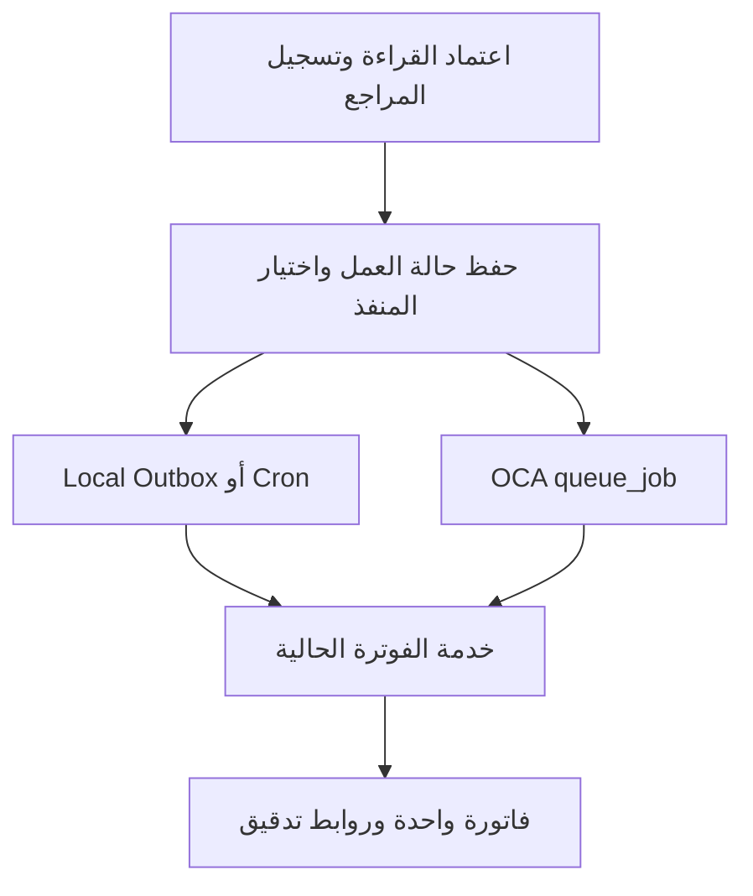

# دليل اختيار ودمج إضافات OCA في Utility ERP — Odoo 16

**تاريخ البحث:** 2026-09-04  
**المستودع المستهدف:** AbdulrhmanBashammmakh/utility_erp  
**الفرع:** development  
**خط أساس المشروع المفحوص:** `226f41522fb9ccdb027cc43b900bbfa7b93244f1`  
**نطاق البحث:** 37 إضافة في 16 مستودعًا من OCA، على سلسلة 16.0.  
**الحالة:** مقترح تقييم ودمج؛ لا يمثل تثبيتًا أو اعتمادًا إنتاجيًا لأي إضافة جديدة.

## 1. القرار المقترح وحدود التقرير

ابدأ بتجارب صغيرة لـ`queue_job` و`auditlog` و`report_xlsx` و`account_financial_report`، مع تمييز بيئات العمل بواسطة `web_environment_ribbon`. أضف إعدادات البيئات وضبط الاستيراد إذا كانت مناسبة لطريقة النشر. انقل نتائج التجربة إلى قرار تنفيذ قبل توسيع الاعتماد.

القائمة لا تعني تثبيت 37 إضافة معًا: بعضها تبعيات، وبعضها بدائل متعارضة أو خيارات مستقبلية. جميعها فُحصت من README وmanifest عند SHA ثابت لمستودعها؛ وجود نسخة 16.0 أو وسم Mature لا يثبت توافقها مع تخصيصات Utility أو نجاح اختبار حمل. لم تُنفّذ في هذا البحث اختبارات Odoo أو UAT أو ترقية أو تحميل أي إضافة إلى قاعدة بيانات.

شرح الفائدة والتشغيل مستند إلى وثائق OCA، أما الأولويات وأمثلة شركة الكهرباء وطريقة الربط ومعايير القبول فهي **توصيات خاصة بالمشروع**. لم يشمل البحث مراجعة كل سطر من كل إضافة، أو كل Issue وPR، أو شجرة التبعيات المتعدية كاملة. يجب إعادة فحص هذه العناصر عند اختيار حزمة للتثبيت.

### 1.1 تصنيف القرار

| الرمز | المقصود |
|---|---|
| A | مرشح لتجربة أولى؛ ليس موافقة تلقائية على الإنتاج |
| B | مرحلة ثانية بعد نجاح الأساس أو ثبوت الحاجة |
| C | مشروط بمتطلب أعمال أو سياسة أو تصميم ربط |
| D | يؤجل أو يقارن كبديل معماري؛ لا يضاف إلى V1 مباشرة |
| E | موجود بالفعل؛ تُدار نسخته وتوافقه |

### 1.2 ما يجب الحفاظ عليه في Utility

| الموجود أو القرار | أثره في اختيار OCA |
|---|---|
| `utility_core` ثم `utility_inventory` ثم `utility_operations` ثم `utility_billing` | نحافظ على ملكية النماذج وترتيب الاعتماد |
| `sale.order` للفاتورة التشغيلية، `account.move` للمحاسبة، `account.payment` للدفع | لا ينشأ دفتر فواتير أو مدفوعات موازٍ |
| لا محفظة عميل في V1، والبيع المسبق خارج النطاق | لا تُضاف حلول Wallet أو STS/POS لهذا الغرض |
| تخصيص الدفعة لفاتورة Utility محددة | واجهات المطابقة العامة لا تتجاوز هذا المسار |
| `utility.workflow.command` وLocal Outbox موجودان | `queue_job` يحتاج حسم ملكية التنفيذ وإعادة المحاولة |
| محوّل Temporal الحالي يحمل `PRODUCTION_READY = False` | وجود ملف المحوّل لا يعني وجود تنفيذ إنتاجي؛ لا نفعّل مسارين للعمل نفسه |
| تخزين مرفقات مخصص عبر `ir.attachment` | أي تخزين OCA جديد يحتاج توافق قراءة وكتابة وخطة ترحيل |
| قيود أدوار ومناطق ومسارات خاصة بالمشروع | كل تقرير وJob وواجهة OCA تحتاج اختبار هذه القيود |
| التدوير السنوي واحتفاظ الصور 365 يومًا هدف تشغيل مشروط | لا يُنسب تنفيذه تلقائيًا إلى إضافات الفترات أو النسخ أو التخزين |

المراجع: [تعليمات ملكية المشروع](https://github.com/AbdulrhmanBashammmakh/utility_erp/blob/226f41522fb9ccdb027cc43b900bbfa7b93244f1/AGENTS.md)، [القرارات المعمارية](https://github.com/AbdulrhmanBashammmakh/utility_erp/blob/226f41522fb9ccdb027cc43b900bbfa7b93244f1/docs/ARCHITECTURE_DECISION_LOG.md)، [Local Outbox](https://github.com/AbdulrhmanBashammmakh/utility_erp/blob/226f41522fb9ccdb027cc43b900bbfa7b93244f1/utility_core/adapters/workflow/local.py)، [حالة Temporal](https://github.com/AbdulrhmanBashammmakh/utility_erp/blob/226f41522fb9ccdb027cc43b900bbfa7b93244f1/utility_core/adapters/workflow/temporal.py)، [تخصيص المرفقات](https://github.com/AbdulrhmanBashammmakh/utility_erp/blob/226f41522fb9ccdb027cc43b900bbfa7b93244f1/utility_core/models/utility_ir_attachment.py).

## 2. خريطة الإضافات المختارة

النسخة في الجدول مستخرجة من manifest عند SHA المثبت في قسم المصادر. التبعيات المباشرة مذكورة في شرح كل إضافة؛ لا تعتبر هذه قائمة تثبيت مكتملة بالتبعيات المتعدية.

| الإضافة | المجال | القرار | النسخة المفحوصة |
|---|---|---|---|
| [`queue_job`](#queue_job) | التنفيذ الخلفي | A — تجربة أولى | `16.0.3.0.2` |
| [`queue_job_batch`](#queue_job_batch) | التنفيذ الخلفي | B — بعد الطابور | `16.0.1.0.1` |
| [`queue_job_cron`](#queue_job_cron) | التنفيذ الخلفي | B — انتقال اختياري | `16.0.2.1.0` |
| [`base_import_async`](#base_import_async) | الترحيل | C — عند استيراد قياسي كبير | `16.0.1.2.1` |
| [`base_export_async`](#base_export_async) | التقارير | C — مشروط بقناة التسليم | `16.0.1.2.0` |
| [`auditlog`](#auditlog) | التدقيق | A — تجربة أولى | `16.0.3.0.5` |
| [`sentry`](#sentry) | المراقبة | C — بعد خدمة مراقبة | `16.0.3.0.3` |
| [`auto_backup`](#auto_backup) | النسخ الاحتياطي | D — ليس أساس نسخ الإنتاج | `16.0.1.0.3` |
| [`session_db`](#session_db) | الجلسات والتوسع | D — بديل معماري فقط | `16.0.1.0.7` |
| [`report_xlsx`](#report_xlsx) | التقارير | A — تجربة أولى | `16.0.2.0.2` |
| [`report_xlsx_helper`](#report_xlsx_helper) | التقارير | B — عند تعدد تقارير Excel | `16.0.1.0.0` |
| [`report_async`](#report_async) | التقارير | B — للتقارير الثقيلة | `16.0.1.1.0` |
| [`account_financial_report`](#account_financial_report) | المحاسبة | A — تجربة محاسبية | `16.0.1.18.0` |
| [`partner_statement`](#partner_statement) | المحاسبة | C — بعد تحديد هوية الكشف | `16.0.1.3.3` |
| [`mis_builder`](#mis_builder) | التحليل الإداري | B — تقارير الإدارة | `16.0.5.8.0` |
| [`mis_builder_budget`](#mis_builder_budget) | التحليل الإداري | B — عند اعتماد موازنة | `16.0.5.4.0` |
| [`date_range`](#date_range) | الفترات | E — موجود؛ حافظ عليه | `16.0.1.0.9` |
| [`base_tier_validation`](#base_tier_validation) | الموافقات | C — موافقات إضافية محددة | `16.0.4.0.2` |
| [`base_import_security_group`](#base_import_security_group) | الصلاحيات | A — تجربة ضبط الاستيراد | `16.0.1.0.0` |
| [`fs_attachment`](#fs_attachment) | المرفقات | D — قرار تخزين لاحق | `16.0.3.1.2` |
| [`server_environment`](#server_environment) | إعدادات التشغيل | A — عند فصل البيئات | `16.0.1.1.3` |
| [`server_environment_ir_config_parameter`](#server_environment_ir_config_parameter) | إعدادات التشغيل | A — مع إعدادات البيئات | `16.0.1.1.0` |
| [`auth_session_timeout`](#auth_session_timeout) | المصادقة | B — بعد اختبار الموبايل | `16.0.1.0.1` |
| [`password_security`](#password_security) | المصادقة | B — سياسة حسابات معتمدة | `16.0.1.0.4` |
| [`account_asset_management`](#account_asset_management) | الأصول | C — إذا الأصول ضمن النطاق | `16.0.1.3.0` |
| [`account_lock_date_update`](#account_lock_date_update) | المحاسبة | B — ضبط الإقفال المحاسبي | `16.0.1.0.1` |
| [`account_reconcile_oca`](#account_reconcile_oca) | المطابقة البنكية | C — بعد حماية تخصيص Utility | `16.0.2.5.1` |
| [`account_statement_import_file`](#account_statement_import_file) | المطابقة البنكية | C — بعد عينة كشف بنك | `16.0.1.1.3` |
| [`account_statement_import_sheet_file`](#account_statement_import_sheet_file) | المطابقة البنكية | C — عند كشوف CSV/XLSX | `16.0.1.3.1` |
| [`account_statement_import_file_reconcile_oca`](#account_statement_import_file_reconcile_oca) | المطابقة البنكية | C — تابع للمطابقة | `16.0.1.0.0` |
| [`web_environment_ribbon`](#web_environment_ribbon) | الواجهة والبيئات | A — سهل التجربة | `16.0.1.0.0` |
| [`web_responsive`](#web_responsive) | الواجهة | B — تجربة واجهة | `16.0.1.4.0` |
| [`web_dialog_size`](#web_dialog_size) | الواجهة | B — تحسين واجهة محدود | `16.0.1.0.4` |
| [`maintenance_plan`](#maintenance_plan) | الصيانة | B — عند تشغيل الصيانة الوقائية | `16.0.1.0.0` |
| [`maintenance_equipment_hierarchy`](#maintenance_equipment_hierarchy) | الصيانة | C — مع سجل معدات واضح | `16.0.1.1.0` |
| [`stock_request`](#stock_request) | المخزون | C — عند طلب مواد الفرق | `16.0.1.1.3` |
| [`fieldservice`](#fieldservice) | الخدمة الميدانية | D — خارج دمج V1 الحالي | `16.0.1.13.1` |

## 3. شرح الإضافات وطريقة استخدامها

### queue_job

**القرار:** A — تجربة أولى — **المجال:** التنفيذ الخلفي.  
**المصدر:** OCA/queue — **النسخة:** `16.0.3.0.2` — **الرخصة المعلنة:** `LGPL-3` — **النضج المعلن:** Mature.  
**التبعيات المباشرة:** `mail`, `base_sparse_field`, `web`.  
**الحزم الخارجية المعلنة:** python: `requests`.  
**auto_install:** `False`.

- **ماذا تقدم؟** طابور وظائف داخل Odoo/PostgreSQL يدعم القنوات والأولوية وإعادة المحاولة. يناسب الفوترة والإشعارات ومعالجة الصور، مع معاملة مستقلة لكل وظيفة.
- **كيفية الاستخدام:** ثبّت الإضافة وتبعياتها، وأضفها إلى server_wide_modules واضبط Workers وJobrunner. عرّف قنوات XML للوظائف، ثم اربط خدمة أعمال محددة بـwith_delay(). راقب المهام من قائمة Job Queue.
- **الربط المقترح بالمشروع:** ابدأ بوظيفة فوترة قراءة معتمدة فقط. تبقى utility.reading وutility.workflow.command سجلات أعمال وتتبّع، وتُحسم ملكية التنفيذ مع الـOutbox الحالي قبل التوسع. لا تضف نظامًا ثانيًا لإعادة المحاولة لنفس الأمر.
- **حدود الدمج والتداخل:** التثبيت وحده لا يحول الخدمات الحالية إلى Jobs. identity_key ليس ضمانًا لعدم تكرار القيد. احتفظ بالأقفال والقيود وفحص الحالة. تمرير Context محدود بقائمة مسموحة؛ لا تمرر رمز الاعتماد الداخلي أو صلاحيات متصورة عبر الوظيفة.
- **اختبار القبول:** اعتماد ثم إعادة طلب ثم إعادة تشغيل العامل: فاتورة واحدة ومكوّنات قراءة صحيحة، مع حفظ المراجع الأصلي ورفض إعادة التنفيذ عند إلغاء العمل.

المصدر المثبت: [README](https://github.com/OCA/queue/blob/4ea642c3930bc2bbaeb760c3410714c2ec9143f1/queue_job/README.rst) و[manifest](https://github.com/OCA/queue/blob/4ea642c3930bc2bbaeb760c3410714c2ec9143f1/queue_job/__manifest__.py).

### queue_job_batch

**القرار:** B — بعد الطابور — **المجال:** التنفيذ الخلفي.  
**المصدر:** OCA/queue — **النسخة:** `16.0.1.0.1` — **الرخصة المعلنة:** `AGPL-3` — **النضج المعلن:** Beta (README).  
**التبعيات المباشرة:** `queue_job`.  
**الحزم الخارجية المعلنة:** لا توجد قائمة صريحة في manifest؛ راجع قسم Installation في المصدر.  
**auto_install:** `False`.

- **ماذا تقدم؟** يجمع وظائف queue_job في دفعة تقنية لتوضيح النتائج والمتابعة. يفيد دورة قراءة تحتوي على وظائف متعددة.
- **كيفية الاستخدام:** ثبّته بعد queue_job، وأنشئ دفعة من كود الربط واربط بها الوظائف التابعة. راقب اكتمالها وإخفاقاتها من واجهات الطوابير.
- **الربط المقترح بالمشروع:** اربط الدفعة التقنية بسجل utility.reading.batch الحالي. تعرض شاشة الأعمال أعداد القراءات والصور، بينما تساعد الدفعة التقنية مسؤول التشغيل في التشخيص.
- **حدود الدمج والتداخل:** لا يستبدل التحقق من ملكية دفعة القراءات أو منطق partial/error. لا تنشئ نسختين مستقلتين من حالة العمل أو تجعل المستخدم يعدّل اكتمال الأعمال من شاشة Jobs.
- **اختبار القبول:** دفعة بها نجاح وفشل وإعادة محاولة تُظهر أعدادًا متطابقة مع سجلات الأعمال ولا تعيد إصدار فواتير الناجح.

المصدر المثبت: [README](https://github.com/OCA/queue/blob/4ea642c3930bc2bbaeb760c3410714c2ec9143f1/queue_job_batch/README.rst) و[manifest](https://github.com/OCA/queue/blob/4ea642c3930bc2bbaeb760c3410714c2ec9143f1/queue_job_batch/__manifest__.py).

### queue_job_cron

**القرار:** B — انتقال اختياري — **المجال:** التنفيذ الخلفي.  
**المصدر:** OCA/queue — **النسخة:** `16.0.2.1.0` — **الرخصة المعلنة:** `AGPL-3` — **النضج المعلن:** Beta (README).  
**التبعيات المباشرة:** `queue_job`.  
**الحزم الخارجية المعلنة:** لا توجد قائمة صريحة في manifest؛ راجع قسم Installation في المصدر.  
**auto_install:** `False`.

- **ماذا تقدم؟** يشغّل Scheduled Action كوظيفة في الطابور، مع اختيار القناة ومنع التوازي لنفس Cron بحسب إعداداته.
- **كيفية الاستخدام:** فعّل Run as queue job في مهمة مجدولة مختارة وحدد القناة. ابدأ بمهمة إشعار غير مالية ثم قِس التنفيذ قبل نقل بقية المهام.
- **الربط المقترح بالمشروع:** قارن منع التوازي الموجود في الإضافة مع prevent_overlap وإدارة Cron الحالية، وحدد طبقة واحدة مسؤولة عن التنفيذ والقفل.
- **حدود الدمج والتداخل:** تغليف Cron طويل في Job واحدة لا يقسمه إلى معاملات صغيرة. لا تجمع تغليف Cron ووظائف لكل قراءة بلا تصميم، فقد تنتج جدولة مكررة.
- **اختبار القبول:** تشغيل الجدولة مرتين لا يؤدي لتنفيذ متوازٍ غير مقصود، ويمكن تتبع مصدر الوظيفة وإعادة المحاولة.

المصدر المثبت: [README](https://github.com/OCA/queue/blob/4ea642c3930bc2bbaeb760c3410714c2ec9143f1/queue_job_cron/README.rst) و[manifest](https://github.com/OCA/queue/blob/4ea642c3930bc2bbaeb760c3410714c2ec9143f1/queue_job_cron/__manifest__.py).

### base_import_async

**القرار:** C — عند استيراد قياسي كبير — **المجال:** الترحيل.  
**المصدر:** OCA/queue — **النسخة:** `16.0.1.2.1` — **الرخصة المعلنة:** `AGPL-3` — **النضج المعلن:** Production/Stable.  
**التبعيات المباشرة:** `base_import`, `queue_job`.  
**الحزم الخارجية المعلنة:** لا توجد قائمة صريحة في manifest؛ راجع قسم Installation في المصدر.  
**auto_install:** `False`.

- **ماذا تقدم؟** ينقل استيراد Odoo القياسي إلى الخلفية ويجزّئ الملف، مع إمكانية تشخيص الجزء الفاشل.
- **كيفية الاستخدام:** بعد تثبيته مع queue_job افتح شاشة الاستيراد القياسية وفعّل خيار الخلفية، ثم استورد ملفًا تجريبيًا وراجع الوظائف والمرفقات للأجزاء الفاشلة.
- **الربط المقترح بالمشروع:** مناسب لبيانات قياسية نظيفة. عمليات Utility التي تحتاج Mapping وStaging وربط العدادات والأرصدة تستمر عبر خدمات الترحيل الحالية.
- **حدود الدمج والتداخل:** ليس محرك ETL ولا ينفذ تحويل البيانات تلقائيًا. فحص الاستيراد لا ينتقل إلى الخلفية بحسب الوثائق. يجب ضبط صلاحيات الملفات الناتجة وفترة الاحتفاظ بها.
- **اختبار القبول:** ملف يضم جزءًا خاطئًا يسمح بتشخيصه وتصحيحه دون تكرار السجلات الصحيحة، والاستيراد غير المصرح به مرفوض.

المصدر المثبت: [README](https://github.com/OCA/queue/blob/4ea642c3930bc2bbaeb760c3410714c2ec9143f1/base_import_async/README.rst) و[manifest](https://github.com/OCA/queue/blob/4ea642c3930bc2bbaeb760c3410714c2ec9143f1/base_import_async/__manifest__.py).

### base_export_async

**القرار:** C — مشروط بقناة التسليم — **المجال:** التقارير.  
**المصدر:** OCA/queue — **النسخة:** `16.0.1.2.0` — **الرخصة المعلنة:** `AGPL-3` — **النضج المعلن:** Beta (README).  
**التبعيات المباشرة:** `web`, `queue_job`.  
**الحزم الخارجية المعلنة:** لا توجد قائمة صريحة في manifest؛ راجع قسم Installation في المصدر.  
**auto_install:** `False`.

- **ماذا تقدم؟** يؤجل التصدير القياسي إلى الخلفية بدل انتظار المستخدم أثناء بناء ملف كبير.
- **كيفية الاستخدام:** افتح شاشة Export وفعّل Asynchronous export. تنفذ الوظيفة التصدير ثم ترسل الملف إلى بريد المستخدم وفق التدفق الموثق.
- **الربط المقترح بالمشروع:** يدرس لتصدير قوائم تشغيلية كبيرة. إذا كان المطلوب التنزيل داخل النظام دون بريد فقيّم report_async أو تطوير تسليم خاص قبل اعتماده.
- **حدود الدمج والتداخل:** التسليم الموثق يعتمد على البريد. لا نفترض أنه مناسب تلقائيًا لسياسة المشروع، ولا أن قائمة مصفاة تمنع تسريب البيانات دون فحص الصلاحيات أثناء التنفيذ والتنزيل.
- **اختبار القبول:** المستخدم المقيد يحصل على ملف نطاقه فقط؛ ألغِ صلاحياته قبل التنفيذ وتحقق من السلوك ومن عدم وصول الملف لغيره.

المصدر المثبت: [README](https://github.com/OCA/queue/blob/4ea642c3930bc2bbaeb760c3410714c2ec9143f1/base_export_async/README.rst) و[manifest](https://github.com/OCA/queue/blob/4ea642c3930bc2bbaeb760c3410714c2ec9143f1/base_export_async/__manifest__.py).

### auditlog

**القرار:** A — تجربة أولى — **المجال:** التدقيق.  
**المصدر:** OCA/server-tools — **النسخة:** `16.0.3.0.5` — **الرخصة المعلنة:** `AGPL-3` — **النضج المعلن:** Beta (README).  
**التبعيات المباشرة:** `base`.  
**الحزم الخارجية المعلنة:** لا توجد قائمة صريحة في manifest؛ راجع قسم Installation في المصدر.  
**auto_install:** `False`.

- **ماذا تقدم؟** يسجل عمليات ORM المختارة على النماذج، ويمكن عرض تفاصيل التغيير والمستخدم والطلب. مناسب للعقود والتعرفة وربط العدادات والصلاحيات.
- **كيفية الاستخدام:** أنشئ قواعد من Settings / Technical / Audit / Rules، وحدد النماذج وعمليات create/write/unlink المطلوبة، ثم راجع Logs واضبط تنظيفها.
- **الربط المقترح بالمشروع:** ابدأ بمجموعة صغيرة من النماذج الحساسة. أبقِ حقول اعتماد القراءة والتسوية كدليل أعمال مستقل، واربط مراجعة التدقيق بدور رقابي محدود.
- **حدود الدمج والتداخل:** لا يعوض صلاحيات الخادم ولا يجعل السجل غير قابل للعبث. تجنب تسجيل الصور والأسرار أو كل read بكثافة. توثيق الإضافة يذكر قصور read لبعض النماذج؛ تنظيف 180 يومًا موجود لكنه غير مفعّل افتراضيًا.
- **اختبار القبول:** تعديل تعرفة وتغيير نطاق مستخدم يظهران مع القيم والأثر الصحيح؛ اختبر الحجم والصلاحيات وعدم تسجيل بيانات اعتماد.

المصدر المثبت: [README](https://github.com/OCA/server-tools/blob/7e2b2252ca243b3768edc99416b0104732b50b52/auditlog/README.rst) و[manifest](https://github.com/OCA/server-tools/blob/7e2b2252ca243b3768edc99416b0104732b50b52/auditlog/__manifest__.py).

### sentry

**القرار:** C — بعد خدمة مراقبة — **المجال:** المراقبة.  
**المصدر:** OCA/server-tools — **النسخة:** `16.0.3.0.3` — **الرخصة المعلنة:** `AGPL-3` — **النضج المعلن:** Beta (README).  
**التبعيات المباشرة:** `base`.  
**الحزم الخارجية المعلنة:** python: `sentry_sdk<=1.9.0`.  
**auto_install:** `False`.

- **ماذا تقدم؟** يربط أخطاء Odoo بخدمة Sentry لتجميع الاستثناءات ومتابعتها حسب الإصدار.
- **كيفية الاستخدام:** جهّز مشروع Sentry ثم تبعيات Python، وحمّل الإضافة server-wide، واضبط sentry_dsn وsentry_enabled والمستوى والاستثناءات المستبعدة. أرسل خطأ اختبار من بيئة التجربة.
- **الربط المقترح بالمشروع:** استخدم SHA الإصدار لربط الأخطاء بالنشر، وميّز أخطاء البرمجة عن أخطاء المستخدم المتوقعة في القراءة والفوترة.
- **حدود الدمج والتداخل:** الإضافة ليست خادم Sentry. الملف المفحوص يقيد sentry_sdk<=1.9.0، لذلك نحتاج فحص توافق حزم بيئة Odoo. راجع سياق الطلب المرسل وسياسة إخفاء الأسرار وبيانات المشتركين.
- **اختبار القبول:** استثناء تجريبي يصل بالإصدار الصحيح، ولا يظهر التوكن أو جسم طلب حساس، ويستمر Odoo عند تعطل خدمة المراقبة.

المصدر المثبت: [README](https://github.com/OCA/server-tools/blob/7e2b2252ca243b3768edc99416b0104732b50b52/sentry/README.rst) و[manifest](https://github.com/OCA/server-tools/blob/7e2b2252ca243b3768edc99416b0104732b50b52/sentry/__manifest__.py).

### auto_backup

**القرار:** D — ليس أساس نسخ الإنتاج — **المجال:** النسخ الاحتياطي.  
**المصدر:** OCA/server-tools — **النسخة:** `16.0.1.0.3` — **الرخصة المعلنة:** `AGPL-3` — **النضج المعلن:** Beta (README).  
**التبعيات المباشرة:** `mail`.  
**الحزم الخارجية المعلنة:** python: `paramiko<4.0.0`, `pysftp`, `cryptography`.  
**auto_install:** `False`.

- **ماذا تقدم؟** يدير نسخًا مجدولة محلية أو إلى SFTP مع سياسات احتفاظ من داخل Odoo.
- **كيفية الاستخدام:** في بيئة صغيرة، جهّز الحزم المطلوبة وأنشئ إعداد النسخ من Automated Backup وحدد المسار والاحتفاظ ثم اختبر الاتصال والتنفيذ والاستعادة.
- **الربط المقترح بالمشروع:** يمكن استخدامه للتطوير أو نسخة مساعدة. تصميم النسخ الرئيسي لقاعدة الكهرباء الكبيرة يجب أن يغطي PostgreSQL وFilestore بصورة قابلة للاستعادة خارج تعطل التطبيق.
- **حدود الدمج والتداخل:** الوثائق تذكر احتمال انتهاء التنفيذ في القواعد الكبيرة وعدم العمل مع list_db=False. لا تغيّر حماية كشف قواعد البيانات لأجل الإضافة. تحتاج أيضًا مراجعة تبعيات pysftp وparamiko.
- **اختبار القبول:** استعد قاعدة وملفاتها إلى بيئة معزولة وافتح الصور والفواتير. وجود ملف ZIP وحده لا يثبت نجاح النسخ.

المصدر المثبت: [README](https://github.com/OCA/server-tools/blob/7e2b2252ca243b3768edc99416b0104732b50b52/auto_backup/README.rst) و[manifest](https://github.com/OCA/server-tools/blob/7e2b2252ca243b3768edc99416b0104732b50b52/auto_backup/__manifest__.py).

### session_db

**القرار:** D — بديل معماري فقط — **المجال:** الجلسات والتوسع.  
**المصدر:** OCA/server-tools — **النسخة:** `16.0.1.0.7` — **الرخصة المعلنة:** `LGPL-3` — **النضج المعلن:** Beta (README).  
**التبعيات المباشرة:** لا توجد قائمة depends صريحة؛ لا يعني ذلك استقلالًا عن Odoo.  
**الحزم الخارجية المعلنة:** لا توجد قائمة صريحة في manifest؛ راجع قسم Installation في المصدر.  
**auto_install:** `False`.

- **ماذا تقدم؟** يحفظ جلسات Odoo في PostgreSQL بدل الملفات لتسهيل المشاركة بين عقد التطبيق.
- **كيفية الاستخدام:** إذا اعتمد هذا البديل، حمّله ضمن server-wide modules وحدد SESSION_DB_URI لقاعدة جلسات مخصصة وفق الوثائق، ثم أعد تشغيل العقد.
- **الربط المقترح بالمشروع:** يُقارن بخطة Redis للجلسات قبل الاختيار. المطلوب Backend جلسات واحد واضح؛ لا نثبته فوق آلية Redis مفترضة أو نعتبر Redis جاهزًا لمجرد وجوده في خطة.
- **حدود الدمج والتداخل:** ليس موصل Redis، وقد يضيف حملًا على PostgreSQL. استخدام قاعدة جلسات مستقلة وتفاصيل التدوير السنوي يحتاج تصميمًا واختبارًا. بيانات الاتصال لا تُكتب في Git.
- **اختبار القبول:** تسجيل الدخول عبر عقدة ثم الانتقال لأخرى ينجح؛ تسجيل الخروج والإبطال يعملان، وقياس الحمل يثبت ملاءمة الخيار.

المصدر المثبت: [README](https://github.com/OCA/server-tools/blob/7e2b2252ca243b3768edc99416b0104732b50b52/session_db/README.rst) و[manifest](https://github.com/OCA/server-tools/blob/7e2b2252ca243b3768edc99416b0104732b50b52/session_db/__manifest__.py).

### report_xlsx

**القرار:** A — تجربة أولى — **المجال:** التقارير.  
**المصدر:** OCA/reporting-engine — **النسخة:** `16.0.2.0.2` — **الرخصة المعلنة:** `AGPL-3` — **النضج المعلن:** Mature.  
**التبعيات المباشرة:** `base`, `web`.  
**الحزم الخارجية المعلنة:** لا توجد قائمة صريحة في manifest؛ راجع قسم Installation في المصدر.  
**auto_install:** `False`.

- **ماذا تقدم؟** يوفر أساسًا برمجيًا لتقارير XLSX عبر ir.actions.report. يصلح لتوحيد تقارير القراءات والتحصيل والتسويات.
- **كيفية الاستخدام:** ثبّت xlsxwriter والإضافة. أنشئ AbstractModel يرث report.report_xlsx.abstract ونفذ generate_xlsx_report ثم عرّف إجراء تقرير من النوع xlsx.
- **الربط المقترح بالمشروع:** ابدأ بتقرير واحد داخل الموديول المالك للبيانات. استخدم ORM ونطاق المستخدم الحالي، وأعد استخدام الصيغ المالية الموجودة بدل حساب أرصدة موازية.
- **حدود الدمج والتداخل:** هو إطار تطوير وليس تقارير Utility جاهزة. راقب الذاكرة عند الملفات الكبيرة، وتنسيق العربية والتواريخ والأرقام وحفظ معرفات العدادات كنص.
- **اختبار القبول:** قارن إجمالي ملف Excel مع شاشة النظام، وافتحه دون تحذيرات، وتحقق من أن المستخدم لا يصدر بيانات فرع آخر.

المصدر المثبت: [README](https://github.com/OCA/reporting-engine/blob/cb3c9ae85276fd20ee6ee2cc22cca687ae59dda2/report_xlsx/README.rst) و[manifest](https://github.com/OCA/reporting-engine/blob/cb3c9ae85276fd20ee6ee2cc22cca687ae59dda2/report_xlsx/__manifest__.py).

### report_xlsx_helper

**القرار:** B — عند تعدد تقارير Excel — **المجال:** التقارير.  
**المصدر:** OCA/reporting-engine — **النسخة:** `16.0.1.0.0` — **الرخصة المعلنة:** `AGPL-3` — **النضج المعلن:** Mature.  
**التبعيات المباشرة:** `report_xlsx`.  
**الحزم الخارجية المعلنة:** لا توجد قائمة صريحة في manifest؛ راجع قسم Installation في المصدر.  
**auto_install:** `False`.

- **ماذا تقدم؟** يضيف أدوات تنسيق وأنواع خلايا وصيغ وقوالب لتسهيل بناء تقارير XLSX متسقة.
- **كيفية الاستخدام:** ثبّته بعد report_xlsx واستخدم مساعداته في تقرير تجريبي متعدد الأوراق قبل تعميم قالب الألوان والأرقام والعناوين.
- **الربط المقترح بالمشروع:** مفيد لتقارير الأرصدة والقراءات والمراجعة الشهرية، كما تتطلبه بعض إضافات المحاسبة المقترحة.
- **حدود الدمج والتداخل:** لا تنشئ مكتبة تنسيق موازية لكل موديول. أمثلة README القديمة لا تعني أن كل الإضافات المذكورة فيها متاحة في 16.0؛ المرجع هو الكود المثبت.
- **اختبار القبول:** تقرير عربي متعدد الأوراق يحافظ على تنسيقات الأموال والصيغ وأسماء الأوراق دون كسر ملفات التقارير السابقة.

المصدر المثبت: [README](https://github.com/OCA/reporting-engine/blob/cb3c9ae85276fd20ee6ee2cc22cca687ae59dda2/report_xlsx_helper/README.rst) و[manifest](https://github.com/OCA/reporting-engine/blob/cb3c9ae85276fd20ee6ee2cc22cca687ae59dda2/report_xlsx_helper/__manifest__.py).

### report_async

**القرار:** B — للتقارير الثقيلة — **المجال:** التقارير.  
**المصدر:** OCA/reporting-engine — **النسخة:** `16.0.1.1.0` — **الرخصة المعلنة:** `AGPL-3` — **النضج المعلن:** Beta.  
**التبعيات المباشرة:** `queue_job`, `spreadsheet_dashboard`.  
**الحزم الخارجية المعلنة:** لا توجد قائمة صريحة في manifest؛ راجع قسم Installation في المصدر.  
**auto_install:** `False`.

- **ماذا تقدم؟** مركز تقارير يتيح التشغيل المباشر أو الخلفي وحفظ الملفات الناتجة، مع بريد اختياري.
- **كيفية الاستخدام:** ثبّت التبعيات، ثم من Dashboard / Report Center عرّف تقريرًا مناسبًا وحدد المجموعات وAllow Async. شغله في الخلفية وافتح Files بعد اكتماله.
- **الربط المقترح بالمشروع:** مناسب لكشف شهري أو تقرير تدقيق يستغرق وقتًا، مع إبقاء تنزيل النتائج داخل النظام وعدم تفعيل البريد إن لم يكن مطلوبًا.
- **حدود الدمج والتداخل:** المجموعات الفارغة تسمح بوصول أوسع بحسب الوثائق؛ يجب تحديدها. يحتاج التقرير إلى إنتاج ملف فعلي. حماية ملكية الملف لا تكفي وحدها لفرض نطاق بيانات التقرير.
- **اختبار القبول:** المستخدم يرى نتائجه فقط، وتتطابق بياناتها مع نطاقه، وتظهر الأخطاء، ويختبر حذف التقارير القديمة دون المساس بالمرفقات المحاسبية.

المصدر المثبت: [README](https://github.com/OCA/reporting-engine/blob/cb3c9ae85276fd20ee6ee2cc22cca687ae59dda2/report_async/README.rst) و[manifest](https://github.com/OCA/reporting-engine/blob/cb3c9ae85276fd20ee6ee2cc22cca687ae59dda2/report_async/__manifest__.py).

### account_financial_report

**القرار:** A — تجربة محاسبية — **المجال:** المحاسبة.  
**المصدر:** OCA/account-financial-reporting — **النسخة:** `16.0.1.18.0` — **الرخصة المعلنة:** `AGPL-3` — **النضج المعلن:** Beta (README).  
**التبعيات المباشرة:** `account`, `date_range`, `report_xlsx`.  
**الحزم الخارجية المعلنة:** لا توجد قائمة صريحة في manifest؛ راجع قسم Installation في المصدر.  
**auto_install:** `False`.

- **ماذا تقدم؟** تقارير الأستاذ العام وميزان المراجعة والبنود المفتوحة وأعمار الديون ودفتر اليومية والضريبة.
- **كيفية الاستخدام:** ثبّته مع report_xlsx وdate_range ثم افتح Invoicing / Reporting / OCA accounting reports وحدد الفترة والحسابات والقيود المطلوبة.
- **الربط المقترح بالمشروع:** يستخدم للتحقق من إجماليات account.move والذمم. فلاتر Utility مثل الفرع وحساب الاشتراك تحتاج ربطًا واختبارًا قبل إتاحتها لمستخدمي الفروع.
- **حدود الدمج والتداخل:** لا تفترض أن قيود ORM المخصصة تطبق تلقائيًا على كل تقرير أو استعلام. تقرير أعمار الشريك ليس بالضرورة أعمار كل اشتراك. مطابقة متطلبات ضريبية محلية موضوع مستقل.
- **اختبار القبول:** اختبر سدادًا جزئيًا وإشعارًا دائنًا وعكس تخصيص ورصيدًا افتتاحيًا؛ قارن ميزان المراجعة والذمم مع القيود الفعلية وبصلاحيات مختلفة.

المصدر المثبت: [README](https://github.com/OCA/account-financial-reporting/blob/00d2d46a7e87aadd812d5d99ab43bbe75df61874/account_financial_report/README.rst) و[manifest](https://github.com/OCA/account-financial-reporting/blob/00d2d46a7e87aadd812d5d99ab43bbe75df61874/account_financial_report/__manifest__.py).

### partner_statement

**القرار:** C — بعد تحديد هوية الكشف — **المجال:** المحاسبة.  
**المصدر:** OCA/account-financial-reporting — **النسخة:** `16.0.1.3.3` — **الرخصة المعلنة:** `AGPL-3` — **النضج المعلن:** Beta (README).  
**التبعيات المباشرة:** `account`, `report_xlsx`, `report_xlsx_helper`.  
**الحزم الخارجية المعلنة:** لا توجد قائمة صريحة في manifest؛ راجع قسم Installation في المصدر.  
**auto_install:** `False`.

- **ماذا تقدم؟** كشف حركة وتفصيلي ومستحقات للشريك، مع رصيد سابق وأعمار ديون بحسب الخيارات.
- **كيفية الاستخدام:** حدد العملاء أو الموردين ثم اختر إجراء كشف الحركة أو المستحقات وحدد التاريخ ونوع الذمم والعملات. اضبط خياراته الافتراضية من إعدادات المحاسبة.
- **الربط المقترح بالمشروع:** قد يفيد الموردين أو عميلًا له حساب واحد. قبل استعماله للمشتركين، قارن كشف Utility الموجود وتحقق من فصل اشتراكات نفس res.partner.
- **حدود الدمج والتداخل:** قد يجمع عدة اشتراكات تحت شريك واحد؛ لا يُستبدل كشف حساب الاشتراك به تلقائيًا. يلزم تضمين نطاق الفرع وحساب الخدمة في التوسعة إن كان ذلك مطلوبًا.
- **اختبار القبول:** شريك لديه اشتراكان: إثبات أن الكشف الإجمالي أو المفصول يطابق الخيار المقصود ولا ينسب دفعة اشتراك إلى الآخر.

المصدر المثبت: [README](https://github.com/OCA/account-financial-reporting/blob/00d2d46a7e87aadd812d5d99ab43bbe75df61874/partner_statement/README.rst) و[manifest](https://github.com/OCA/account-financial-reporting/blob/00d2d46a7e87aadd812d5d99ab43bbe75df61874/partner_statement/__manifest__.py).

### mis_builder

**القرار:** B — تقارير الإدارة — **المجال:** التحليل الإداري.  
**المصدر:** OCA/mis-builder — **النسخة:** `16.0.5.8.0` — **الرخصة المعلنة:** `AGPL-3` — **النضج المعلن:** Production/Stable.  
**التبعيات المباشرة:** `account`, `board`, `report_xlsx`, `date_range`.  
**الحزم الخارجية المعلنة:** لا توجد قائمة صريحة في manifest؛ راجع قسم Installation في المصدر.  
**auto_install:** `False`.

- **ماذا تقدم؟** يبني تقارير مؤشرات في الصفوف وفترات في الأعمدة؛ يمكن الجمع بين بيانات القيود ونماذج Odoo أخرى.
- **كيفية الاستخدام:** أنشئ قالب MIS وحدد المؤشرات والصيغ، ثم نسخة تقرير بفترات شهرية واعرضها أو صدرها إلى PDF/Excel.
- **الربط المقترح بالمشروع:** عرّف مؤشرات الإيراد والتحصيل والمتأخرات والقراءات المفوترة بمعانٍ محاسبية وتشغيلية موثقة. فلاتر الفروع تضاف عبر نقاط التوسعة المناسبة.
- **حدود الدمج والتداخل:** الأرقام لا تصبح صحيحة بمجرد تركيب الإضافة. وثائق 16.0 تشير إلى إزالة الميزات التحليلية القديمة بسبب analytic_distribution؛ لا تعد بدعم مراكز التكلفة دون فحص.
- **اختبار القبول:** طابق كل مؤشر مع مصدره، وافصل إيراد الفترة عن تحصيل مديونيات سابقة، واختبر مستخدم فرع واحد.

المصدر المثبت: [README](https://github.com/OCA/mis-builder/blob/1ec673db9df987a15ba0f4f5e72ccb2b716b365a/mis_builder/README.rst) و[manifest](https://github.com/OCA/mis-builder/blob/1ec673db9df987a15ba0f4f5e72ccb2b716b365a/mis_builder/__manifest__.py).

### mis_builder_budget

**القرار:** B — عند اعتماد موازنة — **المجال:** التحليل الإداري.  
**المصدر:** OCA/mis-builder — **النسخة:** `16.0.5.4.0` — **الرخصة المعلنة:** `AGPL-3` — **النضج المعلن:** Production/Stable.  
**التبعيات المباشرة:** `mis_builder`, `account`.  
**الحزم الخارجية المعلنة:** لا توجد قائمة صريحة في manifest؛ راجع قسم Installation في المصدر.  
**auto_install:** `False`.

- **ماذا تقدم؟** يضيف موازنات إلى تقارير MIS، حسب KPI أو حسابات الأستاذ، ومقارنتها بالفعلي.
- **كيفية الاستخدام:** حدد المؤشرات القابلة للموازنة وطريقة تجميعها، وأدخل مبالغ الفترات أو استوردها، ثم أضف عمود Budget وعمود مقارنة في التقرير.
- **الربط المقترح بالمشروع:** يناسب موازنة الصيانة أو الإيرادات والتحصيل بعد تثبيت تعريف المؤشرات واعتماد المسؤوليات.
- **حدود الدمج والتداخل:** الموازنة حسب KPI وحسب الحسابات طريقتان منفصلتان داخل الموازنة. انتبه لتوزيع المبالغ على فترات جزئية، ولا تفترض جاهزية تحليلات الفروع ومراكز التكلفة في 16.0.
- **اختبار القبول:** شهر كامل وجزء شهر يعرضان القيم المتوقعة؛ الانحراف السنوي يطابق مجموع الفترات دون مضاعفة.

المصدر المثبت: [README](https://github.com/OCA/mis-builder/blob/1ec673db9df987a15ba0f4f5e72ccb2b716b365a/mis_builder_budget/README.rst) و[manifest](https://github.com/OCA/mis-builder/blob/1ec673db9df987a15ba0f4f5e72ccb2b716b365a/mis_builder_budget/__manifest__.py).

### date_range

**القرار:** E — موجود؛ حافظ عليه — **المجال:** الفترات.  
**المصدر:** OCA/server-ux — **النسخة:** `16.0.1.0.9` — **الرخصة المعلنة:** `LGPL-3` — **النضج المعلن:** Mature.  
**التبعيات المباشرة:** `web`.  
**الحزم الخارجية المعلنة:** لا توجد قائمة صريحة في manifest؛ راجع قسم Installation في المصدر.  
**auto_install:** `False`.

- **ماذا تقدم؟** أساس OCA للفترات الزمنية، موجود بالفعل في المستودع وتوسعات Utility تضيف دورة حياة ونطاقات للقراءة والسداد.
- **كيفية الاستخدام:** استمر في استخدام واجهات فترات Utility. عند إضافة تقارير تعتمد عليه اجعل addons_path يحل إلى نسخة واحدة، وسجل مصدر تحديثها.
- **الربط المقترح بالمشروع:** إصدار manifest الموجود يطابق 16.0.1.0.9 في المرجع المفحوص؛ تطابق الإصدار لا يثبت تطابق جميع ملفات الموديول.
- **حدود الدمج والتداخل:** لا تنسخ نسخة OCA ثانية فوق الحالية. أي تحديث يحتاج مقارنة ملفات واختبار period_role والدورية والفتح والإقفال.
- **اختبار القبول:** تثبيت التقارير وترقية الموديولات لا يغير تعريفات الفترات ولا يسمح بفوترة فترة مغلقة أو خارج نطاق القراءة.

المصدر المثبت: [README](https://github.com/OCA/server-ux/blob/55c71e5239140d7cb87c3791928cafd253644a1d/date_range/README.rst) و[manifest](https://github.com/OCA/server-ux/blob/55c71e5239140d7cb87c3791928cafd253644a1d/date_range/__manifest__.py).

### base_tier_validation

**القرار:** C — موافقات إضافية محددة — **المجال:** الموافقات.  
**المصدر:** OCA/server-ux — **النسخة:** `16.0.4.0.2` — **الرخصة المعلنة:** `AGPL-3` — **النضج المعلن:** Mature.  
**التبعيات المباشرة:** `mail`.  
**الحزم الخارجية المعلنة:** لا توجد قائمة صريحة في manifest؛ راجع قسم Installation في المصدر.  
**auto_install:** `False`.

- **ماذا تقدم؟** إطار موافقات متعددة المستويات يضاف برمجيًا إلى النماذج التي تحتاج تسلسل موافقين.
- **كيفية الاستخدام:** حدد نموذجًا مثل طلب تسوية كبيرة، وطوّر الوراثة والانتقالات، ثم أنشئ Tier Definitions وحدد المراجعين والترتيب وقواعد السماح بالتعديل.
- **الربط المقترح بالمشروع:** يُدرس للاستثناءات المالية الكبيرة؛ اعتماد القراءة اليومي يبقى ضمن سيره الحالي حتى يوجد احتياج واضح لتعدد المستويات.
- **حدود الدمج والتداخل:** لا يعمل على كل نموذج بمجرد التثبيت. قد تتداخل حماية تعديل الحالة مع الحراس الحالية. إشعارات المراجعين بالبريد اختيار يحتاج ضبطًا وفق سياسة المشروع.
- **اختبار القبول:** صاحب الطلب لا يعتمد نفسه إن كانت السياسة تمنع ذلك؛ لا تنفذ التسوية المالية قبل اكتمال الموافقات ولا بتجاوز RPC.

المصدر المثبت: [README](https://github.com/OCA/server-ux/blob/55c71e5239140d7cb87c3791928cafd253644a1d/base_tier_validation/README.rst) و[manifest](https://github.com/OCA/server-ux/blob/55c71e5239140d7cb87c3791928cafd253644a1d/base_tier_validation/__manifest__.py).

### base_import_security_group

**القرار:** A — تجربة ضبط الاستيراد — **المجال:** الصلاحيات.  
**المصدر:** OCA/server-ux — **النسخة:** `16.0.1.0.0` — **الرخصة المعلنة:** `AGPL-3` — **النضج المعلن:** Beta (README).  
**التبعيات المباشرة:** `web`, `web_tour`, `base_import`.  
**الحزم الخارجية المعلنة:** لا توجد قائمة صريحة في manifest؛ راجع قسم Installation في المصدر.  
**auto_install:** `False`.

- **ماذا تقدم؟** يقيد الاستيراد القياسي بمجموعة مستخدمين، ويضيف فحصًا خلفيًا إلى جانب إخفاء زر الاستيراد.
- **كيفية الاستخدام:** ثبّته ثم امنح Import CSV/Excel files فقط لمن يحتاج الاستيراد القياسي. اختبر مستخدمًا مخولًا وآخر ميدانيًا غير مخول.
- **الربط المقترح بالمشروع:** يفيد منع الاستيراد العشوائي للبيانات الأساسية. صلاحيات معالج الترحيل المخصص وواجهات رفع القراءات تبقى منفصلة وتراجع في المشروع.
- **حدود الدمج والتداخل:** لا يحمي جميع API المخصصة أو create/write عمومًا. فحص مجموعة الاستيراد لا يعوض قيود النموذج ونطاق الفرع.
- **اختبار القبول:** المستخدم غير المخول لا يستورد عبر الواجهة أو JSON-RPC القياسي، بينما يستمر رفع القراءات المسموح به عبر مساره الخاص.

المصدر المثبت: [README](https://github.com/OCA/server-ux/blob/55c71e5239140d7cb87c3791928cafd253644a1d/base_import_security_group/README.rst) و[manifest](https://github.com/OCA/server-ux/blob/55c71e5239140d7cb87c3791928cafd253644a1d/base_import_security_group/__manifest__.py).

### fs_attachment

**القرار:** D — قرار تخزين لاحق — **المجال:** المرفقات.  
**المصدر:** OCA/storage — **النسخة:** `16.0.3.1.2` — **الرخصة المعلنة:** `AGPL-3` — **النضج المعلن:** Beta.  
**التبعيات المباشرة:** `fs_storage`.  
**الحزم الخارجية المعلنة:** python: `python_slugify`, `fsspec>=2025.3.0`.  
**auto_install:** `False`.

- **ماذا تقدم؟** يوسع ir.attachment للتخزين عبر fs_storage وfsspec، مع إمكانات قراءة وStreaming للملفات.
- **كيفية الاستخدام:** في تجربة معزولة ثبّت fs_storage وموفر التخزين المختار، واضبط Backend ثم خزّن مرفقات اختبار واقرأها واحذفها وفق سياسة التجربة.
- **الربط المقترح بالمشروع:** يوجد تخصيص فعلي لمسارات ir.attachment وخدمات صور في Utility. يلزم تصميم نقل وتوافق قراءة المرفقات القديمة قبل أي تشغيل.
- **حدود الدمج والتداخل:** لا يلزم اعتماد MinIO لمجرد وجود الإضافة. حالة manifest هي Beta، واعتماد fsspec له حد إصدار محدد. سياسة 365 يومًا وحفظ الأدلة التاريخية ليست ميزة تُفترض جاهزة تلقائيًا.
- **اختبار القبول:** اختبر المرفقات القديمة والجديدة والصلاحيات والحذف والاستعادة وانقطاع التخزين، دون فقد روابط الصور بالقراءات والفواتير.

المصدر المثبت: [README](https://github.com/OCA/storage/blob/b0984ba3f26035962f5f75d4f0748b95f3be4e07/fs_attachment/README.rst) و[manifest](https://github.com/OCA/storage/blob/b0984ba3f26035962f5f75d4f0748b95f3be4e07/fs_attachment/__manifest__.py).

### server_environment

**القرار:** A — عند فصل البيئات — **المجال:** إعدادات التشغيل.  
**المصدر:** OCA/server-env — **النسخة:** `16.0.1.1.3` — **الرخصة المعلنة:** `LGPL-3` — **النضج المعلن:** Production/Stable.  
**التبعيات المباشرة:** `base`, `base_sparse_field`.  
**الحزم الخارجية المعلنة:** لا توجد قائمة صريحة في manifest؛ راجع قسم Installation في المصدر.  
**auto_install:** `False`.

- **ماذا تقدم؟** يدير إعدادات تعتمد على البيئة من ملفات أو متغيرات بيئة، ويوفر mixin لحقول النماذج التي تحتاج هذا السلوك.
- **كيفية الاستخدام:** حدد running_env، ثم استخدم ملفات البيئة أو SERVER_ENV_CONFIG وSERVER_ENV_CONFIG_SECRET. إعداد نموذج مخصص يتطلب تحديد الحقول البيئية في كود الربط.
- **الربط المقترح بالمشروع:** يناسب عناوين خدمات الاختبار والإنتاج وإعدادات التكامل. ابدأ بإعدادات بسيطة قبل تحويل حقول الاتصال المخزنة إلى حقول بيئية.
- **حدود الدمج والتداخل:** ليس Secret Vault ولا يشفر كل الإعدادات تلقائيًا. يجب ألا تسمح نسخة UAT المستعادة باستعمال اتصالات الإنتاج. استخدام mixin على حقول موجودة له أثر تخزين وترقية يستلزم اختبارًا.
- **اختبار القبول:** نسخة قاعدة الإنتاج على UAT تتصل بخدمة الاختبار فقط، ولا يستطيع تعديل واجهة عادي تغيير القيمة المفروضة من البيئة.

المصدر المثبت: [README](https://github.com/OCA/server-env/blob/e2d94da20609a310f625fa32dfe634db19633f4c/server_environment/README.rst) و[manifest](https://github.com/OCA/server-env/blob/e2d94da20609a310f625fa32dfe634db19633f4c/server_environment/__manifest__.py).

### server_environment_ir_config_parameter

**القرار:** A — مع إعدادات البيئات — **المجال:** إعدادات التشغيل.  
**المصدر:** OCA/server-env — **النسخة:** `16.0.1.1.0` — **الرخصة المعلنة:** `AGPL-3` — **النضج المعلن:** Beta (README).  
**التبعيات المباشرة:** `server_environment`.  
**الحزم الخارجية المعلنة:** لا توجد قائمة صريحة في manifest؛ راجع قسم Installation في المصدر.  
**auto_install:** `False`.

- **ماذا تقدم؟** يجعل قيم ir.config_parameter المحددة في إعدادات البيئة تتقدم على قيم قاعدة البيانات.
- **كيفية الاستخدام:** بعد server_environment أضف قسم [ir.config_parameter] والمفاتيح المطلوبة. ابدأ بـribbon.name، ثم أضف مفاتيح اتصال موجودة فعليًا في كود المشروع.
- **الربط المقترح بالمشروع:** يحمي فصل بيئات التطوير والاختبار والإنتاج عند استعادة القواعد؛ لا يحتاج تحويل كل نموذج اتصال إلى mixin.
- **حدود الدمج والتداخل:** تعديل قيمة مُدارة من شاشة النظام لا يصبح المرجع الفعلي؛ وثّق ملكية الإعداد حتى لا يظن المشغل أن تغييره نجح. لا تخترع مفاتيح لتعطيل إشعارات لا يقرأها الكود.
- **اختبار القبول:** قيمة البيئة تغلب قيمة القاعدة بعد الاستعادة، والقيم غير المدارة تستمر في العمل بالطريقة المعتادة.

المصدر المثبت: [README](https://github.com/OCA/server-env/blob/e2d94da20609a310f625fa32dfe634db19633f4c/server_environment_ir_config_parameter/README.rst) و[manifest](https://github.com/OCA/server-env/blob/e2d94da20609a310f625fa32dfe634db19633f4c/server_environment_ir_config_parameter/__manifest__.py).

### auth_session_timeout

**القرار:** B — بعد اختبار الموبايل — **المجال:** المصادقة.  
**المصدر:** OCA/server-auth — **النسخة:** `16.0.1.0.1` — **الرخصة المعلنة:** `AGPL-3` — **النضج المعلن:** Production/Stable.  
**التبعيات المباشرة:** لا توجد قائمة depends صريحة؛ لا يعني ذلك استقلالًا عن Odoo.  
**الحزم الخارجية المعلنة:** لا توجد قائمة صريحة في manifest؛ راجع قسم Installation في المصدر.  
**auto_install:** `False`.

- **ماذا تقدم؟** ينهي الجلسات غير النشطة وفق مهلة، ويجري التحقق عند الطلب التالي.
- **كيفية الاستخدام:** اضبط inactive_session_time_out_delay بالثواني، وراجع inactive_session_time_out_ignored_url للطلبات التقنية المسموح باستثنائها.
- **الربط المقترح بالمشروع:** مناسب لمحطات المتحصلين والمكاتب المشتركة. يجب أن يتعامل تطبيق القراءات مع انتهاء الجلسة وإعادة الدخول دون ضياع العمل المحلي.
- **حدود الدمج والتداخل:** لا يوفّر وحده إبطال جميع رموز API أو جلسات مشتركة بين العقد. لا تضف استثناءات واسعة لواجهات القراءة فقط لتجنب إعادة الدخول.
- **اختبار القبول:** جلسة خاملة تنتهي، وإعادة الدخول تعيد المزامنة دون تكرار أو ضياع القراءات والصور.

المصدر المثبت: [README](https://github.com/OCA/server-auth/blob/768b8f2fc0ef246b13e23b9ca27cb93e22fec381/auth_session_timeout/README.rst) و[manifest](https://github.com/OCA/server-auth/blob/768b8f2fc0ef246b13e23b9ca27cb93e22fec381/auth_session_timeout/__manifest__.py).

### password_security

**القرار:** B — سياسة حسابات معتمدة — **المجال:** المصادقة.  
**المصدر:** OCA/server-auth — **النسخة:** `16.0.1.0.4` — **الرخصة المعلنة:** `LGPL-3` — **النضج المعلن:** Beta (README).  
**التبعيات المباشرة:** `auth_signup`, `auth_password_policy_signup`.  
**الحزم الخارجية المعلنة:** لا توجد قائمة صريحة في manifest؛ راجع قسم Installation في المصدر.  
**auto_install:** `False`.

- **ماذا تقدم؟** يفرض سياسة كلمات مرور على مستوى الشركة، تشمل الطول والتعقيد والتاريخ والانتهاء بحسب الإعدادات.
- **كيفية الاستخدام:** من General Settings / Password Policy راجع القيم الافتراضية واضبط السياسة المطلوبة، ثم اختبر تغيير كلمة مرور لمستخدم تجريبي.
- **الربط المقترح بالمشروع:** يناسب الحسابات البشرية. حدد طريقة التعامل مع حسابات التكامل والموبايل حتى لا توقف سياسة انتهاء مفاجئة التشغيل.
- **حدود الدمج والتداخل:** ليس بديلًا عن MFA أو نطاقات API. متطلبات التعقيد تطبق عند التغيير التالي بحسب الوثائق؛ لا تفترض أن تركيب الإضافة أصلح كلمات المرور الموجودة.
- **اختبار القبول:** تُرفض كلمة مخالفة أو إعادة استخدام محظورة، ويعمل مسار تغيير كلمة المرور وإعادة دخول الموبايل.

المصدر المثبت: [README](https://github.com/OCA/server-auth/blob/768b8f2fc0ef246b13e23b9ca27cb93e22fec381/password_security/README.rst) و[manifest](https://github.com/OCA/server-auth/blob/768b8f2fc0ef246b13e23b9ca27cb93e22fec381/password_security/__manifest__.py).

### account_asset_management

**القرار:** C — إذا الأصول ضمن النطاق — **المجال:** الأصول.  
**المصدر:** OCA/account-financial-tools — **النسخة:** `16.0.1.3.0` — **الرخصة المعلنة:** `AGPL-3` — **النضج المعلن:** Mature.  
**التبعيات المباشرة:** `account`, `report_xlsx_helper`.  
**الحزم الخارجية المعلنة:** python: `python-dateutil`.  
**auto_install:** `False`.

- **ماذا تقدم؟** يدير الأصول وجداول الإهلاك والقيود المرتبطة ودورة الاستبعاد. قد يفيد المحولات والمعدات والسيارات المملوكة للشركة.
- **كيفية الاستخدام:** على قاعدة اختبار خالية من account_asset غير المتوافق، اضبط ملفات الأصول وحساباتها، وأنشئ أصلًا يدويًا أو عبر القيد المناسب، ثم احسب جدول الإهلاك وجرّب الترحيل والاستبعاد.
- **الربط المقترح بالمشروع:** اربط الأصل المالي بالمعدة أو المحول عند الحاجة، مع بقاء سجل الشبكة هوية تشغيلية والمخزون مرجع الحيازة المادية.
- **حدود الدمج والتداخل:** الوثائق تصرح بعدم التوافق مع account_asset القياسي. لا نفترض أن كل عداد أصل رأسمالي؛ يلزم قرار محاسبي ونطاق بيانات، وخطة نقل الإهلاك المتراكم عند التدوير السنوي.
- **اختبار القبول:** تكلفة وإهلاك متراكم وصافي قيمة واستبعاد تطابق قيود المحاسبة؛ لا توجد قيود إهلاك مكررة أو سجل أصل بديل متعارض.

المصدر المثبت: [README](https://github.com/OCA/account-financial-tools/blob/a63f658b2e0dc6e03abf9f6965110a00d00713d1/account_asset_management/README.rst) و[manifest](https://github.com/OCA/account-financial-tools/blob/a63f658b2e0dc6e03abf9f6965110a00d00713d1/account_asset_management/__manifest__.py).

### account_lock_date_update

**القرار:** B — ضبط الإقفال المحاسبي — **المجال:** المحاسبة.  
**المصدر:** OCA/account-financial-tools — **النسخة:** `16.0.1.0.1` — **الرخصة المعلنة:** `AGPL-3` — **النضج المعلن:** Beta (README).  
**التبعيات المباشرة:** `account`.  
**الحزم الخارجية المعلنة:** لا توجد قائمة صريحة في manifest؛ راجع قسم Installation في المصدر.  
**auto_install:** `False`.

- **ماذا تقدم؟** يوفر لمستخدم المحاسبة المخول تعديل تواريخ الإقفال دون منحه جميع الإعدادات التقنية.
- **كيفية الاستخدام:** افتح Invoicing / Accounting / Actions / Update accounting lock dates بالحساب المخول، وغيّر التاريخ ثم اختبر منع الترحيل قبل الحد.
- **الربط المقترح بالمشروع:** يربط بإجراءات إقفال الشهر والسنة. تبقى حالات date.range الخاصة بالقراءات والتحصيل طبقة أعمال مستقلة.
- **حدود الدمج والتداخل:** لا يؤرشف قاعدة البيانات ولا ينفذ التدوير السنوي. يجب ضبط من يستطيع إعادة فتح الفترة أو تخفيض تاريخ الإقفال وتسجيل ذلك.
- **اختبار القبول:** القيود السابقة لتاريخ القفل ترفض، والمسموح بعده ينجح؛ فحص قراءة مغلقة يبقى فعالًا حتى لو تغير القفل المحاسبي.

المصدر المثبت: [README](https://github.com/OCA/account-financial-tools/blob/a63f658b2e0dc6e03abf9f6965110a00d00713d1/account_lock_date_update/README.rst) و[manifest](https://github.com/OCA/account-financial-tools/blob/a63f658b2e0dc6e03abf9f6965110a00d00713d1/account_lock_date_update/__manifest__.py).

### account_reconcile_oca

**القرار:** C — بعد حماية تخصيص Utility — **المجال:** المطابقة البنكية.  
**المصدر:** OCA/account-reconcile — **النسخة:** `16.0.2.5.1` — **الرخصة المعلنة:** `AGPL-3` — **النضج المعلن:** Beta (README).  
**التبعيات المباشرة:** `account_statement_base`, `base_sparse_field`.  
**الحزم الخارجية المعلنة:** لا توجد قائمة صريحة في manifest؛ راجع قسم Installation في المصدر.  
**auto_install:** `False`.

- **ماذا تقدم؟** يوفر واجهة مطابقة كشوف البنك وتسوية الحسابات القابلة للتسوية.
- **كيفية الاستخدام:** ثبّت التبعيات وعرّف إعدادات المطابقة، ثم افتح Reconcile من اليومية البنكية أو قائمة تسوية الحسابات بحساب محاسبي مخول.
- **الربط المقترح بالمشروع:** يُدرس للمعاملات البنكية العامة. مدفوعات الكهرباء يجب أن تظل مرتبطة بالفاتورة والتخصيص المحدد؛ وتسوية إيداع المتحصل الحالية لا تُحوّل تلقائيًا إلى مطابقة كشف.
- **حدود الدمج والتداخل:** المطابقة العامة قد تتجاوز مسار utility.payment.allocation. يلزم تحديد الحسابات والعمليات المسموحة وفحص ما إذا كانت التسوية اليدوية تحدث رصيدًا دون سجل تخصيص مطابق.
- **اختبار القبول:** اختبر رسوم بنك وتحويلًا عامًا، ثم محاولة مطابقة دفعة Utility بفواتير اشتراك آخر؛ يجب منع الإخلال بالروابط والرصيد.

المصدر المثبت: [README](https://github.com/OCA/account-reconcile/blob/30e501bf0e0c2eb5f071ab4d0ab5bd86ce1b80a2/account_reconcile_oca/README.rst) و[manifest](https://github.com/OCA/account-reconcile/blob/30e501bf0e0c2eb5f071ab4d0ab5bd86ce1b80a2/account_reconcile_oca/__manifest__.py).

### account_statement_import_file

**القرار:** C — بعد عينة كشف بنك — **المجال:** المطابقة البنكية.  
**المصدر:** OCA/bank-statement-import — **النسخة:** `16.0.1.1.3` — **الرخصة المعلنة:** `LGPL-3` — **النضج المعلن:** Mature.  
**التبعيات المباشرة:** `account_statement_import_base`.  
**الحزم الخارجية المعلنة:** لا توجد قائمة صريحة في manifest؛ راجع قسم Installation في المصدر.  
**auto_install:** `False`.

- **ماذا تقدم؟** إطار استيراد ملفات كشوف البنك، يدعم إرفاق الملف ومعالجة صيغ تضيفها وحدات أخرى.
- **كيفية الاستخدام:** ثبّته مع محلل الصيغة المطلوبة، وافتح Import Statement من اليومية البنكية واختر ملفًا تجريبيًا. راجع اليومية والعملة والتواريخ قبل المتابعة.
- **الربط المقترح بالمشروع:** يوفر إدخال كشوف البنك العامة دون كتابة محلل جديد لكل صيغة. نحافظ على معنى حدث إيداع المتحصل الحالي وقيوده.
- **حدود الدمج والتداخل:** لا يكفي منفردًا لفهم كل ملف. منع التكرار يحتاج التحقق من معرفات البنك والمحلل المستخدم؛ استيراد كشف ليس إذنًا لإنشاء دفعات Utility جديدة تلقائيًا.
- **اختبار القبول:** إعادة استيراد الملف نفسه لا تكرر حركاته، وتتطابق الأرصدة والإشارات والتواريخ مع عينة البنك المعتمدة.

المصدر المثبت: [README](https://github.com/OCA/bank-statement-import/blob/536b050a50beae148e2b545ec02a6c7167b2e0d4/account_statement_import_file/README.rst) و[manifest](https://github.com/OCA/bank-statement-import/blob/536b050a50beae148e2b545ec02a6c7167b2e0d4/account_statement_import_file/__manifest__.py).

### account_statement_import_sheet_file

**القرار:** C — عند كشوف CSV/XLSX — **المجال:** المطابقة البنكية.  
**المصدر:** OCA/bank-statement-import — **النسخة:** `16.0.1.3.1` — **الرخصة المعلنة:** `AGPL-3` — **النضج المعلن:** Beta (README).  
**التبعيات المباشرة:** `account_statement_import_file`.  
**الحزم الخارجية المعلنة:** python: `xlrd`, `chardet`.  
**auto_install:** `False`.

- **ماذا تقدم؟** محلل ملفات TXT/CSV/XLSX عبر خرائط أعمدة قابلة للضبط.
- **كيفية الاستخدام:** أنشئ Mapping من Statement Sheet Mappings وفق ملف البنك، وحدد أعمدة التاريخ والوصف والمبلغ، ثم استورد العينة بالصيغة المقابلة.
- **الربط المقترح بالمشروع:** مفيد للبنوك التي توفر Excel بدل تنسيق مصرفي موحد؛ استخدم عينة حقيقية منزوعة البيانات الحساسة قبل قرار الدمج.
- **حدود الدمج والتداخل:** اختبر الفاصل العشري وترميز العربية والمنطقة الزمنية وإشارة السحب والإيداع. لا تعمم خريطة واحدة على بنوك وعملات مختلفة دون تحقق.
- **اختبار القبول:** ملف يحوي إيداعًا وسحبًا ورسومًا وسطرًا مكررًا يعطي النتائج المقصودة دون عكس الإشارات أو ازدواجية.

المصدر المثبت: [README](https://github.com/OCA/bank-statement-import/blob/536b050a50beae148e2b545ec02a6c7167b2e0d4/account_statement_import_sheet_file/README.rst) و[manifest](https://github.com/OCA/bank-statement-import/blob/536b050a50beae148e2b545ec02a6c7167b2e0d4/account_statement_import_sheet_file/__manifest__.py).

### account_statement_import_file_reconcile_oca

**القرار:** C — تابع للمطابقة — **المجال:** المطابقة البنكية.  
**المصدر:** OCA/bank-statement-import — **النسخة:** `16.0.1.0.0` — **الرخصة المعلنة:** `AGPL-3` — **النضج المعلن:** Beta (README).  
**التبعيات المباشرة:** `account_statement_import_file`, `account_reconcile_oca`.  
**الحزم الخارجية المعلنة:** لا توجد قائمة صريحة في manifest؛ راجع قسم Installation في المصدر.  
**auto_install:** `True`.

- **ماذا تقدم؟** جسر يضيف Import and Start to Reconcile للانتقال من استيراد الكشف إلى واجهة المطابقة.
- **كيفية الاستخدام:** يُثبت تلقائيًا عند توفر account_statement_import_file وaccount_reconcile_oca. استخدم الزر الجديد بعد التحقق من إعدادات الاستيراد.
- **الربط المقترح بالمشروع:** يقلل خطوات المحاسب بعد اعتماد منظومة الاستيراد والمطابقة للعمليات العامة فقط.
- **حدود الدمج والتداخل:** انتبه إلى auto_install عند تركيب الأبوين؛ تركيب حزمة كاملة قد يضيف جسرًا لم يكن في قائمة التنفيذ اليدوية. الزر لا يعني أن المطابقة تمت تلقائيًا.
- **اختبار القبول:** الاستيراد يفتح المطابقة دون إعادة الملف، وتبقى قواعد حماية مدفوعات Utility نافذة.

المصدر المثبت: [README](https://github.com/OCA/bank-statement-import/blob/536b050a50beae148e2b545ec02a6c7167b2e0d4/account_statement_import_file_reconcile_oca/README.rst) و[manifest](https://github.com/OCA/bank-statement-import/blob/536b050a50beae148e2b545ec02a6c7167b2e0d4/account_statement_import_file_reconcile_oca/__manifest__.py).

### web_environment_ribbon

**القرار:** A — سهل التجربة — **المجال:** الواجهة والبيئات.  
**المصدر:** OCA/web — **النسخة:** `16.0.1.0.0` — **الرخصة المعلنة:** `AGPL-3` — **النضج المعلن:** Beta (README).  
**التبعيات المباشرة:** `web`.  
**الحزم الخارجية المعلنة:** لا توجد قائمة صريحة في manifest؛ راجع قسم Installation في المصدر.  
**auto_install:** `False`.

- **ماذا تقدم؟** شريط واضح يميز بيئة الاختبار عن الإنتاج في واجهة Odoo.
- **كيفية الاستخدام:** ثبّته واضبط ribbon.name مثل UAT — {db_name}، ولوني النص والخلفية عبر ribbon.color وribbon.background.color.
- **الربط المقترح بالمشروع:** ادمجه مع قيم البيئة حتى لا تحمل نسخة UAT اسم الإنتاج بعد استعادة قاعدة. يفيد المراجعات اليومية والاختبارات اليدوية.
- **حدود الدمج والتداخل:** إشارة بصرية فقط؛ لا تمنع إرسال رسائل أو ترحيل قيود. فصل الاتصالات والصلاحيات يبقى مطلوبًا.
- **اختبار القبول:** كل بيئة تظهر باسمها الصحيح على الشاشات العربية، ولا يتداخل الشريط مع قوائم النظام أو شاشة مراجعة الصور.

المصدر المثبت: [README](https://github.com/OCA/web/blob/9616bb47cfd0d1fee5b5751f9faaf706bdef3f65/web_environment_ribbon/README.rst) و[manifest](https://github.com/OCA/web/blob/9616bb47cfd0d1fee5b5751f9faaf706bdef3f65/web_environment_ribbon/__manifest__.py).

### web_responsive

**القرار:** B — تجربة واجهة — **المجال:** الواجهة.  
**المصدر:** OCA/web — **النسخة:** `16.0.1.4.0` — **الرخصة المعلنة:** `LGPL-3` — **النضج المعلن:** Production/Stable.  
**التبعيات المباشرة:** `web`, `mail`.  
**الحزم الخارجية المعلنة:** لا توجد قائمة صريحة في manifest؛ راجع قسم Installation في المصدر.  
**auto_install:** `False`.

- **ماذا تقدم؟** يحسن تجاوب Backend والتنقل والقوائم والعرض على الشاشات الصغيرة.
- **كيفية الاستخدام:** ثبّته على قاعدة اختبار ثم جرب قوائم المشتركين والعدادات والنماذج بعروض شاشة مختلفة، وأعد تحميل الأصول بعد التحديث.
- **الربط المقترح بالمشروع:** يفيد المشرف الذي يستخدم المتصفح على لوحي. تطبيق Flutter والعمل Offline يظلان مسارين مستقلين.
- **حدود الدمج والتداخل:** قد يتداخل مع OWL وCSS وشاشة مراجعة الصور الخاصة بالمشروع. لا يعالج وحده بطء الاستعلامات أو يجعل المتصفح تطبيق قراءة دون اتصال.
- **اختبار القبول:** راجع RTL والحوارات وشريط الحالة والصور والاختصارات على الهاتف واللوحي وسطح المكتب دون فقد أزرار العمل.

المصدر المثبت: [README](https://github.com/OCA/web/blob/9616bb47cfd0d1fee5b5751f9faaf706bdef3f65/web_responsive/README.rst) و[manifest](https://github.com/OCA/web/blob/9616bb47cfd0d1fee5b5751f9faaf706bdef3f65/web_responsive/__manifest__.py).

### web_dialog_size

**القرار:** B — تحسين واجهة محدود — **المجال:** الواجهة.  
**المصدر:** OCA/web — **النسخة:** `16.0.1.0.4` — **الرخصة المعلنة:** `AGPL-3` — **النضج المعلن:** Beta (README).  
**التبعيات المباشرة:** `web`.  
**الحزم الخارجية المعلنة:** لا توجد قائمة صريحة في manifest؛ راجع قسم Installation في المصدر.  
**auto_install:** `False`.

- **ماذا تقدم؟** يتيح تكبير الحوار واستعادته وسحبه، مما يساعد معالجات الاستيراد والمراجعة الطويلة.
- **كيفية الاستخدام:** بعد التثبيت استخدم زر التكبير. عند الحاجة اضبط web_dialog_size.default_maximize إلى True لتكبير افتراضي.
- **الربط المقترح بالمشروع:** جرّبه على معالج الترحيل والتسوية بدل تغيير كل Form يدويًا.
- **حدود الدمج والتداخل:** تخصيصات حوارات OWL والـLightbox تحتاج اختبارًا. التكبير لا يحل نموذجًا مزدحمًا أو صلاحيات ناقصة.
- **اختبار القبول:** الحوار قابل للتكبير والإغلاق والحفظ على RTL، وتظل أزرار التأكيد والإلغاء ظاهرة.

المصدر المثبت: [README](https://github.com/OCA/web/blob/9616bb47cfd0d1fee5b5751f9faaf706bdef3f65/web_dialog_size/README.rst) و[manifest](https://github.com/OCA/web/blob/9616bb47cfd0d1fee5b5751f9faaf706bdef3f65/web_dialog_size/__manifest__.py).

### maintenance_plan

**القرار:** B — عند تشغيل الصيانة الوقائية — **المجال:** الصيانة.  
**المصدر:** OCA/maintenance — **النسخة:** `16.0.1.0.0` — **الرخصة المعلنة:** `AGPL-3` — **النضج المعلن:** Beta (README).  
**التبعيات المباشرة:** `base_maintenance`.  
**الحزم الخارجية المعلنة:** python: `dateutil`.  
**auto_install:** `False`.

- **ماذا تقدم؟** يدعم عدة أنواع وخطط صيانة وقائية للمعدة الواحدة، مع تكرار ومدد وأفق تخطيط.
- **كيفية الاستخدام:** عرّف Maintenance Kinds ثم أضف خططًا للمعدة وحدد التكرار والمدة والأفق والتعليمات. راقب طلبات الصيانة التي تنشئها جدولة Maintenance.
- **الربط المقترح بالمشروع:** مثل فحص محول وتنظيفه وصيانته الدورية. اربط maintenance.equipment بهوية المحول أو المعدة الموجودة، وحدد علاقة طلب الصيانة بأمر العمل الحالي.
- **حدود الدمج والتداخل:** التثبيت قد يحول إعدادات صيانة سابقة إلى خطط ويكشف طلبات مكررة؛ يلزم تجربة ترقية. لا تنشئ أمر خدمة وأمر صيانة منفصلين للأثر نفسه دون رابط ومسؤولية واضحة.
- **اختبار القبول:** خطة دورية تنتج العدد الصحيح من الطلبات داخل الأفق، دون تكرار، مع ظهورها للفريق والنطاق الصحيحين.

المصدر المثبت: [README](https://github.com/OCA/maintenance/blob/908a803d145e7e07b635dc869ef080a22c0220a8/maintenance_plan/README.rst) و[manifest](https://github.com/OCA/maintenance/blob/908a803d145e7e07b635dc869ef080a22c0220a8/maintenance_plan/__manifest__.py).

### maintenance_equipment_hierarchy

**القرار:** C — مع سجل معدات واضح — **المجال:** الصيانة.  
**المصدر:** OCA/maintenance — **النسخة:** `16.0.1.1.0` — **الرخصة المعلنة:** `LGPL-3` — **النضج المعلن:** Beta (README).  
**التبعيات المباشرة:** `maintenance`.  
**الحزم الخارجية المعلنة:** لا توجد قائمة صريحة في manifest؛ راجع قسم Installation في المصدر.  
**auto_install:** `False`.

- **ماذا تقدم؟** يضيف علاقة هرمية بين المعدات، لتجميع معدة ومكوناتها.
- **كيفية الاستخدام:** حدد المعدات الأصلية والفرعية بعد التثبيت، ثم اعرض علاقة المكونات داخل سجل الصيانة.
- **الربط المقترح بالمشروع:** يناسب مجموعة كهربائية ومكوناتها أو معدات محطة. استخدمه للمكونات القابلة للصيانة، مع رابط إلى شبكة Utility.
- **حدود الدمج والتداخل:** لا تستبدل به جغرافيا region/area/zone أو سلسلة feeder/transformer/route. التسلسل التشغيلي للشبكة ليس تلقائيًا شجرة معدات صيانة.
- **اختبار القبول:** تغييرات صيانة مكوّن لا تغير تخصيص المشترك أو مساره، ويمكن تتبع المعدة إلى السجل التشغيلي الصحيح.

المصدر المثبت: [README](https://github.com/OCA/maintenance/blob/908a803d145e7e07b635dc869ef080a22c0220a8/maintenance_equipment_hierarchy/README.rst) و[manifest](https://github.com/OCA/maintenance/blob/908a803d145e7e07b635dc869ef080a22c0220a8/maintenance_equipment_hierarchy/__manifest__.py).

### stock_request

**القرار:** C — عند طلب مواد الفرق — **المجال:** المخزون.  
**المصدر:** OCA/stock-logistics-request — **النسخة:** `16.0.1.1.3` — **الرخصة المعلنة:** `LGPL-3` — **النضج المعلن:** Beta (README).  
**التبعيات المباشرة:** `stock`.  
**الحزم الخارجية المعلنة:** لا توجد قائمة صريحة في manifest؛ راجع قسم Installation في المصدر.  
**auto_install:** `False`.

- **ماذا تقدم؟** يسمح بطلب منتجات وكميات إلى موقع، ويعتمد على قواعد التوريد لتوليد الحركات اللازمة.
- **كيفية الاستخدام:** امنح مجموعات Stock Request المناسبة، وأنشئ طلب منتج وكمية وموقع ثم Confirm. افتح Transfers لمتابعة الحركة الناتجة.
- **الربط المقترح بالمشروع:** مفيد لطلب مستلزمات فريق صيانة. تبقى حركة العداد المسلسل عبر الجسر المخزني الحالي؛ يلزم ربط الطلب بأمر العمل إذا كانا لنفس المهمة.
- **حدود الدمج والتداخل:** قواعد التوريد قد تنتج تحويلًا أو شراءً وفق إعدادها. تجنب صرف عداد مرة عبر الطلب ومرة عبر تنفيذ التركيب. مجموعات الإضافة لا تعرف نطاقات Utility تلقائيًا.
- **اختبار القبول:** طلب فريق ينتج حركة واحدة إلى موقعه، والإلغاء يتعامل مع الحركات المعلقة دون إلغاء عملية منفذة أو خرق حيازة Serial.

المصدر المثبت: [README](https://github.com/OCA/stock-logistics-request/blob/7a23da2f8456da892a50bb4d0f558753d375bfb7/stock_request/README.rst) و[manifest](https://github.com/OCA/stock-logistics-request/blob/7a23da2f8456da892a50bb4d0f558753d375bfb7/stock_request/__manifest__.py).

### fieldservice

**القرار:** D — خارج دمج V1 الحالي — **المجال:** الخدمة الميدانية.  
**المصدر:** OCA/field-service — **النسخة:** `16.0.1.13.1` — **الرخصة المعلنة:** `AGPL-3` — **النضج المعلن:** Production/Stable.  
**التبعيات المباشرة:** `base_territory`, `base_geolocalize`, `resource`, `contacts`.  
**الحزم الخارجية المعلنة:** لا توجد قائمة صريحة في manifest؛ راجع قسم Installation في المصدر.  
**auto_install:** `False`.

- **ماذا تقدم؟** منصة مستقلة للخدمة الميدانية تشمل مواقع وعمالًا وفرقًا وأوامر ومراحل عمل.
- **كيفية الاستخدام:** للتقييم فقط في قاعدة منفصلة: عرّف المواقع والعمال والفرق والمراحل ثم نفذ أمرًا ميدانيًا كاملًا.
- **الربط المقترح بالمشروع:** يُدرس فقط إذا تقرر استبدال أو إعادة تصميم إدارة العمليات مستقبلًا، مع خريطة نقل من utility.service.order وأوامر العمل والشبكة الحالية.
- **حدود الدمج والتداخل:** يتداخل جوهريًا مع utility_operations، ويعتمد على base_territory بتقسيم جغرافي آخر. لا يُثبت لتحسين شاشة صغيرة ولا ينشأ Branch موازٍ في V1.
- **اختبار القبول:** قبل أي اعتماد: إثبات منفعة واضحة وخريطة ملكية وترحيل وصلاحيات، ومنع تكرار أوامر الخدمة والمخزون والهوية الجغرافية.

المصدر المثبت: [README](https://github.com/OCA/field-service/blob/169e96240dc9eb3b36f8e04a6e3e0bed2a4b9ca9/fieldservice/README.rst) و[manifest](https://github.com/OCA/field-service/blob/169e96240dc9eb3b36f8e04a6e3e0bed2a4b9ca9/fieldservice/__manifest__.py).

## 4. تصميم الدمج المقترح

### 4.1 تجربة queue_job دون تغيير قواعد الأعمال

المشروع ليس بلا طابور: توجد أوامر Workflow محلية، ويوجد Cron للفوترة. لذلك تكون التجربة على مسار محدد، مع قرار صريح هل `queue_job` ينفذ الأمر الحالي أو يستبدل تنفيذ ذلك المسار. لا يصح ترك Cron المحلي وJobrunner وTemporal مسؤولين عن المحاولة نفسها.

**تصور مستقبلي، غير منفذ بهذا التقرير:**



الفرعان بديلان حسب الإعداد للمسار المحدد، ولا ينفذان العمل نفسه معًا. يبقى اعتماد القراءة إجراءً متزامنًا مصرحًا به؛ المؤجل هو إصدار الفاتورة بعد الاعتماد. لا ننقل رمز `_APPROVAL_ACTION_TOKEN` إلى بيانات Job أو JSON أو قاعدة البيانات، ولا نستدعي `action_approve()` من عامل بصلاحيات أعلى لإعادة تمثيل المستخدم.

| المسار التجريبي | وحدة العمل الأولى | سياسة مقترحة |
|---|---|---|
| الفوترة | قراءة دورية واحدة، مع مكوناتها | تسلسل أولي ثم زيادة توازٍ بعد اختبار الأقفال |
| الصور | أصل صورة واحد أو مجموعة صغيرة مقاسة | قناة منفصلة عن الفوترة |
| الإشعارات | إشعار موثق بمعرف مستقل | إعادة محاولة للأعطال المؤقتة فقط |
| الترحيل | جزء محدود من Staging | لا تتجاوز تحقق الخرائط وروابط المصدر |

أحجام الدفعات النهائية وسعة القنوات تستنتج من القياس؛ العدد 300 ألف مشترك أو عدد المستخدمين ليس وحده معيارًا لسعة Workers.

مثال إعداد Runner **توضيحي لبيئة اختبار**، وليس توصية موارد إنتاج:

```ini
[options]
workers = 6
server_wide_modules = web,queue_job

[queue_job]
channels = root:3,root.utility_billing:1,root.utility_media:1,root.utility_notifications:1
```

تُدمج `queue_job` مع قائمة التحميل الموجودة فعلًا، ولا تُحذف منها موديولات حالية. يجب تعريف قنوات ووظائف الربط في XML والتحقق من بدء Jobrunner؛ الإعداد وحده لا يخلق وظيفة فوترة Utility.

نمط الربط التالي **اسم مقترح يحتاج تطويرًا، وليس دالة موجودة**:

```python
# Called only after the authorized action has persisted the business approval.
reading.with_delay(
    channel="root.utility_billing",
    identity_key=f"utility-bill:{reading.company_id.id}:{reading.id}",
)._job_generate_utility_bill()
```

متطلبات الدالة المقترحة: إعادة قراءة الحالة، وفحص الشركة والصلاحية التشغيلية الحالية، واحترام الفترة المؤهلة، والعودة بأثر آمن إذا كانت الفاتورة موجودة، ثم استخدام خدمة الإصدار الحالية. لا يُستخدم sudo شامل بدل تصميم مستخدم التنفيذ؛ إن احتاجت خطوة محاسبية رفع صلاحية، يُحصر بعد التحقق من المرجع والنطاق وتُحفظ هوية من اعتمد العمل.

يجب فصل خطأ إعداد تجاري يتطلب تدخلًا عن خطأ شبكة أو قفل قابل لإعادة المحاولة. ابتلاع الاستثناء والعودة بنجاح يجعل Job تبدو ناجحة رغم فشل الأعمال. تعطل العامل وإعادة المحاولة جزء من التصميم، لا مبرر لتكرار القيد.

مرجع السلوك التقني: [queue_job عند SHA البحث](https://github.com/OCA/queue/blob/4ea642c3930bc2bbaeb760c3410714c2ec9143f1/queue_job/README.rst). مرجع التنفيذ الحالي: [Workflow Service](https://github.com/AbdulrhmanBashammmakh/utility_erp/blob/226f41522fb9ccdb027cc43b900bbfa7b93244f1/utility_core/services/utility_workflow_service.py) و[فوترة القراءات](https://github.com/AbdulrhmanBashammmakh/utility_erp/blob/226f41522fb9ccdb027cc43b900bbfa7b93244f1/utility_billing/models/utility_reading.py).

### 4.2 خطة التقارير

1. تقرير Excel واحد للقراءات المعتمدة/المفوترة كإثبات ربط وصلاحيات.
2. ميزان مراجعة وبنود مفتوحة من OCA لمقارنة الأرقام المحاسبية.
3. كشف اشتراك: يُحسم الفصل بين `utility.customer` و`res.partner` قبل اختيار partner_statement.
4. MIS بإيرادات وتحصيل ومتأخرات؛ لكل مؤشر مصدر وصيغة وفترة مرجعية موثقة.
5. report_async فقط للتقارير التي ثبت أنها بطيئة، مع تنزيل ملفات محمي وسياسة احتفاظ منفصلة عن صور العدادات.

لا نستخدم أعمدة تقرير أو Domain في الواجهة بوصفها حاجزًا أمنيًا. يجب فحص مصدر البيانات في كل إضافة، خصوصًا الاستعلامات المباشرة أو التنفيذ الخلفي، وتطبيق الشركة والنطاق التنظيمي على البيانات والملف النهائي.

### 4.3 البنك والتحصيل: حدود لا تتغير تلقائيًا

وفق ADR-022، إيداع المتحصل الحالي حدث تسوية مباشرة بقيد وتخصيص، وليس مسار انتظار مطابقة كشف البنك. لذلك تركيب إضافات Bank Statement لا يغيّر هذه الدورة. أي توحيد مستقبلي يحتاج قرارًا مستقلًا يحدد مصدر الحركة وكيف يمنع تسجيل الإيداع مرتين.

التجربة الأولى للمطابقة تكون في يومية ومعاملات عامة محددة. قبل توسيعها، اختبر هل إنشاء تسوية من واجهة OCA يتجاوز أثر `utility.payment.allocation` أو يسمح بالمطابقة عبر اشتراكات الشريك. إذا كان الجواب نعم، تمنع هذه العمليات أو يطوّر جسر يمر بالخدمة الحالية؛ لا نكتفي بأن الرصيد النهائي يبدو صحيحًا.

### 4.4 تشغيل البيئات والرسائل

قيمة بيئية بسيطة ومؤكدة الاستخدام:

```ini
[ir.config_parameter]
ribbon.name=UAT — {db_name}
ribbon.background.color=#b45309
```

تعتمد على `server_environment_ir_config_parameter` و`web_environment_ribbon`. أما تعطيل SMS أو WhatsApp أو خدمات الدفع في UAT فيستخدم المفاتيح التي يقرأها كود Utility فعلًا، أو تطويرًا صريحًا إن لم توجد. لا يفترض أن شريط UAT أو running_env يعطّل الاتصالات الخارجية.

`base_export_async` يسلّم عبر البريد في تدفقه الموثق؛ `report_async` يجعل إشعار البريد اختياريًا. يفضل مسار تنزيل داخل النظام إذا لم يعتمد بريد تشغيلي. لا تعمم سياسة عدم إرسال بريد للعملاء على كل إشعار داخلي دون قرار، لكن لا تفعّل البريد ضمنيًا أثناء تركيب الحزمة.

### 4.5 فصل الهويات التشغيلية

| الهوية | مصدر الحقيقة المقترح الحفاظ عليه |
|---|---|
| حساب الاشتراك والعداد | Utility Core |
| الحيازة والموقع المادي والرقم التسلسلي | Standard Stock + Utility Inventory |
| أمر الخدمة والتركيب والاستبدال | Utility Operations |
| المعدة وخطة الصيانة | Maintenance، مع رابط إلى هوية Utility |
| تكلفة الأصل والإهلاك | محاسبة الأصول المختارة، إذا اعتمدت |
| الموقع أو التقسيم الجغرافي | هرم Utility الحالي؛ لا ينشأ هرم FSM موازٍ في V1 |

وجود روابط بين هذه السجلات لا يجعلها نسخًا لبعضها. لا تُعامل كل حركة عداد كإضافة أصل جديد، ولا كل صيانة كأمر تركيب، ولا كل Stock Request كصرف منفذ.

## 5. خطوات إدخال الإضافات إلى المشروع

### 5.1 إدارة المصدر والتبعيات

1. اعتمد قائمة قصيرة من هذه الوثيقة. ثبّت SHAs محددة من جدول المصادر، ثم راجع أي تحديث قبل تغييره.
2. جلب المستودع لا يعني تثبيت جميع إضافاته. تتبع `depends` و`auto_install` والحزم الخارجية، وسجل المجموعة الفعلية قبل تشغيل Odoo.
3. حدد أسلوب إدارة OCA مرة واحدة: مستودعات مثبتة في مسار نشر، أو آلية تجميع يملكها المشروع. لا تفترض وجود Git Submodules أو ملفات تجميع لم تنفذ.
4. اجعل إضافات OCA في مسار منفصل ضمن addons_path. لا تضع نسختين من `date_range` أو أي اسم موديول آخر.
5. اجعل التخصيص عبر الوراثة أو جسر محدد المسؤولية؛ تجنب تعديلات مباشرة داخل مصدر OCA، إلا إذا كان Fork مقصودًا ومتعقبًا.
6. إذا أُنشئ Bridge مثل `utility_queue_job`، فهو اسم مقترح فقط وليس جزءًا من التنفيذ الحالي. يعتمد على الموديول المالك وOCA ولا ينقل النماذج الأساسية من مكانها.

### 5.2 ترتيب تبعيات مهم

| الهدف | الترتيب المباشر المهم |
|---|---|
| طوابير | queue_job ثم queue_job_batch أو queue_job_cron حسب الاختيار |
| Excel | report_xlsx ثم report_xlsx_helper عند الحاجة |
| تقارير مالية | date_range الموجود + report_xlsx + account ثم account_financial_report |
| MIS | date_range + report_xlsx + account + board ثم mis_builder ثم mis_builder_budget |
| تقرير خلفي | queue_job + spreadsheet_dashboard ثم report_async |
| إعدادات | server_environment ثم server_environment_ir_config_parameter |
| البنك | account_statement_import_base ثم account_statement_import_file ثم محلل الصيغة؛ المطابقة لها تبعيات مستقلة |
| جسر البنك | تركيب import_file وaccount_reconcile_oca قد يثبت file_reconcile_oca تلقائيًا |
| صيانة | base_maintenance ثم maintenance_plan؛ hierarchy يعتمد على maintenance |
| تخزين | fs_storage ثم fs_attachment ثم مزود البروتوكول عند الحاجة |

هذا جدول للعلاقات المباشرة المهمة، وليس إغلاقًا كاملًا للتبعيات. يراجع المنفذ كل manifest عند SHA النشر لتحديد جميع الإضافات المطلوبة.

### 5.3 تجربة تثبيت على قاعدة معزولة

أمثلة أوامر **بعد تجهيز التبعيات وإعداد Odoo**، لا تستخدم قاعدة إنتاج:

```bash
odoo-bin -c /etc/odoo/uat.conf -d utility_oca_test \
  -i report_xlsx,account_financial_report,web_environment_ribbon \
  --test-enable --stop-after-init

odoo-bin -c /etc/odoo/uat.conf -d utility_oca_queue_test \
  -i queue_job --test-enable --stop-after-init
```

التثبيت مع stop-after-init لا يثبت عمل Jobrunner بعد الإقلاع، ولا أن وظائف Utility صارت مؤجلة. يتبع ذلك تشغيل الخادم واختبار الوظائف المربوطة فعليًا. يجب تحديد Modules/Test Tags وفق الحزمة المثبتة وتسجيل عدد الاختبارات لا مجرد نجاح الأمر.

### 5.4 التراجع

قبل التجربة، احتفظ بنسخة قابلة للاستعادة من قاعدة الاختبار وملفاتها وسجل إصدار الحزم. إذا فشل الدمج، أوقف المكوّن الجديد ثم استعد اللقطة أو أصلح الترحيل. إزالة addon من القرص أو uninstall بعد إنشاء بيانات مالية ليست خطة رجوع آمنة.

عند نقل مسار إلى Queue، صرّف أو أوقف وظائفه المعلقة قبل تبديل المنفذ. يجب أن تبقى المعرفات وقيود عدم التكرار مشتركة في عملية التحويل حتى لا تعالج مهمة معلقة مرة أخرى كعمل جديد.

### 5.5 الرخص والإصدارات

يعرض كل قسم الرخصة المعلنة حرفيًا في manifest. لا نفترض أن جميع إضافات OCA تحمل الرخصة نفسها، ولا أن وسم Mature في إضافة يشمل بقية المستودع. عند توزيع المنتج أو إتاحة مصدره، تراجع التزامات الإضافات المختارة وطريقة الربط وفق سياسة المشروع. هذا فهرس تقني للرخص وليس رأيًا قانونيًا.

## 6. مراحل التنفيذ ومعايير القرار

| المرحلة | الحزمة | معيار الانتقال |
|---|---|---|
| 0 — خط أساس | قاعدة اختبار ونسخة ملفات وإصدارات ثابتة | تشغيل السيناريوهات الحالية وتسجيل نتائجها قبل الإضافة |
| 1 — تجربة محدودة | ribbon، تقرير XLSX، تقرير مالي، قاعدة Audit واحدة، وظيفة Queue واحدة | صحة النتائج والنطاق، وعدم مضاعفة الأثر، وقياس الحمل |
| 2 — تشغيل منضبط | إعدادات البيئات، منع الاستيراد غير المصرح، مراقبة مختارة | UAT لا يتصل بالإنتاج؛ السجلات مفيدة ولا تكشف أسرارًا |
| 3 — توسعة مبنية على القياس | batch/cron/report_async وMIS | تحسن قابل للقياس دون مسار تنفيذ أو كشف مكرر |
| 4 — أعمال إضافية | صيانة/مواد/أصول/موازنة | مالك أعمال وتعريف محاسبي وروابط بيانات ومعايير قبول |
| 5 — قرارات منفصلة | بنك وتخزين وجلسات وFSM | قرار معماري وخطة ترحيل ورجوع؛ لا تضاف تلقائيًا إلى V1 |

### 6.1 مصفوفة اختبار مشتركة

| الاختبار | المطلوب إثباته |
|---|---|
| تثبيت جديد | تحميل التبعيات والنماذج والواجهات والأصول دون خطأ |
| ترقية نسخة قائمة | بقاء روابط العملاء والعدادات والقراءات والفواتير والمرفقات |
| أدوار متعددة | قارئ، مشرف، محاسب، مدير، مراجع، ومستخدم دون دور |
| نطاق فارغ أو مسار فقط | رفض الوصول غير المخصص وعدم توسيع الصلاحية ضمنيًا |
| وصول مباشر | اختبار RPC وروابط تنزيل الملف، لا الاكتفاء بإخفاء الأزرار |
| فقد الصلاحية قبل Job | تحديد السياسة وإعادة فحص الوصول وقت التنفيذ |
| إعادة المحاولة | فاتورة/قيد/حركة واحدة بعد طلب مكرر أو توقف عامل |
| أعطال عابرة ودائمة | تصنيف صحيح؛ لا حلقة إعادة محاولة لخطأ إعداد دائم |
| صحة المالية | أرصدة وتسويات وإهلاك وتقرير تطابق السجلات القياسية |
| نسخ واستعادة | البيانات وFilestore والإعدادات البيئية متسقة بعد الاستعادة |
| الأداء | p95 زمن الاستجابة، زمن الانتظار، وظائف/دقيقة، أخطاء، CPU/RAM، أقفال DB |
| واجهة عربية | RTL وأرقام وصور وحوارات وتقارير قابلة للاستخدام |
| الاحتفاظ | حذف نواتج مؤقتة دون حذف صورة أو دليل ما زال مطلوبًا |

تحدد أهداف الأداء قبل التجربة وفق خط الأساس. لا تدّعي هذه الوثيقة أن عددًا معينًا من Workers يخدم 300 ألف مشترك؛ يلزم حجم بيانات وتزامن ودورة قراءة ممثلة للإنتاج.

### 6.2 سجل قرار لكل إضافة

يسجل مالك التنفيذ: الاسم وSHA، الحاجة، الإضافات التي ستثبت فعليًا، التبعيات، إعدادات التشغيل، التخصيصات، بيانات التجربة، نتيجة الاختبارات، أثر الأداء، خطة الرجوع، ثم قرار قبول/تعديل/تأجيل. التقرير أو الاختبار الموجود في OCA لا يحل محل نتيجة الاختبار على Utility.

## 7. ما لا نضيفه الآن

- لا نضيف منصة Field Service موازية لأوامر الخدمة الحالية.
- لا نستبدل تخزين الصور أو جلسات المستخدمين قبل قرار معماري واختبار ترحيل؛ session_db بديل PostgreSQL وليس Redis.
- لا نعتمد auto_backup أساسًا وحيدًا لنسخ الإنتاج الكبير.
- لا نستخدم المطابقة الجماعية العامة لتجاوز تخصيصات مدفوعات Utility.
- لا نضيف استيرادًا خلفيًا قياسيًا بدل منظومة Staging التي تتحقق من بيانات الترحيل.
- لا نثبت موديولات إضافية لمجرد أنها في المستودع نفسه؛ هذه ليست قائمة جميع إضافات OCA.

## 8. مصادر البحث المثبتة

فروع البحث هي 16.0، لكن روابط الشرح والـmanifest أعلاه مثبتة إلى SHAs التالية لتكون النتيجة قابلة للمراجعة. هذه SHAs مصادر بحث وليست شهادة اعتماد نشر أو قائمة إصدارات أُدخلت للمشروع.

| مستودع OCA | SHA المفحوص | عدد الإضافات في هذه الدراسة |
|---|---|---|
| [OCA/queue](https://github.com/OCA/queue/tree/16.0) | [`4ea642c3930bc2bbaeb760c3410714c2ec9143f1`](https://github.com/OCA/queue/commit/4ea642c3930bc2bbaeb760c3410714c2ec9143f1) | 5 |
| [OCA/server-tools](https://github.com/OCA/server-tools/tree/16.0) | [`7e2b2252ca243b3768edc99416b0104732b50b52`](https://github.com/OCA/server-tools/commit/7e2b2252ca243b3768edc99416b0104732b50b52) | 4 |
| [OCA/reporting-engine](https://github.com/OCA/reporting-engine/tree/16.0) | [`cb3c9ae85276fd20ee6ee2cc22cca687ae59dda2`](https://github.com/OCA/reporting-engine/commit/cb3c9ae85276fd20ee6ee2cc22cca687ae59dda2) | 3 |
| [OCA/account-financial-reporting](https://github.com/OCA/account-financial-reporting/tree/16.0) | [`00d2d46a7e87aadd812d5d99ab43bbe75df61874`](https://github.com/OCA/account-financial-reporting/commit/00d2d46a7e87aadd812d5d99ab43bbe75df61874) | 2 |
| [OCA/mis-builder](https://github.com/OCA/mis-builder/tree/16.0) | [`1ec673db9df987a15ba0f4f5e72ccb2b716b365a`](https://github.com/OCA/mis-builder/commit/1ec673db9df987a15ba0f4f5e72ccb2b716b365a) | 2 |
| [OCA/server-ux](https://github.com/OCA/server-ux/tree/16.0) | [`55c71e5239140d7cb87c3791928cafd253644a1d`](https://github.com/OCA/server-ux/commit/55c71e5239140d7cb87c3791928cafd253644a1d) | 3 |
| [OCA/storage](https://github.com/OCA/storage/tree/16.0) | [`b0984ba3f26035962f5f75d4f0748b95f3be4e07`](https://github.com/OCA/storage/commit/b0984ba3f26035962f5f75d4f0748b95f3be4e07) | 1 |
| [OCA/server-env](https://github.com/OCA/server-env/tree/16.0) | [`e2d94da20609a310f625fa32dfe634db19633f4c`](https://github.com/OCA/server-env/commit/e2d94da20609a310f625fa32dfe634db19633f4c) | 2 |
| [OCA/server-auth](https://github.com/OCA/server-auth/tree/16.0) | [`768b8f2fc0ef246b13e23b9ca27cb93e22fec381`](https://github.com/OCA/server-auth/commit/768b8f2fc0ef246b13e23b9ca27cb93e22fec381) | 2 |
| [OCA/account-financial-tools](https://github.com/OCA/account-financial-tools/tree/16.0) | [`a63f658b2e0dc6e03abf9f6965110a00d00713d1`](https://github.com/OCA/account-financial-tools/commit/a63f658b2e0dc6e03abf9f6965110a00d00713d1) | 2 |
| [OCA/account-reconcile](https://github.com/OCA/account-reconcile/tree/16.0) | [`30e501bf0e0c2eb5f071ab4d0ab5bd86ce1b80a2`](https://github.com/OCA/account-reconcile/commit/30e501bf0e0c2eb5f071ab4d0ab5bd86ce1b80a2) | 1 |
| [OCA/bank-statement-import](https://github.com/OCA/bank-statement-import/tree/16.0) | [`536b050a50beae148e2b545ec02a6c7167b2e0d4`](https://github.com/OCA/bank-statement-import/commit/536b050a50beae148e2b545ec02a6c7167b2e0d4) | 3 |
| [OCA/web](https://github.com/OCA/web/tree/16.0) | [`9616bb47cfd0d1fee5b5751f9faaf706bdef3f65`](https://github.com/OCA/web/commit/9616bb47cfd0d1fee5b5751f9faaf706bdef3f65) | 3 |
| [OCA/maintenance](https://github.com/OCA/maintenance/tree/16.0) | [`908a803d145e7e07b635dc869ef080a22c0220a8`](https://github.com/OCA/maintenance/commit/908a803d145e7e07b635dc869ef080a22c0220a8) | 2 |
| [OCA/stock-logistics-request](https://github.com/OCA/stock-logistics-request/tree/16.0) | [`7a23da2f8456da892a50bb4d0f558753d375bfb7`](https://github.com/OCA/stock-logistics-request/commit/7a23da2f8456da892a50bb4d0f558753d375bfb7) | 1 |
| [OCA/field-service](https://github.com/OCA/field-service/tree/16.0) | [`169e96240dc9eb3b36f8e04a6e3e0bed2a4b9ca9`](https://github.com/OCA/field-service/commit/169e96240dc9eb3b36f8e04a6e3e0bed2a4b9ca9) | 1 |

### 8.1 وثائق المشروع ذات الصلة

- [فهرس الوثائق](DOCUMENT_INDEX.md).
- [القرارات المعمارية](ARCHITECTURE_DECISION_LOG.md).
- [الفوترة](BILLING_ENGINE.md) و[التخصيص المالي](PAYMENT_ALLOCATION.md).
- [التكاملات](INTEGRATION_ARCHITECTURE.md) و[دفعات القراءات](READING_BATCH_ARCHITECTURE.md).
- [المرفقات](MEDIA_ARCHITECTURE.md) و[النشر](DEPLOYMENT.md) و[النسخ والاستعادة](BACKUP_RESTORE.md).
- [مصفوفة الأمان](SECURITY_MATRIX.md) و[اختبارات القبول](UAT_PLAN.md).

**ملاحظة حداثة:** بعض الوثائق السابقة تصف baseline أقدم. عند التعارض يُرجع إلى الكود عند `226f41522fb9ccdb027cc43b900bbfa7b93244f1` والقرارات المقبولة؛ إضافة هذا الدليل لا تعيد تصنيف جميع أهداف V2 كتنفيذ قائم.
