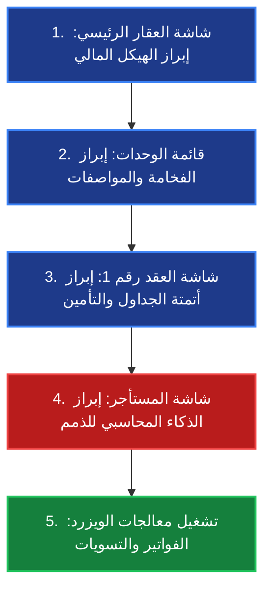
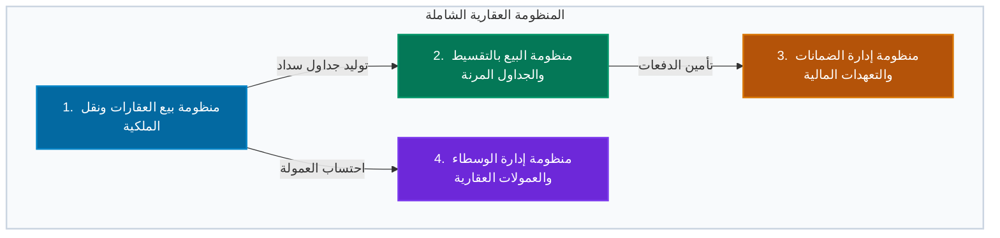
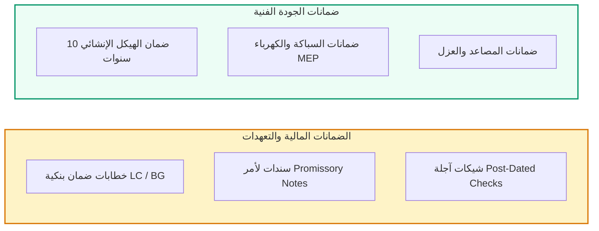

# 🌟 الخطة الاستراتيجية الشاملة: سيناريو العرض الحي المتكامل وخطة التوسع المستقبلية (Live Demo & Expansion Plan)

تم إعداد هذه الخطة الاستراتيجية المزدوجة لتلبي هدفين جوهريين:
1. **تمكين العرض الحي (Live Demo):** تقديم سيناريو تفاعلي متكامل خطوة بخطوة لعرض إمكانيات الموديول الحالي بأعلى درجات الاحترافية.
2. **خطة التوسع المستقبلية (Expansion Plan):** وضع المواصفات الهندسية والمالية لتطوير الموديول ليصبح منظومة شاملة لإدارة الأملاك، وبيع العقارات (كاش وبالتقسيط)، وإدارة الضمانات والوسطاء العقاريين.

---

# 🎯 الجزء الأول: الخطة التنفيذية للعرض الحي المتكامل (Live Demo Master Plan)

## 📊 جدول مراحل العرض الحي (Demo Workflow Table)

| المرحلة | الهدف الرئيسي | الشاشات المستخدمة في Odoo | الوقت المقدر | النقاط المحورية للمتحدث (Talking Points) |
| :--- | :--- | :--- | :--- | :--- |
| **1. التمهيد والجاذبية (The Hook)** | إبراز فخامة الأصول وشمولية النظام | شاشة الأصول `property.property` | 3 دقائق | استعراض "برج الملك عبدالله المالي"، الحسابات المحاسبية المستقلة، وأزرار الإحصائيات (Smart Buttons). |
| **2. جولة التميز العقاري (Deep Dive)** | استعراض تنوع المنتجات العقارية | شاشة الوحدات `property.unit` | 4 دقائق | عرض الشقق الفاخرة، الفلل، المكاتب، والمعارض (`APT-101`, `VILLA-01`...) وتفاصيل الدخول الذكي والمساحات. |
| **3. الأتمتة التعاقدية (Automation)** | عرض الذكاء في العقود والذمم | شاشة العقود `property.lease` والمستأجرين | 5 دقائق | شرح احتساب الـ 12 شهراً الشامل، التوليد الآلي لجدول الأقساط، والذكاء المحاسبي لرصيد المستأجر المتأخر (`500,000` ر.س). |
| **4. الذكاء التشغيلي (Wizards)** | إثبات كفاءة النظام واختصار الوقت | معالجات `Split Billing` & `Owner Settlement`| 4 دقائق | تشغيل المعالجات الحية لتوزيع فواتير الخدمات على مساحات الوحدات، وتوليد قيد تسوية المالك بكبسة زر. |
| **5. الأسئلة والنقاش (Q&A)** | تأكيد الامتثال والموثوقية | تقارير النظام الحية | 4 دقائق | تأكيد توافق النظام مع معايير IFRS / SOCPA ودعم العملات الأجنبية. |

---

## 🎬 سيناريو الحوار التفاعلي للعرض الحي (Detailed Script & Dialogue)

### 🔹 المشهد الأول: "صورة متكاملة للأصل العقاري"
* **الفعل العملي:** افتح شاشة العقارات واضغط على **"برج الملك عبدالله المالي"**.
* **نص المتحدث:** "أهلاً بكم. اليوم سنستعرض منظومة إدارة الممتلكات المتقدمة في Odoo. نلاحظ هنا شاشة الأصل الرئيسي لـ 'برج الملك عبدالله المالي'. النظام لا يعامل العقار كاسم فقط، بل يمنحه استقلالية محاسبية تامة؛ نرى هنا دفتر اليومية المخصص للإيجار (`Rent Journal`)، وحسابات الالتزامات المستقلة للتأمين الضماني (`Deposit Liability Account`). في الأعلى، تمنحنا الأزرار الذكية رؤية فورية لعدد الوحدات، وعقود الإيجار السارية، وأوامر الصيانة المفتوحة دون الحاجة لمغادرة الشاشة."

### 🔹 المشهد الثاني: "منتجات عقارية فاخرة ومتنوعة"
* **الفعل العملي:** اضغط على زر الوحدات (`Units`) واعرض القائمة.
* **نص المتحدث:** "الآن نلقي نظرة على التنوع الاستثماري داخل البرج. يدعم النظام تصنيفات متعددة للوحدات: لدينا شقة فاخرة `APT-101`، فيلا روف `VILLA-01`، مكتب تنفيذي `OFF-501`، ومعرض تجاري `RET-05`. كل وحدة تحتوي على تفاصيل هندسية دقيقة: المساحة الإجمالية بالمتر المربع، عدد الغرف، مزايا التأثيث، أنظمة الدخول الذكي بالبصمة، والقيمة السوقية الحالية."

### 🔹 المشهد الثالث: "أتمتة العقود ودقة الحسابات"
* **الفعل العملي:** انتقل إلى عقد الإيجار رقم 1 `LSE-00001`.
* **نص المتحدث:** "عند التعاقد، يبرز ذكاء النظام المحاسبي. نرى العقد ساري المفعول من `2026-01-01` إلى `2026-12-31`. لاحظ أن النظام احتسب المدة التلقائية كـ **12 شهراً** كاملة بفضل معادلات رياضية ذكية تتضمن اليوم الأخير. كما نرى التوليد الآلي لمبلغ التأمين الضماني (`100,000` ر.س) وجدول الدفعات والأقساط الشهرية الـ 12 أسفل العقد بكل تواريخ استحقاقها."

### 🔹 المشهد الرابع: "الضربة المحاسبية القاضية (الذمم المدينة)"
* **الفعل العملي:** افتح شاشة المستأجر (محمد آل سعود) وأشر إلى حقل `Outstanding Balance`.
* **نص المتحدث:** "هنا تكمن القوة الكبرى التي يبحث عنها أي مدير مالي. نرى في ذمة المستأجر رصيداً مستحقاً يبلغ **`500,000.00` ر.س**. لماذا 500 ألف وليس 700 ألف (التي تمثل كامل الأقساط المتبقية للعام)؟ لأن النظام يمتلك ذكاءً يفصل بين الأقساط المستقبلية التي لم يحن موعدها، وبين **الـ 5 أشهر المتأخرة فعلياً** (من يناير حتى مايو) التي انقضى تاريخ استحقاقها، مما يقدم لصناع القرار قراءة مالية حقيقية لجهود التحصيل."

### 🔹 المشهد الخامس: "قوة التشغيل الآلي (Wizards)"
* **الفعل العملي:** افتح معالج `Split Billing / CAM` ثم معالج `Owner Settlement`.
* **نص المتحدث:** "لحظة الحسم في إدارة المرافق هي توزيع المصاريف المشتركة. يتيح لنا معالج الفواتير إدخال فاتورة كهرباء أو تكييف مشتركة وتوزيعها على المستأجرين *نسبياً حسب مساحة الوحدة (م²)* ليدفع المعرض الكبير حصة أكبر من المكتب الصغير آلياً. وأخيراً، معالج تسوية الملاك يجمع كافة الإيجارات المحصلة، يخصم رسوم الإدارة (`Management Fee 5%`) ومصاريف الصيانة، ويولد قيد التسوية المحاسبي للمالك بضغطة زر واحدة."

---

## ❓ الأسئلة المتوقعة من الحضور والإجابات النموذجية (Q&A Preparation)

* **س: ماذا لو كان لدينا عقود تأجير بعملة أجنبية (مثل الدولار) بينما عملة شركتنا هي الريال السعودي؟**
  * **ج:** *الموديول يدعم العملات المتعددة بشكل كامل. يحتوي عقد الإيجار على حقل `Contract Currency` مستقل، وعند سداد الدفعات، يقوم النظام تلقائياً بتحويل المبلغ لعملة الشركة الأم (`company_amount`) في قيد اليومية (`account.move`) بناءً على أسعار الصرف الحية أو المثبتة يدوياً.*
* **س: هل يقوم النظام بإقفال العقود تلقائياً عند انتهاء مدتها؟**
  * **ج:** *نعم، توجد مهام مجدولة (Scheduled Crons) تفحص تواريخ انتهاء العقود يومياً، وتقوم بتحويل حالة العقد إلى `Expired` وإعادة حالة الوحدة العقارية إلى `Available` لإتاحة تأجيرها من جديد.*
* **س: كيف يتعامل النظام مع التأمين الضماني للمستأجر عند خروجه؟**
  * **ج:** *النظام يوثق التأمين في حساب التزام مستقل (`Deposit Liability`). عند إنهاء العقد، يتيح النظام إنشاء فاتورة استقطاع مقابل أي أضرار بالوحدة، ورد المبلغ المتبقي عبر قيد عكسي آلي (`Refund Move`).*

---
---

# 🚀 الجزء الثاني: الخطة الهندسية لتطوير وتوسعة الموديول (Property Sales & Warranties Expansion Plan)

تتجه هذه الخطة لتحويل الموديول من نظام مقتصر على التأجير إلى **منظومة شاملة لإدارة الأصول العقارية ومبيعاتها (Property Management & Real Estate Sales)**.

---

## 🏛️ 1. منظومة بيع العقارات المباشر ونقل الملكية (Direct Property Sales & Transfer)

### 🔹 البنية الهندسية للنماذج (Data Models)
* **نموذج عقد البيع (`property.sale.contract`):**
  * **الحقول الرئيسية:** `property_id`, `unit_id`, `buyer_id` (المشتري)، `seller_id` (المالك الحالي)، `sale_price` (سعر البيع)، `currency_id`، و`contract_date`.
  * **حالات العقد (`state`):** مسودة (`Draft`) ➔ بانتظار الدفعة المقدمة (`Waiting Downpayment`) ➔ مؤكد/نشط (`Confirmed`) ➔ مكتمل/منقول الملكية (`Completed`) ➔ ملغي (`Cancelled`).

### 🔹 المعالجة المحاسبية والامتثال (Accounting & IFRS Compliance)
* **الاعتراف بالإيراد (IFRS 15):** ربط عملية البيع المباشر بحساب إيرادات المبيعات العقارية (`Real Estate Sales Income`) أو حساب أرباح رأس المال (`Capital Gains`) في حالة الأصول المملوكة للشركة.
* **إسقاط الأصل العقاري (`Asset Derecognition`):** توليد قيد عكسي لإقفال حساب الأصول الثابتة للعقار المباع ونقل قيمته الدفترية.

### 🔹 أتمتة العمليات ونقل الملكية (`Ownership Transfer Wizard`)
* معالج ويزرد مخصص ينطلق عند تحول عقد البيع إلى `Completed` (سداد كامل القيمة).
* **دور الويزرد:** يقوم آلياً بتغيير حقل المالك (`owner_id`) في شاشة الوحدة العقارية `property.unit` إلى المشتري الجديد (`buyer_id`)، وتحديث حالة الوحدة إلى `SOLD`.

---

## 📅 2. منظومة البيع بالتقسيط والجداول المرنة (Installment Sales & Payment Plans)

### 🔹 البنية الهندسية للنماذج (Data Models)
* **نموذج خطة التقسيط (`property.installment.plan`):**
  * يرتبط مباشرة بعقد البيع `property.sale.contract`.
  * **الحقول الرئيسية:** `total_amount` (القيمة الإجمالية)، `downpayment_percent` (نسبة الدفعة المقدمة)، `downpayment_amount`، `installment_frequency` (شهري، ربع سنوي، نصف سنوي، أو دفعات مرتبطة بمراحل البناء Milestone-Based)، `number_of_installments` (عدد الأقساط)، و`financing_markup_percent` (نسبة هامش التمويل/المرابحة إن وجد).
* **نموذج قسط البيع (`property.installment.line`):**
  * **الحقول:** `sequence`، `due_date`، `amount`، `capital_amount` (أصل المبلغ)، `profit_amount` (هامش الربح)، `invoice_id` (`account.move`)، و`state` (`pending`, `paid`, `overdue`).

### 🔹 الامتثال لمعايير IFRS 15 و IFRS 9 (الاعتراف المحاسبي)
* **المعالجة المالية للتقسيط:** في البيع طويل الأجل (مثلاً 5 سنوات)، يتم فصل إيراد البيع الفوري (القيمة الحالية Cash Equivalent Value) عن إيرادات التمويل والمرابحة التي يتم الاعتراف بها تدريجياً بمرور الوقت (`Financing Income`).
* **فواتير الأقساط الأوتوماتيكية:** يقوم النظام بإنشاء فاتورة منفصلة (`account.move`) لكل قسط عند اقتراب تاريخ استحقاقه، مع إمكانية إشعار المشتري بالبريد الإلكتروني والرسائل النصية (SMS).

---

## 🛡️ 3. منظومة إدارة الضمانات والتعهدات المالية (Warranties, Bank Guarantees & Promissory Notes)

### 🔹 البنية الهندسية للنماذج (Data Models)
تُقسم هذه المنظومة إلى شقين جوهريين: **الضمانات المالية القانونية**، و**ضمانات الجودة الفنية**.

#### أ. نموذج الضمانات والتعهدات المالية (`property.guarantee`)
* **الحقول الرئيسية:** `guarantee_type` (سند لأمر `Promissory Note`، خطاب ضمان بنكي `Bank Guarantee`، شيك آجل `Post-Dated Check`).
* `reference_number` (رقم السند/الشيك)، `bank_id` (البنك المصدر)، `amount`، `issue_date`، `expiry_date` (تاريخ الصلاحية)، `status` (`Active`, `Redeemed` محصل، `Returned` مسترجع، `Confiscated` مصادر).
* **الأتمتة المحاسبية:** ربط الضمانات المالية بحسابات نظامية (Off-Balance Sheet Accounts) أو دفاتر أوراق القبض.

#### ب. نموذج ضمانات الجودة والمباني (`property.warranty`)
* **الحقول الرئيسية:** `property_id`، `unit_id`، `warranty_type` (إنشائي `Structural`، عزل `Insulation`، كهرباء وسباكة `MEP`، مصاعد `Elevators`).
* `contractor_id` (`res.partner` - المقاول المنفذ أو المورد الضامن)، `start_date`، `end_date`، و`warranty_document` (مرفق عقد الضمان).
* **ربط الصيانة الذكي:** عند إنشاء طلب صيانة `property.maintenance` لوحدة معينة، يقوم النظام بفحص الضمانات السارية ويعرض تنبيهاً للمدير: ⚠️ *"هذه الوحدة لا تزال تحت ضمان المقاول (شركة الإنشاءات) حتى 2035 - خدمة مجانية"*.

---

## 🤝 4. منظومة إدارة الوسطاء والعمولات العقارية (Real Estate Brokerage & Commissions)

### 🔹 البنية الهندسية للنماذج (Data Models)
* **تعريف الوسيط العقاري (`res.partner` Extension):** إضافة خاصية `is_broker = True` لملف جهة الاتصال.
* **نموذج شريحة العمولات (`property.commission.tier`):**
  * تحديد نسب مئوية ثابتة أو متدرجة (مثلاً: 2.5% للمبيعات أقل من مليون، 3.5% لما فوق المليون).
* **نموذج مطالبة العمولة (`property.commission.claim`):**
  * يرتبط بعقد البيع `property.sale.contract` أو الإيجار `property.lease`.
  * **الحقول:** `broker_id`، `calculation_method` (مبلغ ثابت `Fixed`، نسبة `Percentage`)، `commission_amount`، `due_date` (فوري عند التوقيع، أو مشروط بتحصيل الأقساط `Collection-Based`).
  * **المعالجة المحاسبية:** توليد قيد التزام مصاريف عمولات عقارية (`Brokerage Expense Payable`) آلياً عند الاعتماد.

---

## 🗺️ 5. خارطة الطريق ومراحل التنفيذ التقني (Technical Roadmap & Phasing)

| المرحلة | الأهداف والوحدات المستهدفة بالتطوير | المدة الزمنية | المخرجات الفنية في Odoo |
| :--- | :--- | :--- | :--- |
| **المرحلة الأولى (Phase 1)** | **بناء مبيعات العقارات ونقل الملكية** | أسبوعان | نماذج `property.sale.contract`، ربط الحسابات والإيرادات، ومعالج نقل الملكية. |
| **المرحلة الثانية (Phase 2)** | **نظام البيع بالتقسيط وفواتير IFRS 15** | أسبوعان | نماذج `property.installment.plan`، حوسبة الأقساط التلقائية، وجدولة إنشاء الفواتير. |
| **المرحلة الثالثة (Phase 3)** | **بناء منظومة الضمانات المالية والفنية** | أسبوع واحد | نماذج `property.guarantee` و `property.warranty`، إشعارات انتهاء الصلاحية، وربط الصيانة. |
| **المرحلة الرابعة (Phase 4)** | **بناء منظومة الوسطاء العقاريين والعمولات** | أسبوع واحد | شاشات الوسطاء، حاسبة العمولات المتدرجة، وتوليد قيود استحقاق السماسرة. |
| **المرحلة الخامسة (Phase 5)** | **الاختبارات الشاملة والتوافق المحاسبي (UAT)** | أسبوع واحد | فحص التكاملات مع `account.move`، التحقق من التوافق مع معايير IFRS / SOCPA، وتسليم المشروع. |

---
**💡 الميزة الكبرى للتطوير:**
تنفيذ هذه الخطة سيجعل من موديول `property_management` قصة نجاح كبرى ونظاماً متكاملاً لإدارة الثروات العقارية يغطي (الإيجار، البيع الكاش، البيع بالتقسيط، الضمانات، والوساطة) في منصة Odoo واحدة.
