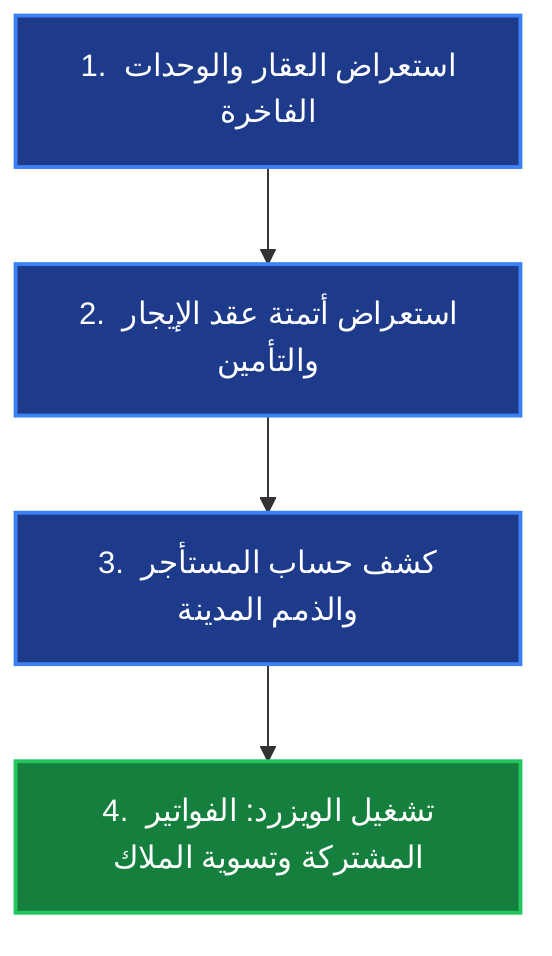

# 🌟 الدليل التقديمي الشامل لموديول إدارة الممتلكات (Property Management)

## 🎯 ملخص تنفيذي (Executive Summary)
نظام `Property Management` هو حل رقمي متكامل بمستوى المؤسسات (Enterprise-Grade) مصمم داخل بيئة Odoo لإدارة دورة حياة الأصول العقارية بالكامل. يجمع الموديول بين **التنظيم الهرمي الذكي للأصول**، و**الامتثال التام لمعايير المحاسبة الدولية والمحلية (IFRS / SOCPA)**، و**أتمتة العمليات التشغيلية** (التأجير، الصيانة، فواتير الخدمات، وتسويات الملاك) مع دعم كامل لنظام **العملات المتعددة (Multi-Currency)**.

---

## 🏛️ القسم الأول: الشرح النظري (Theoretical Framework & Architecture)

### 1. الهندسة العقارية الهرمية (Hierarchical Asset Architecture)
يعتمد الموديول على بنية بيانات علائقية مترابطة تضمن عدم تشتت المعلومات وتوفر رؤية واضحة (360-Degree View) للأصل العقاري:
* **العقار الرئيسي (`property.property`):** يمثل المجمع أو البرج التجاري (مثل: *برج الملك عبدالله المالي*). يضم الحسابات المحاسبية المخصصة، والدفاتر (Journals)، ومؤشرات الأداء التلقائية (KPIs) مثل نسبة الإشغال وصافي الدخل التشغيلي.
* **المباني والوحدات (`property.building` & `property.unit`):** تقسيم العقار إلى مباني ثم وحدات مستقلة (شقق، فلل، مكاتب، معارض). تحتفظ كل وحدة ببياناتها الفنية (المساحة، الغرف، التأثيث) والقيمة السوقية وحالة التأجير الآلية.
* **الملاك والمستأجرين (`property.owner` & `property.tenant`):** ملفات تعريفية متقدمة ترتبط بسجل جهات الاتصال (`res.partner`) لإدارة الحسابات الدائنة والمدينة بشكل مستقل.

### 2. الأتمتة التعاقدية والمالية (Financial & Contractual Automation)
* **دورة حياة العقود (`property.lease`):** أتمتة كاملة لحالات العقد (مسودة `Draft` ➔ ساري `Active` ➔ منتهي `Expired` أو مجدد `Renewed`).
* **جدولة الدفعات الآلية (`Payment Schedules`):** بمجرد تنشيط العقد، يقوم النظام آلياً بتوليد جدول الأقساط (شهري، ربع سنوي، نصف سنوي، أو سنوي) وتوزيع المبالغ بدقة مع احتساب نسب الزيادة السنوية (`Escalation %`) إن وجدت.
* **احتساب الرصيد المستحق الفعلي (`Outstanding Balance`):** تمتاز البنية المحاسبية للموديول بالذكاء؛ فهي تفرق بوضوح بين *الأقساط المستقبلية* و*الأقساط المتأخرة المستحقة فعلياً* (`date <= today`)، مما يعطي متخذ القرار صورة حقيقية عن الديون المستحقة.

### 3. الامتثال لمعايير IFRS / SOCPA ودعم العملات المتعددة (Multi-Currency)
* **ربط المبالغ بالعملات (`fields.Monetary`):** كل حقل مالي في النظام مرتبط صراحةً بحقل عملة (`currency_id`).
* **مرونة العملات التعاقدية:** يتيح النظام إبرام عقود تأجير بعملات أجنبية (مثل الدولار أو اليورو) مع أتمتة تحويل المعاملات المحاسبية إلى العملة الوظيفية للشركة (الريال السعودي `SAR`) في القيود اليومية (`account.move`) بناءً على أسعار الصرف.
* **فصل الالتزامات والإيرادات:** توجيه الدفعات تلقائياً؛ فالإيجارات تذهب لحسابات الإيرادات (`Rent Income`)، بينما يوجه التأمين الضماني لحسابات الالتزامات (`Deposit Liability`).

### 4. العمليات المتقدمة وإدارة المرافق (Advanced Facility Operations)
* **تقسيم الفواتير المشتركة (`Split Billing / CAM`):** معالج ذكي لتوزيع فواتير الخدمات العامة (مياه، كهرباء، حراسة، نظافة) على المستأجرين إما بالتساوي أو تناسبياً حسب مساحة الوحدة (م²).
* **تسوية الملاك (`Owner Settlement`):** معالج آلي يجمع الإيجارات المحصلة، ويخصم رسوم الإدارة (`Management Fee %`) وتكاليف الصيانة، ويولد قيد التسوية المحاسبي للمالك بكبسة زر.
* **طلبات الصيانة (`Maintenance`):** تتبع أعطال الوحدات وتوثيق تكاليف قطع الغيار والعمالة وربطها محاسبياً بملف العقار.

---

## 💻 القسم الثاني: الشرح العملي وسيناريوهات العرض الحية (Live Demo Scenarios)

أثناء تقديمك للعرض العملي على قاعدة البيانات `p2`، أنصحك باتباع تسلسل السيناريوهات الأربعة التالية لإبهار الحضور:

### 🎬 السيناريو الأول: استعراض الأصول والوحدات (Property & Units Showcase)
1. **الخطوة العملية:** افتح شاشة العقارات واضغط على عقار **"برج الملك عبدالله المالي"**.
2. **نقاط التحدث (Talking Points):**
   * أشر إلى بطاقات العرض العلوية (Smart Buttons) التي تعرض عدد الوحدات، وعقود الإيجار، وطلبات الصيانة المفتوحة.
   * استعرض قسم الحسابات المحاسبية المخصصة للعقار (Rent Journal, Receivable Account, Deposit Account) لتؤكد على الاستقلالية المحاسبية.
   * افتح **قائمة الوحدات العقارية** واعرض التنوع الفاخر للوحدات التي تم إدخالها (`APT-101`, `VILLA-01`, `OFF-501`, `RET-05`).
   * أشر إلى التفاصيل الفنية لكل وحدة: المساحة (م²)، الإيجار الشهري، القيمة السوقية، مواقف السيارات، وحالة الدخول الذكي.

---

### 🎬 السيناريو الثاني: إبرام العقد وأتمتة الجداول (Lease & Deposit Automation)
1. **الخطوة العملية:** انتقل إلى **عقد الإيجار رقم 1 (LSE-00001)**.
2. **نقاط التحدث (Talking Points):**
   * **المدة التعاقدية:** وضّح كيف يقوم النظام آلياً بحساب المدة الصحيحة من `2026-01-01` إلى `2026-12-31` لتظهر **12 شهراً** (نطاق تاريخي شامل ومطابق للواقع).
   * **التأمين الضماني (`Security Deposit`):** اشرح كيف يحتسب النظام مبلغ التأمين (`100,000` ر.س) تلقائياً، وكيف ينشئ له قيداً مستقلاً عند التفعيل.
   * **العملة:** وضّح ظهور حقل العملة بالريال السعودي (`SAR`) وتوفر خيار تغييره لأي عملة دولية مع ربط مباشر بأسعار الصرف.
   * **جدول الدفعات (`Schedule`):** استعرض جدول الأقساط الشهرية الـ 12 المولدة أسفل العقد، مع توضيح حالات الأقساط (Paid, Pending, Overdue).

---

### 🎬 السيناريو الثالث: ذمم المستأجرين والأقساط المتأخرة (Tenant Account & Overdue Balances)
1. **الخطوة العملية:** افتح ملف المستأجر **محمد آل سعود (Mohammed Al-Saud)**.
2. **نقاط التحدث (Talking Points):**
   * أشر مباشرة إلى حقل **الرصيد المستحق (Outstanding Balance)** بقيمة **`500,000.00` ر.س**.
   * **الضربة القاضية المحاسبية:** اشرح للحضور الذكاء المحاسبي لهذا الحقل؛ فالنظام لا يقوم بجمع كل الأقساط الـ 7 المتبقية حتى نهاية العام (والتي تبلغ 700 ألف)، بل يقوم بفلترة واحتساب **الـ 5 أشهر المتأخرة فقط** التي انقضى تاريخ استحقاقها فعلياً (يناير حتى مايو)، مما يمنح الإدارة المالية دقة تامة في متابعة التحصيل.

---

### 🎬 السيناريو الرابع: تشغيل معالجات العمليات المتقدمة (Powerful Wizards in Action)
هنا تظهر القوة التشغيلية الكبرى للنظام لاختصار ساعات من العمل اليدوي:

#### أ. معالج الفواتير المشتركة (Split Billing / CAM Wizard)
* **كيفية التقديم:** افتح المعالج من قائمة المهام المتقدمة `Split Billing / CAM`.
* **ماذا تشرح:** "تخيل أن لدينا فاتورة كهرباء وتكييف أو حراسة مشتركة بقيمة 50,000 ر.س لكامل البرج التجاري. بدلاً من إنشاء فواتير يدوية لكل مستأجر، يتيح لنا هذا الويزرد إدخال المبلغ الإجمالي واختيار طريقة التوزيع:
  1. **التوزيع المتساوي (`Equal Split`):** يقسم المبلغ بالتساوي على المستأجرين الحاليين.
  2. **التوزيع النسبي بالمساحة (`Proportional by Area`):** يوزع التكلفة بناءً على مساحة وحدة كل مستأجر (م²)، حيث يدفع صاحب المعرض الكبير حصة أكبر من صاحب المكتب الصغير. وبكبسة زر، يولد النظام فواتير محاسبية رسمية (`account.move`) لكل مستأجر على حدة."

#### ب. معالج تسوية الملاك (Owner Settlement Wizard)
* **كيفية التقديم:** افتح ملف المالك التابع للبرج واضغط على زر `Owner Settlement`.
* **ماذا تشرح:** "هذا المعالج يحول عملية شهرية معقدة إلى إجراء يستغرق 3 ثوانٍ. يقوم الويزرد بـ:
  1. حصر كامل الإيجارات المحصلة فعلياً خلال الفترة المحددة.
  2. اقتطاع نسبة رسوم إدارة الممتلكات الخاصة بشركتنا (مثلاً `5% Management Fee`).
  3. اقتطاع كامل مصاريف الصيانة وقطع الغيار التي صرفت على وحدات المالك.
  4. احتساب صافي المبلغ المستحق للمالك (`Net Payable`) وإنشاء قيد محاسبي جاهز للصرف والمطابقة البنكية."

---

## 💡 نصائح ذهبية لنجاح العرض التقديمي (Golden Tips)
1. **ابدأ بالصورة الكبرى:** افتح شاشة لوحة المعلومات أو قائمة الأصول أولاً لتعطي انطباعاً بالفخامة والشمولية.
2. **ركّز على مصطلحات الأتمتة والامتثال:** استخدم عبارات مثل *"توليد آلي"*، *"فصل الذمم المالية"*، *"صفر عمل يدوي"*، و*"متوافق مع معايير هيئة المحاسبين SOCPA"*.
3. **التنقل السلس:** استخدم الروابط المباشرة و Smart Buttons داخل النماذج للتنقل بين العقار ➔ الوحدة ➔ العقد ➔ المستأجر بدلاً من البحث في القوائم الرئيسية، لتبين مدى انسيابية وسرعة واجهة المستخدم (UX).
